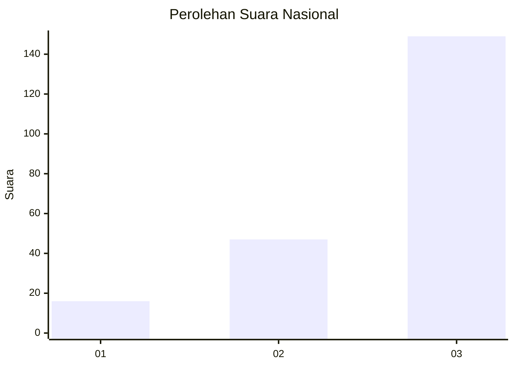
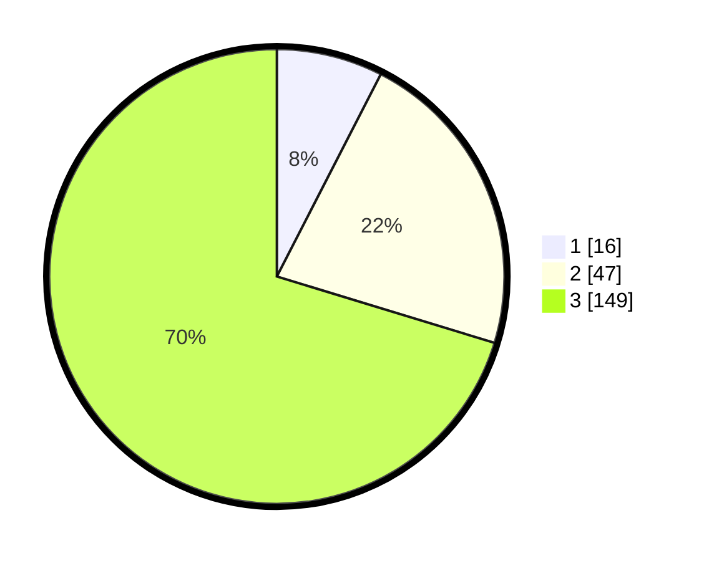

# Hasil

## Grafik

## Tabel

| No. | Nama Paslon    | Suara | Suara (raw) | Persentase |
|:--- |:-------------- | -----:| -----------:| ----------:|
| 1   | ANIES MUHAIMIN | 16    | [16][p-1]   | 7,55       |
| 2   | PRABOWO GIBRAN | 47    | [47][p-2]   | 22,17      |
| 3   | GANJAR MAHFUD  | 149   | [149][p-3]  | 70,28      |

[p-1]: https://github.com/gigit-pemilu/pemilu-2024/blob/main/pilpres/hitung-suara/sub/96-papua-barat-daya/sub/01-sorong/sub/01-makbon/sub/1001-makbon/sub/001-tps/sub/paslon-1.txt
[p-2]: https://github.com/gigit-pemilu/pemilu-2024/blob/main/pilpres/hitung-suara/sub/96-papua-barat-daya/sub/01-sorong/sub/01-makbon/sub/1001-makbon/sub/001-tps/sub/paslon-2.txt
[p-3]: https://github.com/gigit-pemilu/pemilu-2024/blob/main/pilpres/hitung-suara/sub/96-papua-barat-daya/sub/01-sorong/sub/01-makbon/sub/1001-makbon/sub/001-tps/sub/paslon-3.txt

## Foto C Plano

https://sirekap-obj-formc.kpu.go.id/5885/pemilu/ppwp/96/01/01/10/01/9601011001001-20240215-203741--2e475bac-f7dc-4e28-805e-a3762f735b47.jpg

https://sirekap-obj-formc.kpu.go.id/5885/pemilu/ppwp/96/01/01/10/01/9601011001001-20240215-201229--9f6401e3-48d8-4830-87dc-9dd849204709.jpg

https://sirekap-obj-formc.kpu.go.id/5885/pemilu/ppwp/96/01/01/10/01/9601011001001-20240215-185916--a1517df8-3b1e-4b39-83b8-f518a10dabae.jpg

## Metadata

| Key        | Value               |
| ---------- | ------------------- |
| Time Stamp | 2024-02-17 16:00:02 |

## DATA PEMILIH TETAP

Jumlah pemilih dalam DPT: **214**.
 * L: **98**.
 * P: **116**.

## DATA PENGGUNA HAK PILIH

Jumlah pengguna hak pilih dalam DPT: **214**.
 * L: **98**.
 * P: **116**.

Jumlah pengguna hak pilih dalam DPTb: **4**.
 * L: **1**.
 * P: **3**.

Jumlah pengguna hak pilih dalam DPK: **0**.
 * L: **0**.
 * P: **0**.

Jumlah pengguna hak pilih: **218**.
 * L: **99**.
 * P: **119**.

## JUMLAH SUARA SAH DAN TIDAK SAH

JUMLAH SELURUH SUARA SAH: **212**.

JUMLAH SUARA TIDAK SAH: **6**.

JUMLAH SELURUH SUARA SAH DAN SUARA TIDAK SAH: **218**.

