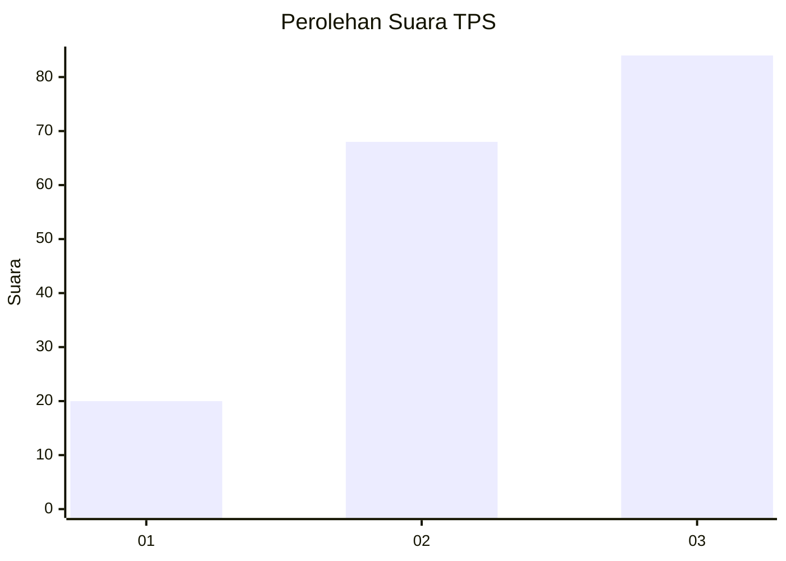
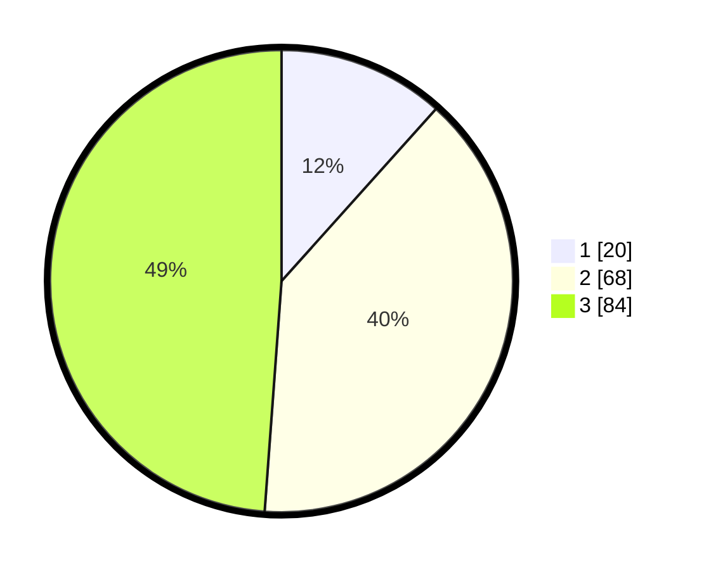

# Hasil

## Grafik

## Tabel

| No. | Nama Paslon    | Suara | Suara (raw) | Persentase |
|:--- |:-------------- | -----:| -----------:| ----------:|
| 1   | ANIES MUHAIMIN | 20    | [20][p-1]   | 11,63      |
| 2   | PRABOWO GIBRAN | 68    | [68][p-2]   | 39,53      |
| 3   | GANJAR MAHFUD  | 84    | [84][p-3]   | 48,84      |

[p-1]: https://github.com/gigit-pemilu/pemilu-2024-96-papua-barat-daya/blob/main/pilpres/hitung-suara/sub/96-papua-barat-daya/sub/01-sorong/sub/01-makbon/sub/1001-makbon/sub/003-tps/sub/paslon-1.txt
[p-2]: https://github.com/gigit-pemilu/pemilu-2024-96-papua-barat-daya/blob/main/pilpres/hitung-suara/sub/96-papua-barat-daya/sub/01-sorong/sub/01-makbon/sub/1001-makbon/sub/003-tps/sub/paslon-2.txt
[p-3]: https://github.com/gigit-pemilu/pemilu-2024-96-papua-barat-daya/blob/main/pilpres/hitung-suara/sub/96-papua-barat-daya/sub/01-sorong/sub/01-makbon/sub/1001-makbon/sub/003-tps/sub/paslon-3.txt

## Foto C Plano

https://sirekap-obj-formc.kpu.go.id/af88/pemilu/ppwp/96/01/01/10/01/9601011001003-20240216-172739--e9288b26-ae6e-4c3d-9ff7-4bafa2e5c9b5.jpg

https://sirekap-obj-formc.kpu.go.id/af88/pemilu/ppwp/96/01/01/10/01/9601011001003-20240216-115228--72f55eca-46a6-446e-9ae5-583c4d628bbf.jpg

https://sirekap-obj-formc.kpu.go.id/af88/pemilu/ppwp/96/01/01/10/01/9601011001003-20240216-115608--dccd3f0f-9921-4bdb-8230-07bb8e6ab56e.jpg

## Metadata

| Key        | Value               |
| ---------- | ------------------- |
| Time Stamp | 2024-02-16 21:01:00 |

## DATA PEMILIH TETAP

Jumlah pemilih dalam DPT: **259**.
 * L: **129**.
 * P: **130**.

## DATA PENGGUNA HAK PILIH

Jumlah pengguna hak pilih dalam DPT: **175**.
 * L: **86**.
 * P: **89**.

Jumlah pengguna hak pilih dalam DPTb: **0**.
 * L: **0**.
 * P: **0**.

Jumlah pengguna hak pilih dalam DPK: **0**.
 * L: **0**.
 * P: **0**.

Jumlah pengguna hak pilih: **175**.
 * L: **86**.
 * P: **89**.

## JUMLAH SUARA SAH DAN TIDAK SAH

JUMLAH SELURUH SUARA SAH: **172**.

JUMLAH SUARA TIDAK SAH: **3**.

JUMLAH SELURUH SUARA SAH DAN SUARA TIDAK SAH: **175**.

