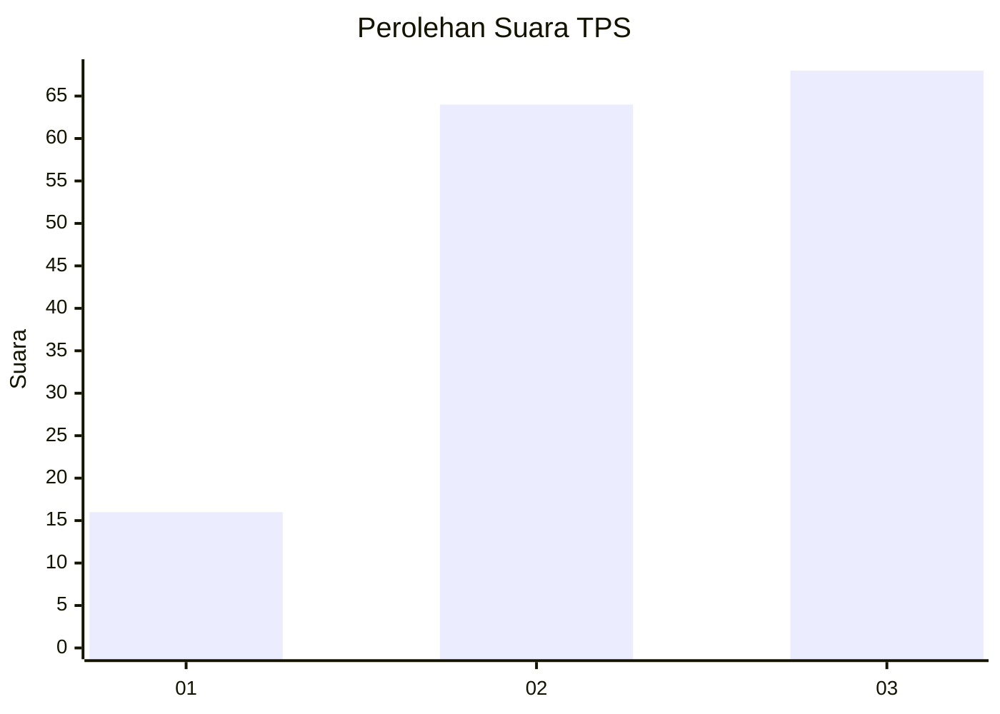
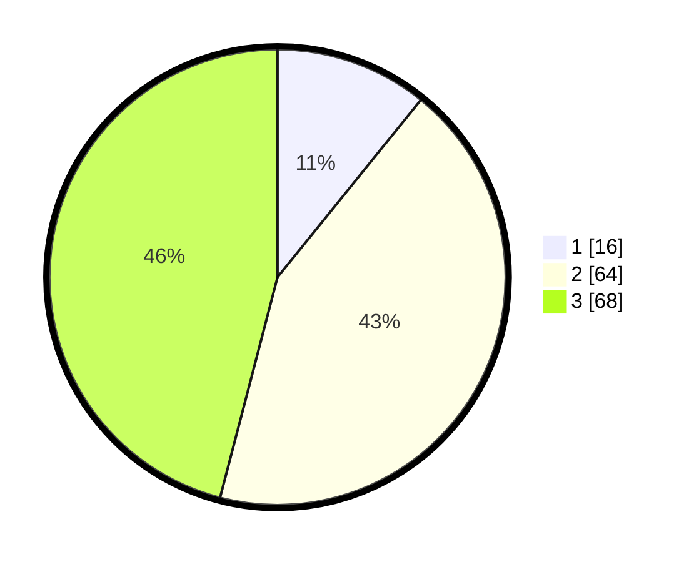

# Hasil

## Grafik

## Tabel

| No. | Nama Paslon    | Suara | Suara (raw) | Persentase |
|:--- |:-------------- | -----:| -----------:| ----------:|
| 1   | ANIES MUHAIMIN | 16    | [16][p-1]   | 10,81      |
| 2   | PRABOWO GIBRAN | 64    | [64][p-2]   | 43,24      |
| 3   | GANJAR MAHFUD  | 68    | [68][p-3]   | 45,95      |

[p-1]: https://github.com/gigit-pemilu/pemilu-2024-96-papua-barat-daya/blob/main/pilpres/hitung-suara/sub/96-papua-barat-daya/sub/01-sorong/sub/01-makbon/sub/2005-batu-lubang/sub/001-tps/sub/paslon-1.txt
[p-2]: https://github.com/gigit-pemilu/pemilu-2024-96-papua-barat-daya/blob/main/pilpres/hitung-suara/sub/96-papua-barat-daya/sub/01-sorong/sub/01-makbon/sub/2005-batu-lubang/sub/001-tps/sub/paslon-2.txt
[p-3]: https://github.com/gigit-pemilu/pemilu-2024-96-papua-barat-daya/blob/main/pilpres/hitung-suara/sub/96-papua-barat-daya/sub/01-sorong/sub/01-makbon/sub/2005-batu-lubang/sub/001-tps/sub/paslon-3.txt

## Foto C Plano

https://sirekap-obj-formc.kpu.go.id/bee1/pemilu/ppwp/96/01/01/20/05/9601012005001-20240221-181859--94efe2d4-d0f9-4d18-b320-faefd6ff5da9.jpg

https://sirekap-obj-formc.kpu.go.id/bee1/pemilu/ppwp/96/01/01/20/05/9601012005001-20240222-150029--eb6c3191-8cd4-4438-b96b-6ecc30b32899.jpg

https://sirekap-obj-formc.kpu.go.id/bee1/pemilu/ppwp/96/01/01/20/05/9601012005001-20240222-150043--3e31071e-f102-42bf-98d8-0a1a94932e47.jpg

## Metadata

| Key        | Value               |
| ---------- | ------------------- |
| Time Stamp | 2024-02-22 19:00:00 |

