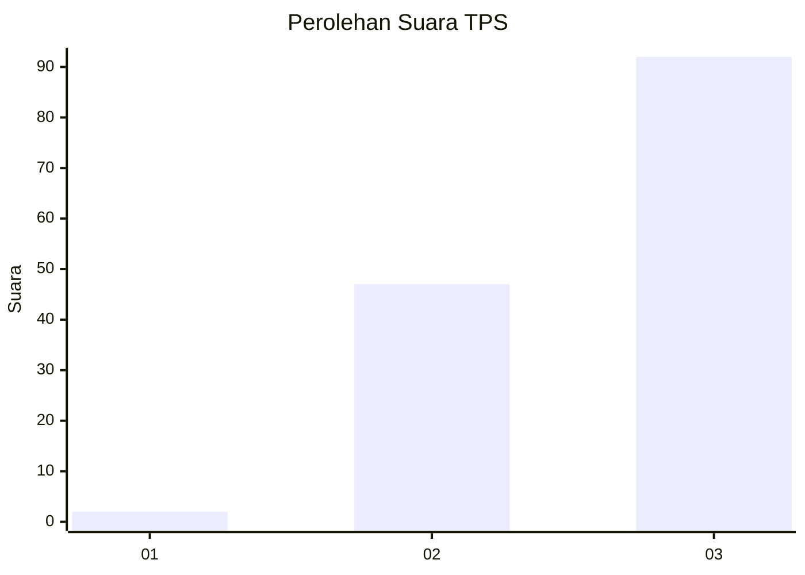
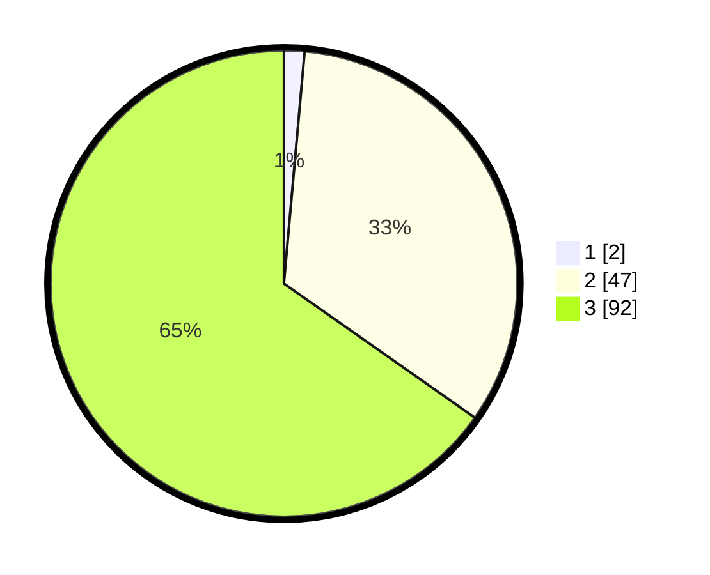

# Hasil

## Grafik

## Tabel

| No. | Nama Paslon    | Suara | Suara (raw) | Persentase |
|:--- |:-------------- | -----:| -----------:| ----------:|
| 1   | ANIES MUHAIMIN | 2     | [2][p-1]    | 1,42       |
| 2   | PRABOWO GIBRAN | 47    | [47][p-2]   | 33,33      |
| 3   | GANJAR MAHFUD  | 92    | [92][p-3]   | 65,25      |

[p-1]: https://github.com/gigit-pemilu/pemilu-2024-96-papua-barat-daya/blob/main/pilpres/hitung-suara/sub/96-papua-barat-daya/sub/01-sorong/sub/01-makbon/sub/2009-bainkete/sub/001-tps/sub/paslon-1.txt
[p-2]: https://github.com/gigit-pemilu/pemilu-2024-96-papua-barat-daya/blob/main/pilpres/hitung-suara/sub/96-papua-barat-daya/sub/01-sorong/sub/01-makbon/sub/2009-bainkete/sub/001-tps/sub/paslon-2.txt
[p-3]: https://github.com/gigit-pemilu/pemilu-2024-96-papua-barat-daya/blob/main/pilpres/hitung-suara/sub/96-papua-barat-daya/sub/01-sorong/sub/01-makbon/sub/2009-bainkete/sub/001-tps/sub/paslon-3.txt

## Foto C Plano

https://sirekap-obj-formc.kpu.go.id/ccbc/pemilu/ppwp/96/01/01/20/09/9601012009001-20240223-104840--8c57fc70-f7f1-4da7-8594-b9e9967d72ed.jpg

https://sirekap-obj-formc.kpu.go.id/ccbc/pemilu/ppwp/96/01/01/20/09/9601012009001-20240223-104733--9d924922-9373-4bea-b8e5-ea5e9ac44c19.jpg

https://sirekap-obj-formc.kpu.go.id/ccbc/pemilu/ppwp/96/01/01/20/09/9601012009001-20240223-104451--b398c31e-59a0-4166-921a-ea7cf1fe012f.jpg

## Metadata

| Key        | Value               |
| ---------- | ------------------- |
| Time Stamp | 2024-02-24 22:31:28 |

