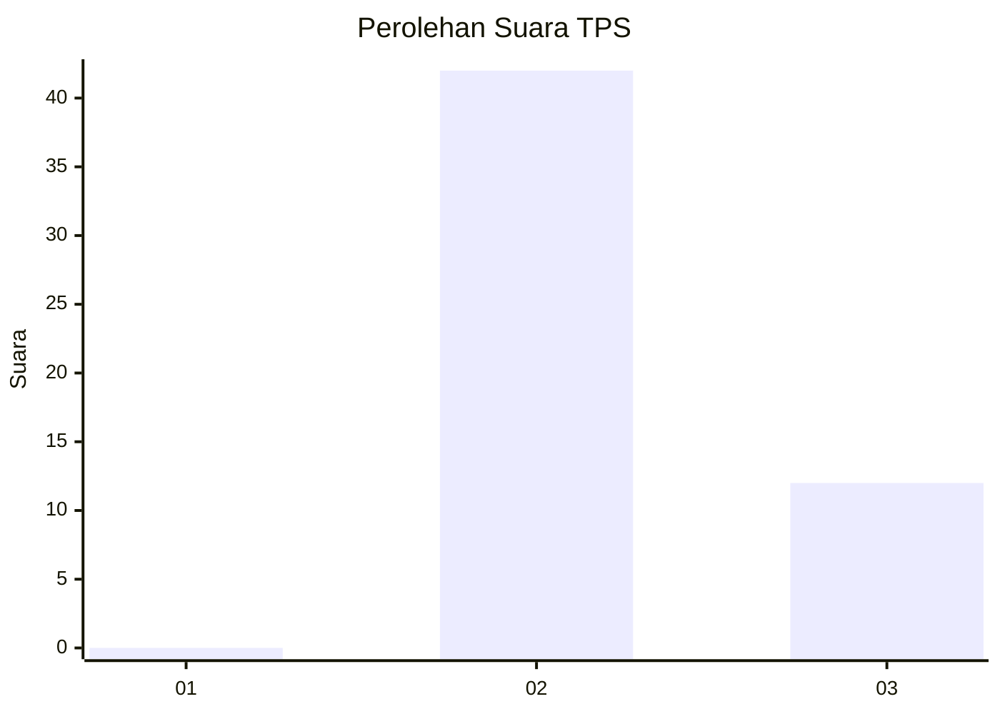
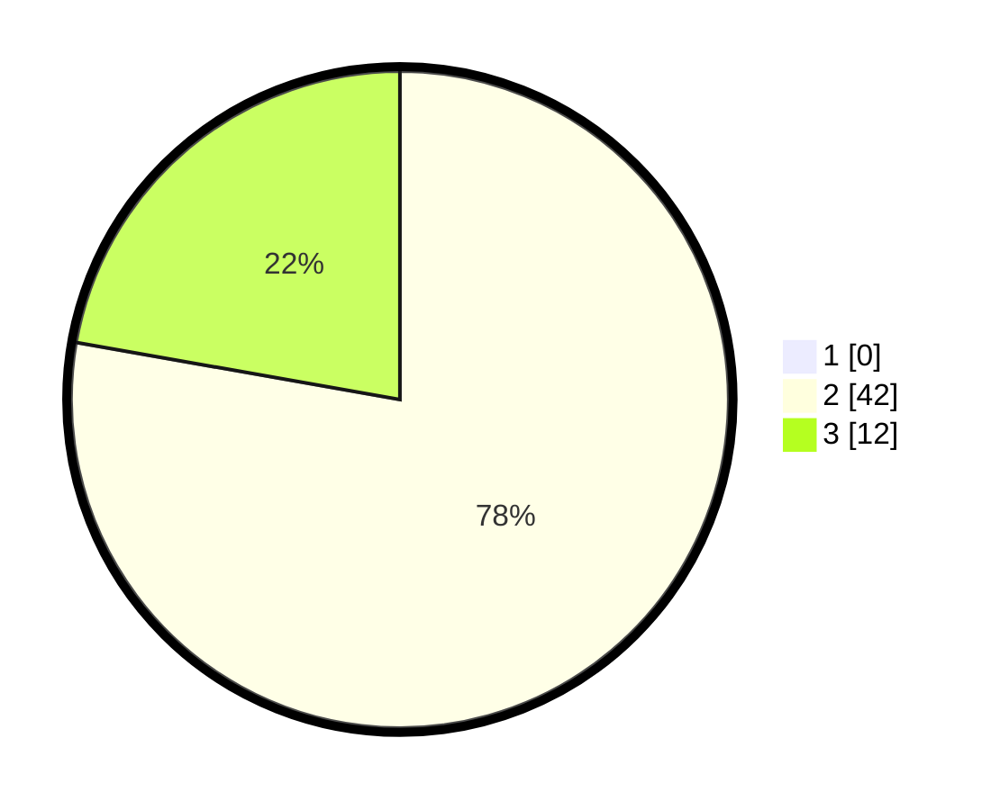

# Hasil

## Grafik

## Tabel

| No. | Nama Paslon    | Suara | Suara (raw) | Persentase |
|:--- |:-------------- | -----:| -----------:| ----------:|
| 1   | ANIES MUHAIMIN | 0     | [0][p-1]    | 0,00       |
| 2   | PRABOWO GIBRAN | 42    | [42][p-2]   | 77,78      |
| 3   | GANJAR MAHFUD  | 12    | [12][p-3]   | 22,22      |

[p-1]: https://github.com/gigit-pemilu/pemilu-2024-96-papua-barat-daya/blob/main/pilpres/hitung-suara/sub/96-papua-barat-daya/sub/01-sorong/sub/01-makbon/sub/2014-klasigi/sub/001-tps/sub/paslon-1.txt
[p-2]: https://github.com/gigit-pemilu/pemilu-2024-96-papua-barat-daya/blob/main/pilpres/hitung-suara/sub/96-papua-barat-daya/sub/01-sorong/sub/01-makbon/sub/2014-klasigi/sub/001-tps/sub/paslon-2.txt
[p-3]: https://github.com/gigit-pemilu/pemilu-2024-96-papua-barat-daya/blob/main/pilpres/hitung-suara/sub/96-papua-barat-daya/sub/01-sorong/sub/01-makbon/sub/2014-klasigi/sub/001-tps/sub/paslon-3.txt

## Foto C Plano

https://sirekap-obj-formc.kpu.go.id/f19b/pemilu/ppwp/96/01/01/20/14/9601012014001-20240226-100943--41072143-c93d-452c-bdf3-a804061c410e.jpg

https://sirekap-obj-formc.kpu.go.id/f19b/pemilu/ppwp/96/01/01/20/14/9601012014001-20240226-100959--707798ce-5a62-43b1-abd3-222610bd4cf7.jpg

## Metadata

| Key        | Value               |
| ---------- | ------------------- |
| Time Stamp | 2024-02-27 10:00:00 |

