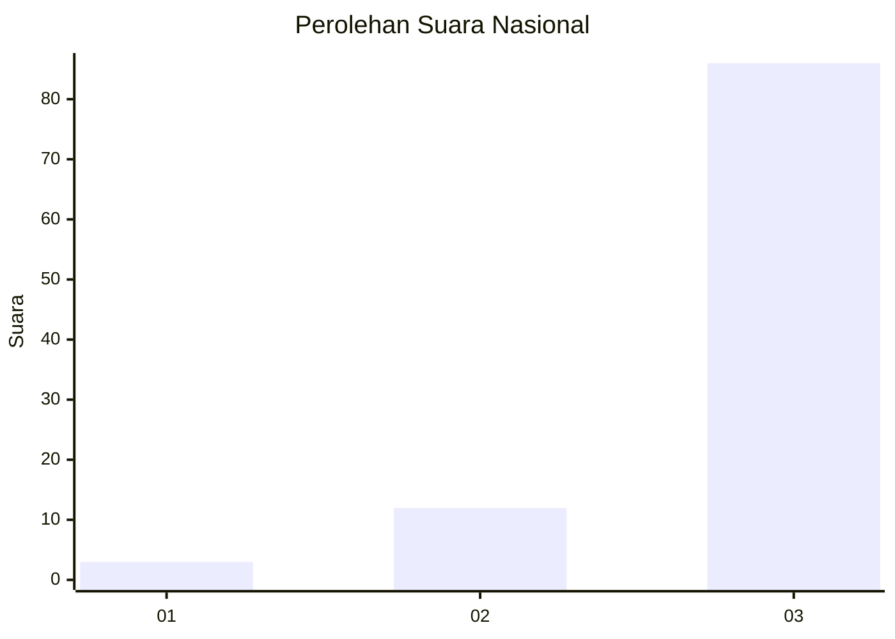
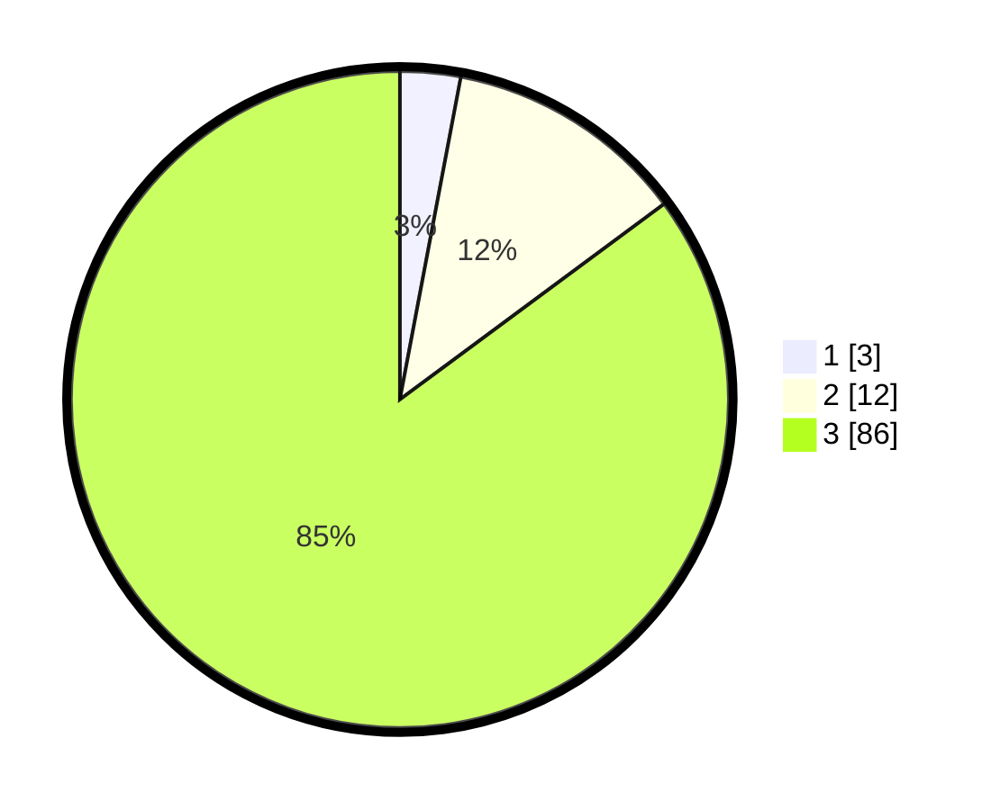

# Hasil

## Grafik

## Tabel

| No. | Nama Paslon    | Suara | Suara (raw) | Persentase |
|:--- |:-------------- | -----:| -----------:| ----------:|
| 1   | ANIES MUHAIMIN | 3     | [3][p-1]    | 2,97       |
| 2   | PRABOWO GIBRAN | 12    | [12][p-2]   | 11,88      |
| 3   | GANJAR MAHFUD  | 86    | [86][p-3]   | 85,15      |

[p-1]: https://github.com/gigit-pemilu/pemilu-2024/blob/main/pilpres/hitung-suara/sub/96-papua-barat-daya/sub/01-sorong/sub/01-makbon/sub/2016-suatolo/sub/001-tps/sub/paslon-1.txt
[p-2]: https://github.com/gigit-pemilu/pemilu-2024/blob/main/pilpres/hitung-suara/sub/96-papua-barat-daya/sub/01-sorong/sub/01-makbon/sub/2016-suatolo/sub/001-tps/sub/paslon-2.txt
[p-3]: https://github.com/gigit-pemilu/pemilu-2024/blob/main/pilpres/hitung-suara/sub/96-papua-barat-daya/sub/01-sorong/sub/01-makbon/sub/2016-suatolo/sub/001-tps/sub/paslon-3.txt

## Foto C Plano

https://sirekap-obj-formc.kpu.go.id/a6b5/pemilu/ppwp/96/01/01/20/16/9601012016001-20240226-094146--0542b830-22f0-4476-a7fb-73e58549571a.jpg

https://sirekap-obj-formc.kpu.go.id/a6b5/pemilu/ppwp/96/01/01/20/16/9601012016001-20240226-094217--c9e4f91f-8963-4d40-a684-3610a8b76ee1.jpg

https://sirekap-obj-formc.kpu.go.id/a6b5/pemilu/ppwp/96/01/01/20/16/9601012016001-20240226-094251--ad856067-b34b-4489-9ee2-db074ca653a4.jpg

## Metadata

| Key        | Value               |
| ---------- | ------------------- |
| Time Stamp | 2024-02-26 18:00:00 |

