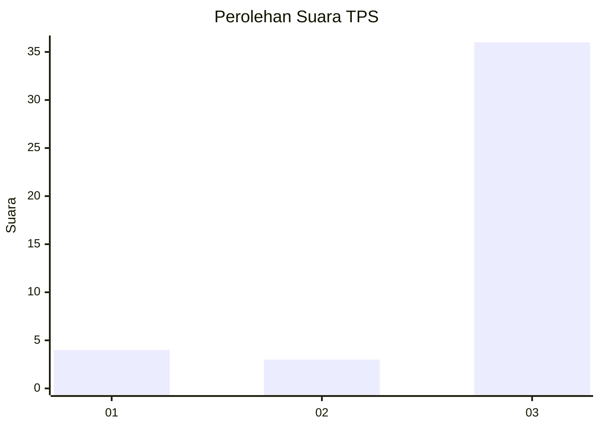
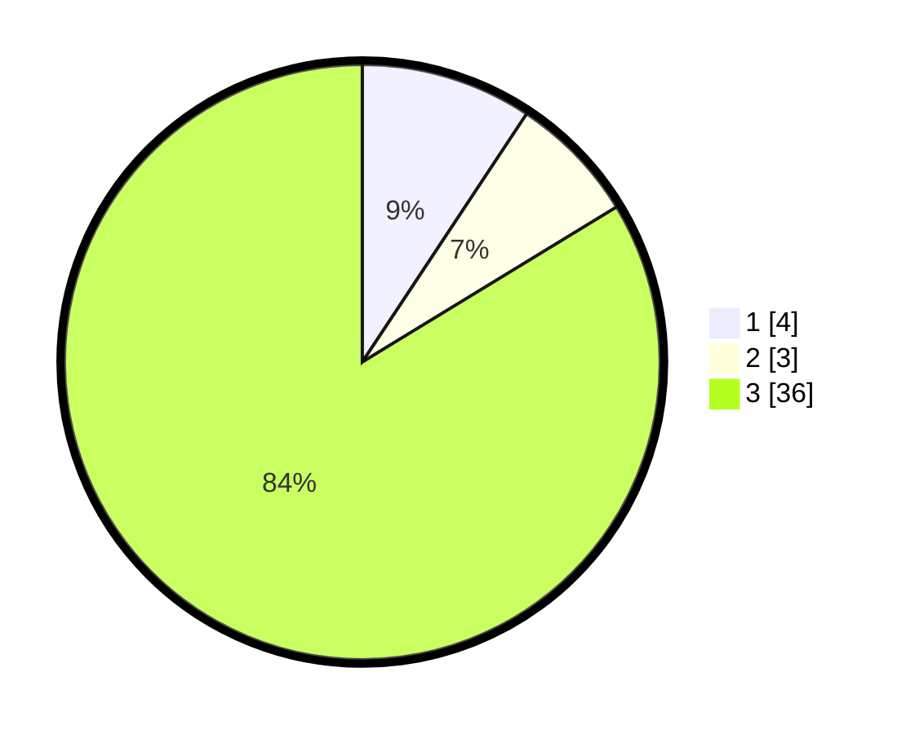

# Hasil

## Grafik

## Tabel

| No. | Nama Paslon    | Suara | Suara (raw) | Persentase |
|:--- |:-------------- | -----:| -----------:| ----------:|
| 1   | ANIES MUHAIMIN | 4     | [4][p-1]    | 9,30       |
| 2   | PRABOWO GIBRAN | 3     | [3][p-2]    | 6,98       |
| 3   | GANJAR MAHFUD  | 36    | [36][p-3]   | 83,72      |

[p-1]: https://github.com/gigit-pemilu/pemilu-2024-96-papua-barat-daya/blob/main/pilpres/hitung-suara/sub/96-papua-barat-daya/sub/01-sorong/sub/04-beraur/sub/2022-kmafo/sub/001-tps/sub/paslon-1.txt
[p-2]: https://github.com/gigit-pemilu/pemilu-2024-96-papua-barat-daya/blob/main/pilpres/hitung-suara/sub/96-papua-barat-daya/sub/01-sorong/sub/04-beraur/sub/2022-kmafo/sub/001-tps/sub/paslon-2.txt
[p-3]: https://github.com/gigit-pemilu/pemilu-2024-96-papua-barat-daya/blob/main/pilpres/hitung-suara/sub/96-papua-barat-daya/sub/01-sorong/sub/04-beraur/sub/2022-kmafo/sub/001-tps/sub/paslon-3.txt

## Foto C Plano

https://sirekap-obj-formc.kpu.go.id/e981/pemilu/ppwp/96/01/04/20/22/9601042022001-20240223-100350--ff512dd8-7fd7-4ae5-975e-a4b272c6e6e5.jpg

https://sirekap-obj-formc.kpu.go.id/e981/pemilu/ppwp/96/01/04/20/22/9601042022001-20240223-103015--ac65f219-ef5e-42fd-afc5-195fb27ac4d4.jpg

https://sirekap-obj-formc.kpu.go.id/e981/pemilu/ppwp/96/01/04/20/22/9601042022001-20240223-102805--0bc1dc06-e180-4544-9083-c442ca7bab45.jpg

## Metadata

| Key        | Value               |
| ---------- | ------------------- |
| Time Stamp | 2024-02-25 15:00:00 |

