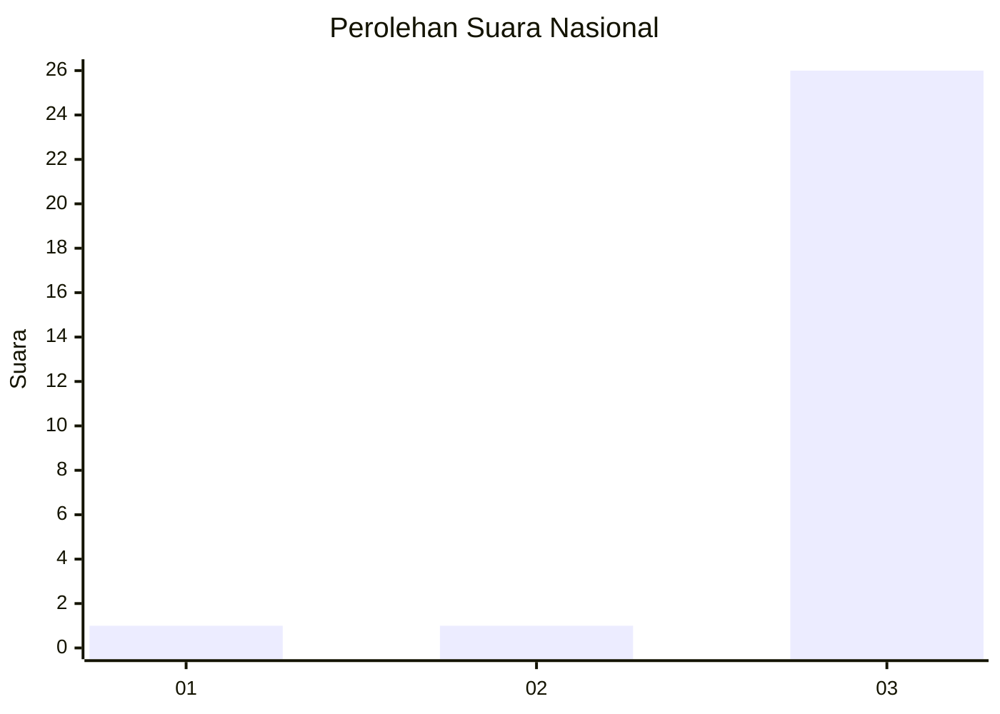
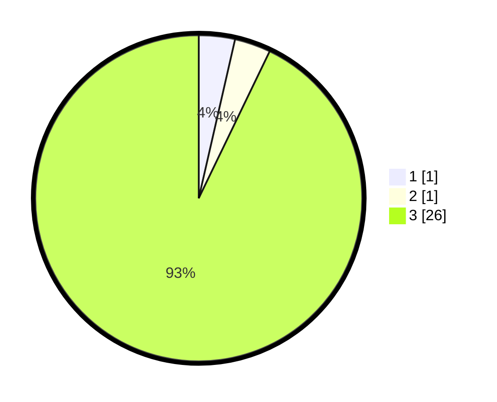

# Hasil

## Grafik

## Tabel

| No. | Nama Paslon    | Suara | Suara (raw) | Persentase |
|:--- |:-------------- | -----:| -----------:| ----------:|
| 1   | ANIES MUHAIMIN | 1     | [1][p-1]    | 3,57       |
| 2   | PRABOWO GIBRAN | 1     | [1][p-2]    | 3,57       |
| 3   | GANJAR MAHFUD  | 26    | [26][p-3]   | 92,86      |

[p-1]: https://github.com/gigit-pemilu/pemilu-2024/blob/main/pilpres/hitung-suara/sub/96-papua-barat-daya/sub/01-sorong/sub/04-beraur/sub/2028-sorain/sub/001-tps/sub/paslon-1.txt
[p-2]: https://github.com/gigit-pemilu/pemilu-2024/blob/main/pilpres/hitung-suara/sub/96-papua-barat-daya/sub/01-sorong/sub/04-beraur/sub/2028-sorain/sub/001-tps/sub/paslon-2.txt
[p-3]: https://github.com/gigit-pemilu/pemilu-2024/blob/main/pilpres/hitung-suara/sub/96-papua-barat-daya/sub/01-sorong/sub/04-beraur/sub/2028-sorain/sub/001-tps/sub/paslon-3.txt

## Foto C Plano

https://sirekap-obj-formc.kpu.go.id/28a6/pemilu/ppwp/96/01/04/20/28/9601042028001-20240223-123747--20f400e6-3ac8-4bcd-88c0-8224ed7a1fe5.jpg

https://sirekap-obj-formc.kpu.go.id/28a6/pemilu/ppwp/96/01/04/20/28/9601042028001-20240223-123927--008b5577-05b4-4fff-984f-4649d40e8589.jpg

https://sirekap-obj-formc.kpu.go.id/28a6/pemilu/ppwp/96/01/04/20/28/9601042028001-20240223-124122--e1ad2933-77b1-42ed-8205-6e3ef2986ead.jpg

## Metadata

| Key        | Value               |
| ---------- | ------------------- |
| Time Stamp | 2024-02-24 22:31:28 |

## DATA PEMILIH TETAP

Jumlah pemilih dalam DPT: **28**.
 * L: **15**.
 * P: **13**.

## DATA PENGGUNA HAK PILIH

Jumlah pengguna hak pilih dalam DPT: **28**.
 * L: **15**.
 * P: **13**.

Jumlah pengguna hak pilih dalam DPTb: **0**.
 * L: **0**.
 * P: **0**.

Jumlah pengguna hak pilih dalam DPK: **0**.
 * L: **0**.
 * P: **0**.

Jumlah pengguna hak pilih: **28**.
 * L: **15**.
 * P: **13**.

## JUMLAH SUARA SAH DAN TIDAK SAH

JUMLAH SELURUH SUARA SAH: **28**.

JUMLAH SUARA TIDAK SAH: **0**.

JUMLAH SELURUH SUARA SAH DAN SUARA TIDAK SAH: **28**.

