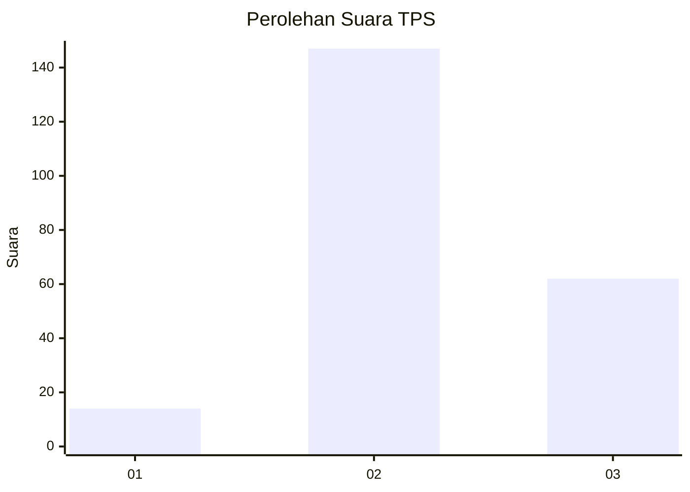

# Hasil

## Grafik

## Tabel

| No. | Nama Paslon    | Suara | Suara (raw) | Persentase |
|:--- |:-------------- | -----:| -----------:| ----------:|
| 1   | ANIES MUHAIMIN | 14    | [14][p-1]   | 6,28       |
| 2   | PRABOWO GIBRAN | 147   | [147][p-2]  | 65,92      |
| 3   | GANJAR MAHFUD  | 62    | [62][p-3]   | 27,80      |

[p-1]: https://github.com/gigit-pemilu/pemilu-2024-96-papua-barat-daya/blob/main/pilpres/hitung-suara/sub/96-papua-barat-daya/sub/01-sorong/sub/05-salawati/sub/1006-majener/sub/001-tps/sub/paslon-1.txt
[p-2]: https://github.com/gigit-pemilu/pemilu-2024-96-papua-barat-daya/blob/main/pilpres/hitung-suara/sub/96-papua-barat-daya/sub/01-sorong/sub/05-salawati/sub/1006-majener/sub/001-tps/sub/paslon-2.txt
[p-3]: https://github.com/gigit-pemilu/pemilu-2024-96-papua-barat-daya/blob/main/pilpres/hitung-suara/sub/96-papua-barat-daya/sub/01-sorong/sub/05-salawati/sub/1006-majener/sub/001-tps/sub/paslon-3.txt

## Foto C Plano

https://sirekap-obj-formc.kpu.go.id/0138/pemilu/ppwp/96/01/05/10/06/9601051006001-20240215-033603--b85edb51-6f0e-4d07-b859-d1a52d0f6cb3.jpg

https://sirekap-obj-formc.kpu.go.id/0138/pemilu/ppwp/96/01/05/10/06/9601051006001-20240215-033719--ddddff38-b82f-4d67-be7b-16cd046e568d.jpg

https://sirekap-obj-formc.kpu.go.id/0138/pemilu/ppwp/96/01/05/10/06/9601051006001-20240215-033836--9e5f9ff5-0cb0-4c51-aa63-f899fbc23b55.jpg

## Metadata

| Key        | Value               |
| ---------- | ------------------- |
| Time Stamp | 2024-02-19 06:16:00 |

