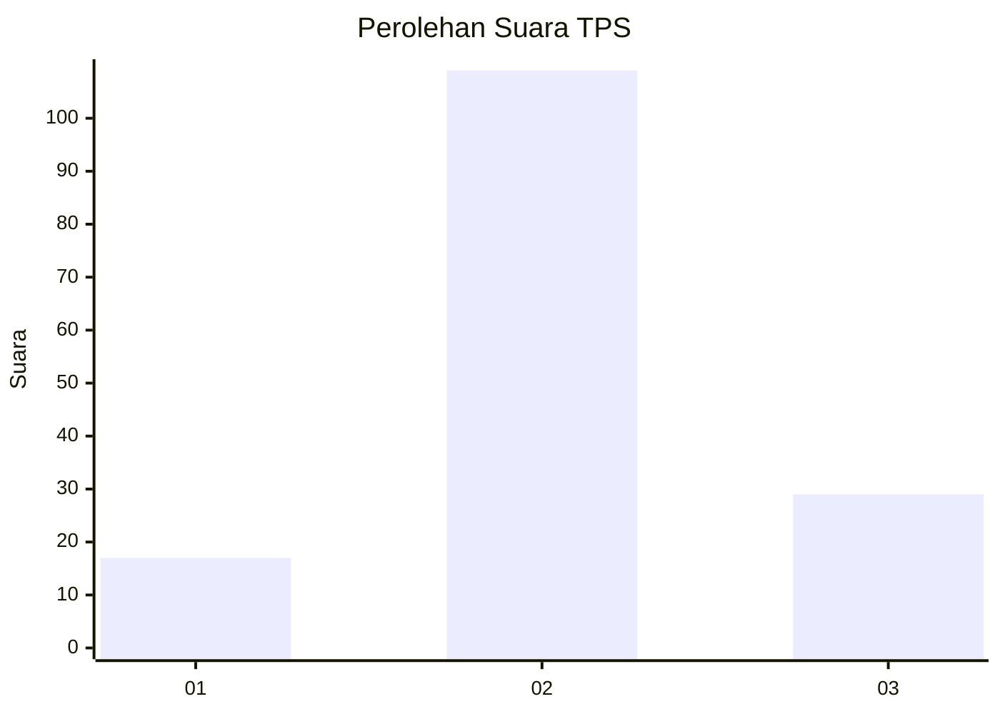
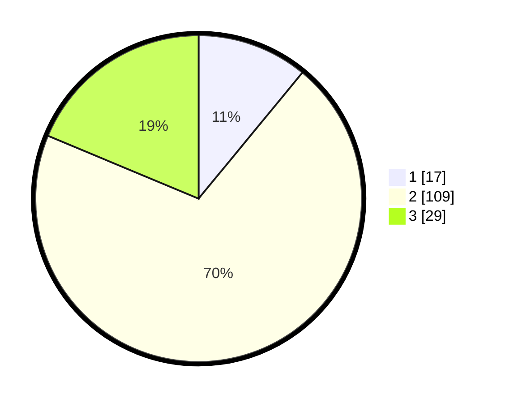

# Hasil

## Grafik

## Tabel

| No. | Nama Paslon    | Suara | Suara (raw) | Persentase |
|:--- |:-------------- | -----:| -----------:| ----------:|
| 1   | ANIES MUHAIMIN | 17    | [17][p-1]   | 10,97      |
| 2   | PRABOWO GIBRAN | 109   | [109][p-2]  | 70,32      |
| 3   | GANJAR MAHFUD  | 29    | [29][p-3]   | 18,71      |

[p-1]: https://github.com/gigit-pemilu/pemilu-2024-96-papua-barat-daya/blob/main/pilpres/hitung-suara/sub/96-papua-barat-daya/sub/01-sorong/sub/05-salawati/sub/1006-majener/sub/003-tps/sub/paslon-1.txt
[p-2]: https://github.com/gigit-pemilu/pemilu-2024-96-papua-barat-daya/blob/main/pilpres/hitung-suara/sub/96-papua-barat-daya/sub/01-sorong/sub/05-salawati/sub/1006-majener/sub/003-tps/sub/paslon-2.txt
[p-3]: https://github.com/gigit-pemilu/pemilu-2024-96-papua-barat-daya/blob/main/pilpres/hitung-suara/sub/96-papua-barat-daya/sub/01-sorong/sub/05-salawati/sub/1006-majener/sub/003-tps/sub/paslon-3.txt

## Foto C Plano

https://sirekap-obj-formc.kpu.go.id/2ab7/pemilu/ppwp/96/01/05/10/06/9601051006003-20240214-130226--a9bb55c5-b4e0-4992-a7cc-e4c00c000eeb.jpg

https://sirekap-obj-formc.kpu.go.id/2ab7/pemilu/ppwp/96/01/05/10/06/9601051006003-20240214-130738--ed5e130f-5609-4bc5-997b-a5a3f94554a3.jpg

https://sirekap-obj-formc.kpu.go.id/2ab7/pemilu/ppwp/96/01/05/10/06/9601051006003-20240214-131122--1a3d7ec7-e1aa-4b08-aa34-c863a9308276.jpg

## Metadata

| Key        | Value               |
| ---------- | ------------------- |
| Time Stamp | 2024-02-19 10:00:00 |

