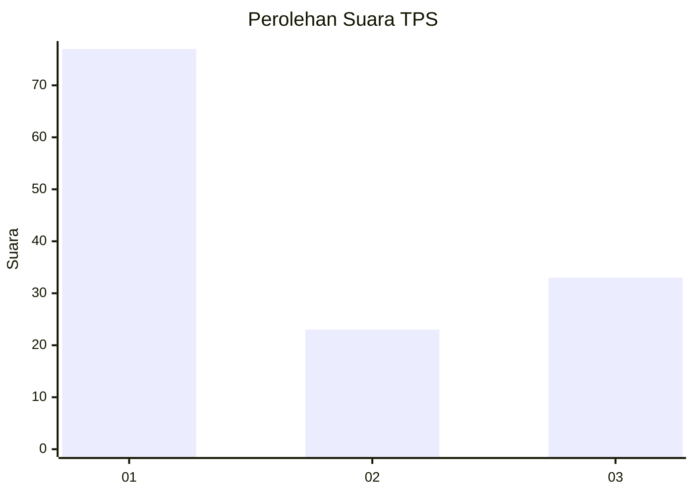
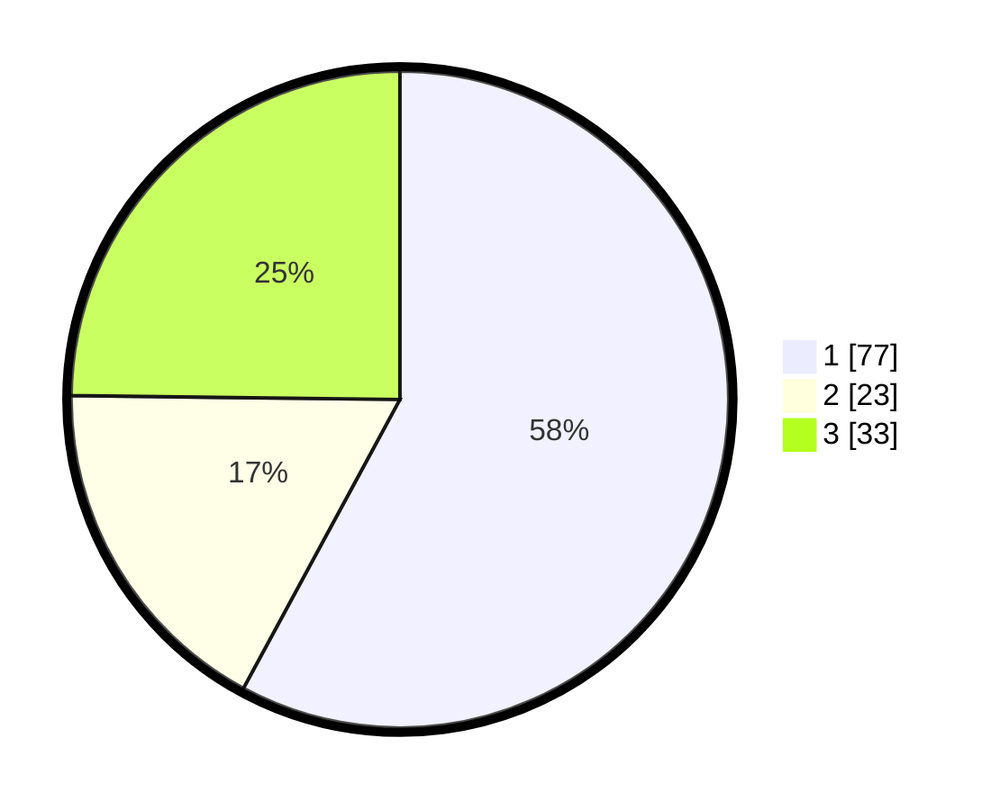

# Hasil

## Grafik

## Tabel

| No. | Nama Paslon    | Suara | Suara (raw) | Persentase |
|:--- |:-------------- | -----:| -----------:| ----------:|
| 1   | ANIES MUHAIMIN | 77    | [77][p-1]   | 57,89      |
| 2   | PRABOWO GIBRAN | 23    | [23][p-2]   | 17,29      |
| 3   | GANJAR MAHFUD  | 33    | [33][p-3]   | 24,81      |

[p-1]: https://github.com/gigit-pemilu/pemilu-2024-96-papua-barat-daya/blob/main/pilpres/hitung-suara/sub/96-papua-barat-daya/sub/01-sorong/sub/06-seget/sub/2004-malabam/sub/002-tps/sub/paslon-1.txt
[p-2]: https://github.com/gigit-pemilu/pemilu-2024-96-papua-barat-daya/blob/main/pilpres/hitung-suara/sub/96-papua-barat-daya/sub/01-sorong/sub/06-seget/sub/2004-malabam/sub/002-tps/sub/paslon-2.txt
[p-3]: https://github.com/gigit-pemilu/pemilu-2024-96-papua-barat-daya/blob/main/pilpres/hitung-suara/sub/96-papua-barat-daya/sub/01-sorong/sub/06-seget/sub/2004-malabam/sub/002-tps/sub/paslon-3.txt

## Foto C Plano

https://sirekap-obj-formc.kpu.go.id/4ab2/pemilu/ppwp/96/01/06/20/04/9601062004002-20240221-100452--e88db1cc-73d2-46e7-8925-0ddf68a02dac.jpg

https://sirekap-obj-formc.kpu.go.id/4ab2/pemilu/ppwp/96/01/06/20/04/9601062004002-20240221-093258--f391f334-e127-46cb-a66a-b40d7174fcf6.jpg

https://sirekap-obj-formc.kpu.go.id/4ab2/pemilu/ppwp/96/01/06/20/04/9601062004002-20240221-093314--356103d8-eb20-40ab-ac08-b62241c6fb1a.jpg

## Metadata

| Key        | Value               |
| ---------- | ------------------- |
| Time Stamp | 2024-02-24 22:31:28 |

