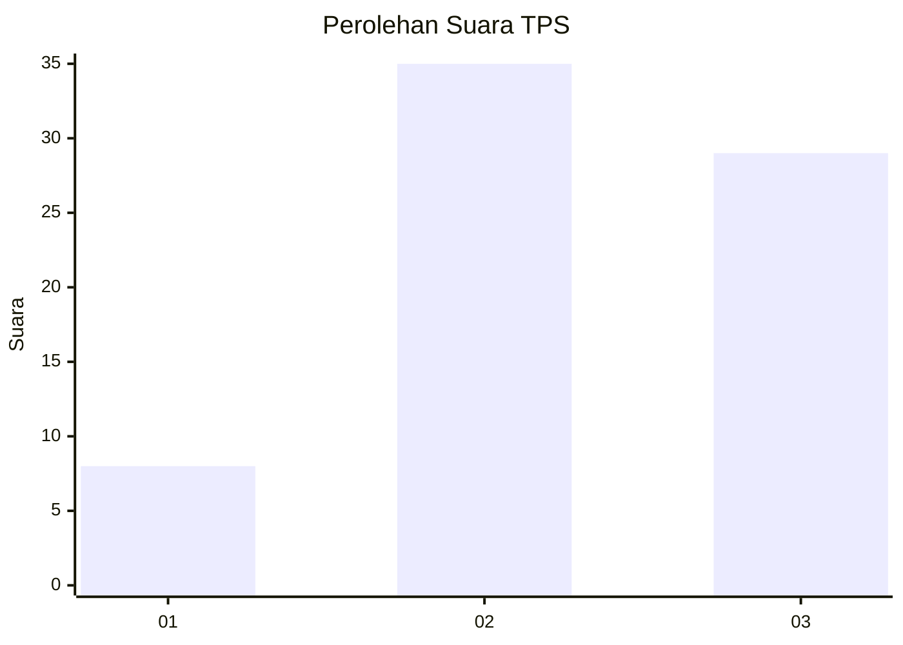
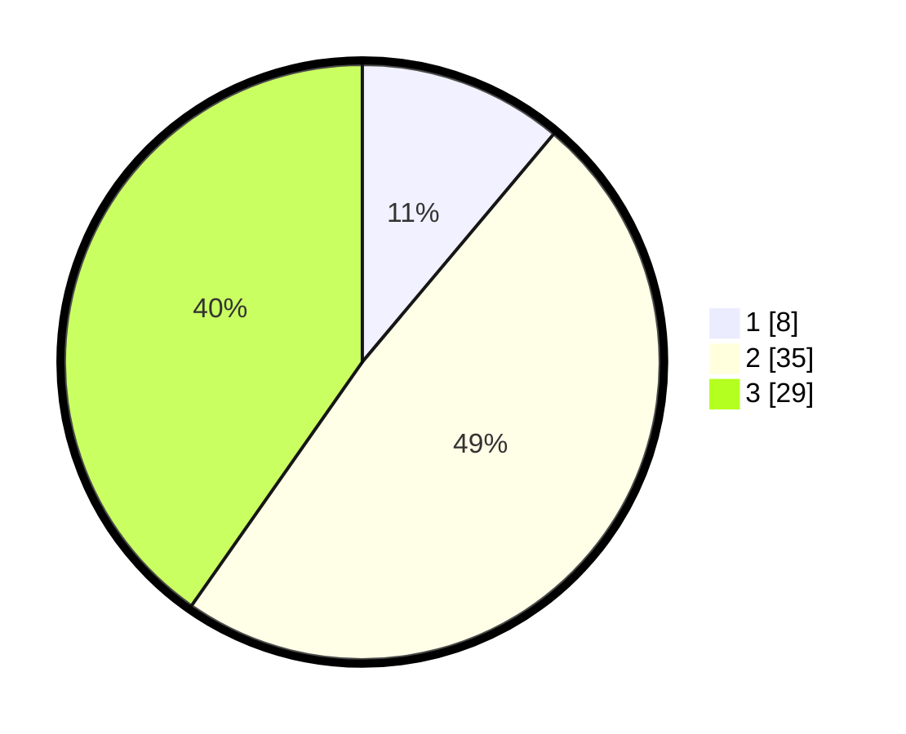

# Hasil

## Grafik

## Tabel

| No. | Nama Paslon    | Suara | Suara (raw) | Persentase |
|:--- |:-------------- | -----:| -----------:| ----------:|
| 1   | ANIES MUHAIMIN | 8     | [8][p-1]    | 11,11      |
| 2   | PRABOWO GIBRAN | 35    | [35][p-2]   | 48,61      |
| 3   | GANJAR MAHFUD  | 29    | [29][p-3]   | 40,28      |

[p-1]: https://github.com/gigit-pemilu/pemilu-2024-96-papua-barat-daya/blob/main/pilpres/hitung-suara/sub/96-papua-barat-daya/sub/01-sorong/sub/06-seget/sub/2005-pulau-kasim/sub/002-tps/sub/paslon-1.txt
[p-2]: https://github.com/gigit-pemilu/pemilu-2024-96-papua-barat-daya/blob/main/pilpres/hitung-suara/sub/96-papua-barat-daya/sub/01-sorong/sub/06-seget/sub/2005-pulau-kasim/sub/002-tps/sub/paslon-2.txt
[p-3]: https://github.com/gigit-pemilu/pemilu-2024-96-papua-barat-daya/blob/main/pilpres/hitung-suara/sub/96-papua-barat-daya/sub/01-sorong/sub/06-seget/sub/2005-pulau-kasim/sub/002-tps/sub/paslon-3.txt

## Foto C Plano

https://sirekap-obj-formc.kpu.go.id/8bcf/pemilu/ppwp/96/01/06/20/05/9601062005002-20240218-084635--db32d662-5cf5-41ef-8f21-57568595e796.jpg

https://sirekap-obj-formc.kpu.go.id/8bcf/pemilu/ppwp/96/01/06/20/05/9601062005002-20240218-084637--3a7dc9f5-c850-44d1-a141-84a8d81d837c.jpg

https://sirekap-obj-formc.kpu.go.id/8bcf/pemilu/ppwp/96/01/06/20/05/9601062005002-20240218-084636--d144218a-008a-4115-b8a9-f9b5d4c6ff73.jpg

## Metadata

| Key        | Value               |
| ---------- | ------------------- |
| Time Stamp | 2024-02-24 22:31:28 |

## DATA PEMILIH TETAP

Jumlah pemilih dalam DPT: **248**.
 * L: **142**.
 * P: **106**.

## DATA PENGGUNA HAK PILIH

Jumlah pengguna hak pilih dalam DPT: **57**.
 * L: **27**.
 * P: **30**.

Jumlah pengguna hak pilih dalam DPTb: **11**.
 * L: **11**.
 * P: **0**.

Jumlah pengguna hak pilih dalam DPK: **6**.
 * L: **4**.
 * P: **2**.

Jumlah pengguna hak pilih: **74**.
 * L: **42**.
 * P: **32**.

## JUMLAH SUARA SAH DAN TIDAK SAH

JUMLAH SELURUH SUARA SAH: **72**.

JUMLAH SUARA TIDAK SAH: **2**.

JUMLAH SELURUH SUARA SAH DAN SUARA TIDAK SAH: **74**.

