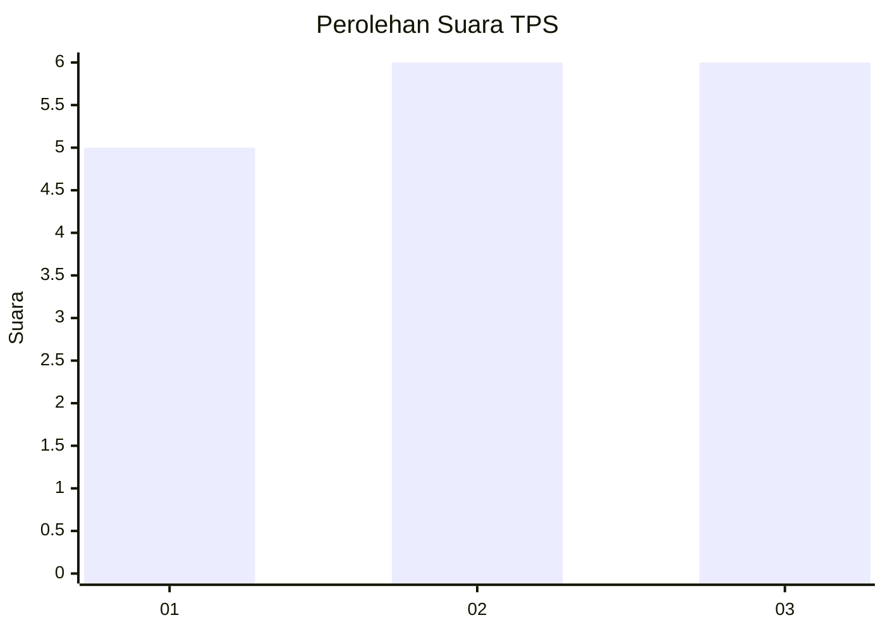
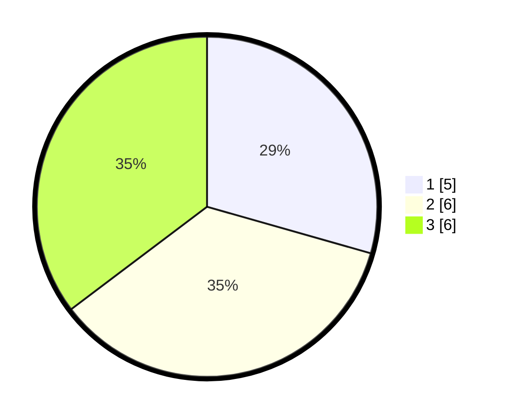

# Hasil

## Grafik

## Tabel

| No. | Nama Paslon    | Suara | Suara (raw) | Persentase |
|:--- |:-------------- | -----:| -----------:| ----------:|
| 1   | ANIES MUHAIMIN | 5     | [5][p-1]    | 29,41      |
| 2   | PRABOWO GIBRAN | 6     | [6][p-2]    | 35,29      |
| 3   | GANJAR MAHFUD  | 6     | [6][p-3]    | 35,29      |

[p-1]: https://github.com/gigit-pemilu/pemilu-2024-96-papua-barat-daya/blob/main/pilpres/hitung-suara/sub/96-papua-barat-daya/sub/01-sorong/sub/06-seget/sub/2005-pulau-kasim/sub/003-tps/sub/paslon-1.txt
[p-2]: https://github.com/gigit-pemilu/pemilu-2024-96-papua-barat-daya/blob/main/pilpres/hitung-suara/sub/96-papua-barat-daya/sub/01-sorong/sub/06-seget/sub/2005-pulau-kasim/sub/003-tps/sub/paslon-2.txt
[p-3]: https://github.com/gigit-pemilu/pemilu-2024-96-papua-barat-daya/blob/main/pilpres/hitung-suara/sub/96-papua-barat-daya/sub/01-sorong/sub/06-seget/sub/2005-pulau-kasim/sub/003-tps/sub/paslon-3.txt

## Foto C Plano

https://sirekap-obj-formc.kpu.go.id/6fd1/pemilu/ppwp/96/01/06/20/05/9601062005003-20240217-112301--ff32498b-39e6-4845-8446-1481f323ff12.jpg

https://sirekap-obj-formc.kpu.go.id/6fd1/pemilu/ppwp/96/01/06/20/05/9601062005003-20240216-001150--3561c479-a032-46c0-8976-90935f3b17d6.jpg

https://sirekap-obj-formc.kpu.go.id/6fd1/pemilu/ppwp/96/01/06/20/05/9601062005003-20240216-001149--563f5894-bbc0-401c-8eb9-32e6ea0f35c2.jpg

## Metadata

| Key        | Value               |
| ---------- | ------------------- |
| Time Stamp | 2024-02-22 17:00:00 |

## DATA PEMILIH TETAP

Jumlah pemilih dalam DPT: **76**.
 * L: **32**.
 * P: **44**.

## DATA PENGGUNA HAK PILIH

Jumlah pengguna hak pilih dalam DPT: **25**.
 * L: **12**.
 * P: **13**.

Jumlah pengguna hak pilih dalam DPTb: **3**.
 * L: **3**.
 * P: **0**.

Jumlah pengguna hak pilih dalam DPK: **5**.
 * L: **2**.
 * P: **3**.

Jumlah pengguna hak pilih: **33**.
 * L: **17**.
 * P: **16**.

## JUMLAH SUARA SAH DAN TIDAK SAH

JUMLAH SELURUH SUARA SAH: **17**.

JUMLAH SUARA TIDAK SAH: **0**.

JUMLAH SELURUH SUARA SAH DAN SUARA TIDAK SAH: **17**.

