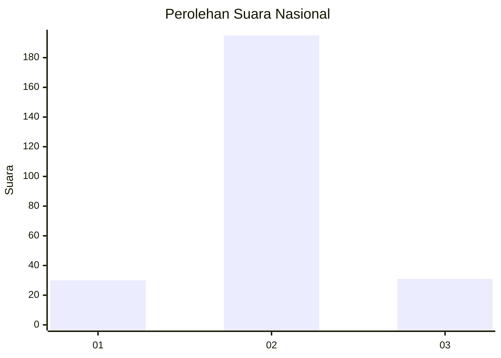
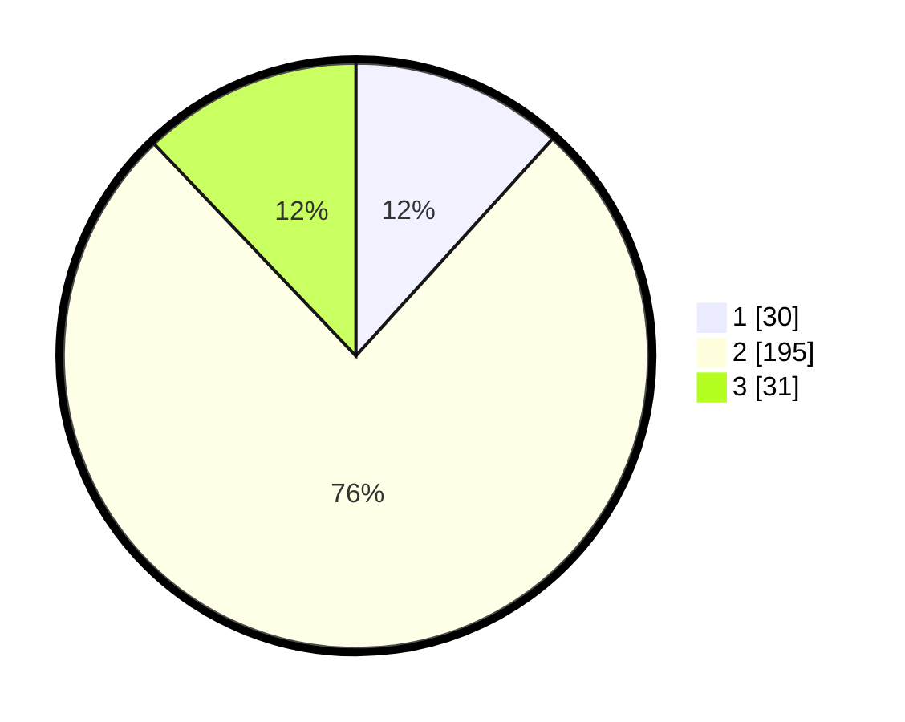

# Hasil

## Grafik

## Tabel

| No. | Nama Paslon    | Suara | Suara (raw) | Persentase |
|:--- |:-------------- | -----:| -----------:| ----------:|
| 1   | ANIES MUHAIMIN | 30    | [30][p-1]   | 11,72      |
| 2   | PRABOWO GIBRAN | 195   | [195][p-2]  | 76,17      |
| 3   | GANJAR MAHFUD  | 31    | [31][p-3]   | 12,11      |

[p-1]: https://github.com/gigit-pemilu/pemilu-2024/blob/main/pilpres/hitung-suara/sub/96-papua-barat-daya/sub/01-sorong/sub/07-aimas/sub/1001-aimas/sub/003-tps/sub/paslon-1.txt
[p-2]: https://github.com/gigit-pemilu/pemilu-2024/blob/main/pilpres/hitung-suara/sub/96-papua-barat-daya/sub/01-sorong/sub/07-aimas/sub/1001-aimas/sub/003-tps/sub/paslon-2.txt
[p-3]: https://github.com/gigit-pemilu/pemilu-2024/blob/main/pilpres/hitung-suara/sub/96-papua-barat-daya/sub/01-sorong/sub/07-aimas/sub/1001-aimas/sub/003-tps/sub/paslon-3.txt

## Foto C Plano

https://sirekap-obj-formc.kpu.go.id/1efb/pemilu/ppwp/96/01/07/10/01/9601071001003-20240215-074439--b7a6d73c-6bef-49bd-923d-698d043b08aa.jpg

https://sirekap-obj-formc.kpu.go.id/1efb/pemilu/ppwp/96/01/07/10/01/9601071001003-20240215-074935--ac4e9f35-5ae0-4eab-80fb-8a25c018577f.jpg

https://sirekap-obj-formc.kpu.go.id/1efb/pemilu/ppwp/96/01/07/10/01/9601071001003-20240215-075338--e56ad2a2-0b62-422a-9f3b-588ce0620561.jpg

## Metadata

| Key        | Value               |
| ---------- | ------------------- |
| Time Stamp | 2024-02-16 16:25:10 |

