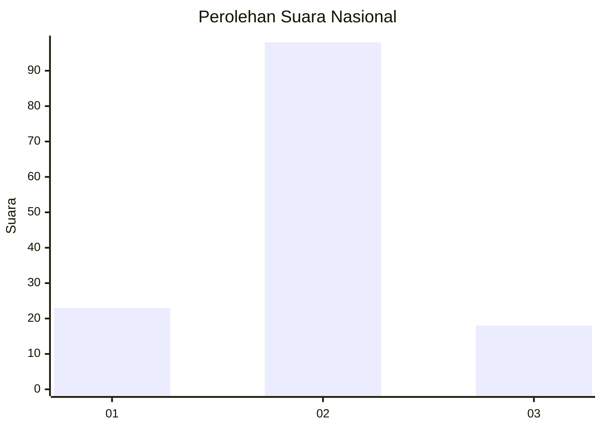
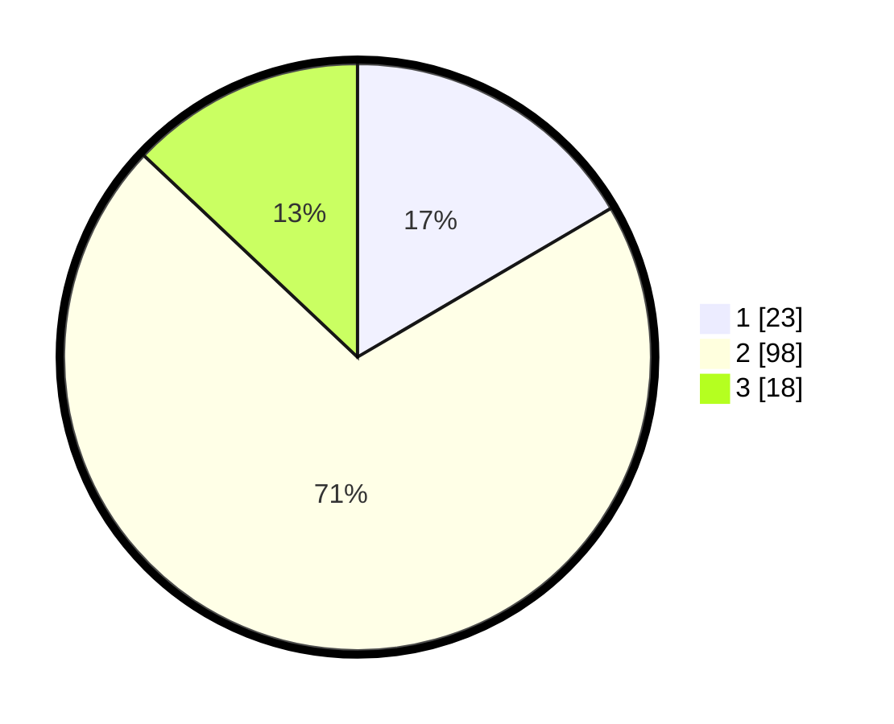

# Hasil

## Grafik

## Tabel

| No. | Nama Paslon    | Suara | Suara (raw) | Persentase |
|:--- |:-------------- | -----:| -----------:| ----------:|
| 1   | ANIES MUHAIMIN | 23    | [23][p-1]   | 16,55      |
| 2   | PRABOWO GIBRAN | 98    | [98][p-2]   | 70,50      |
| 3   | GANJAR MAHFUD  | 18    | [18][p-3]   | 12,95      |

[p-1]: https://github.com/gigit-pemilu/pemilu-2024/blob/main/pilpres/hitung-suara/sub/96-papua-barat-daya/sub/01-sorong/sub/07-aimas/sub/1001-aimas/sub/004-tps/sub/paslon-1.txt
[p-2]: https://github.com/gigit-pemilu/pemilu-2024/blob/main/pilpres/hitung-suara/sub/96-papua-barat-daya/sub/01-sorong/sub/07-aimas/sub/1001-aimas/sub/004-tps/sub/paslon-2.txt
[p-3]: https://github.com/gigit-pemilu/pemilu-2024/blob/main/pilpres/hitung-suara/sub/96-papua-barat-daya/sub/01-sorong/sub/07-aimas/sub/1001-aimas/sub/004-tps/sub/paslon-3.txt

## Foto C Plano

https://sirekap-obj-formc.kpu.go.id/1032/pemilu/ppwp/96/01/07/10/01/9601071001004-20240215-001302--605f96f7-ae03-4057-8ccc-0344c910d6c6.jpg

https://sirekap-obj-formc.kpu.go.id/1032/pemilu/ppwp/96/01/07/10/01/9601071001004-20240215-001439--540a95f4-d2c1-4949-8a8a-2d17229ddce2.jpg

https://sirekap-obj-formc.kpu.go.id/1032/pemilu/ppwp/96/01/07/10/01/9601071001004-20240215-020942--d6564cdb-8d8a-4560-9d9b-d1ad2c760399.jpg

## Metadata

| Key        | Value               |
| ---------- | ------------------- |
| Time Stamp | 2024-02-16 16:25:10 |

