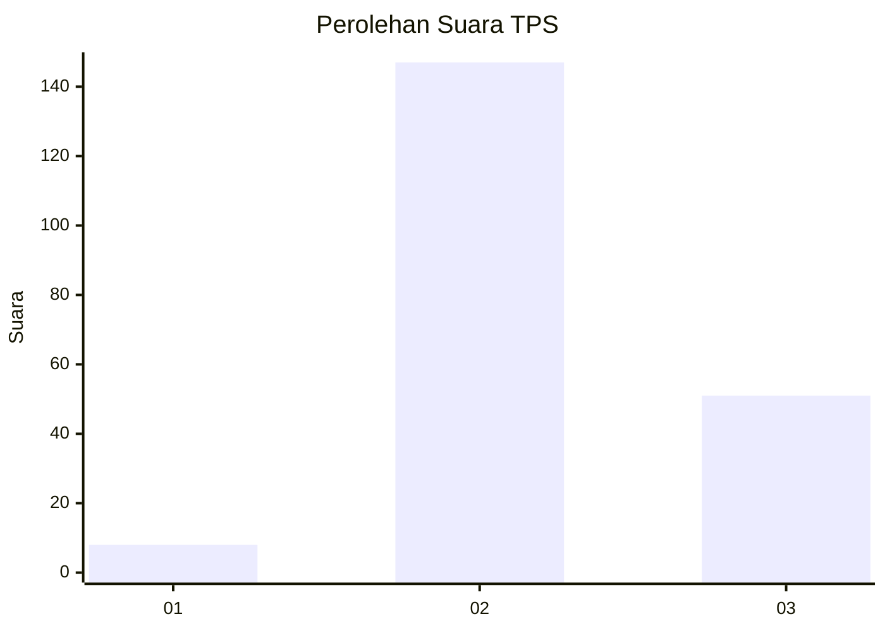
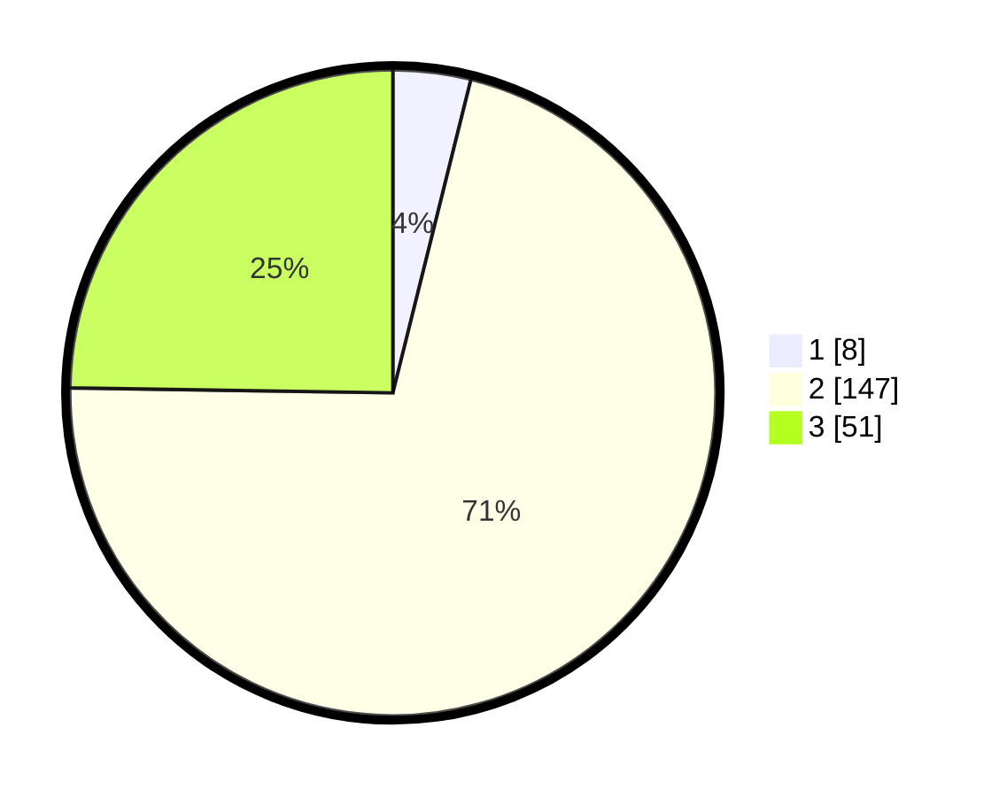

# Hasil

## Grafik

## Tabel

| No. | Nama Paslon    | Suara | Suara (raw) | Persentase |
|:--- |:-------------- | -----:| -----------:| ----------:|
| 1   | ANIES MUHAIMIN | 8     | [8][p-1]    | 3,88       |
| 2   | PRABOWO GIBRAN | 147   | [147][p-2]  | 71,36      |
| 3   | GANJAR MAHFUD  | 51    | [51][p-3]   | 24,76      |

[p-1]: https://github.com/gigit-pemilu/pemilu-2024-96-papua-barat-daya/blob/main/pilpres/hitung-suara/sub/96-papua-barat-daya/sub/01-sorong/sub/07-aimas/sub/1001-aimas/sub/009-tps/sub/paslon-1.txt
[p-2]: https://github.com/gigit-pemilu/pemilu-2024-96-papua-barat-daya/blob/main/pilpres/hitung-suara/sub/96-papua-barat-daya/sub/01-sorong/sub/07-aimas/sub/1001-aimas/sub/009-tps/sub/paslon-2.txt
[p-3]: https://github.com/gigit-pemilu/pemilu-2024-96-papua-barat-daya/blob/main/pilpres/hitung-suara/sub/96-papua-barat-daya/sub/01-sorong/sub/07-aimas/sub/1001-aimas/sub/009-tps/sub/paslon-3.txt

## Foto C Plano

https://sirekap-obj-formc.kpu.go.id/7b46/pemilu/ppwp/96/01/07/10/01/9601071001009-20240215-105022--5d0f8b91-ea42-4eed-9858-75f29ca5c57d.jpg

https://sirekap-obj-formc.kpu.go.id/7b46/pemilu/ppwp/96/01/07/10/01/9601071001009-20240215-105053--de09ced8-1f06-4743-8356-95e9c54d38be.jpg

https://sirekap-obj-formc.kpu.go.id/7b46/pemilu/ppwp/96/01/07/10/01/9601071001009-20240215-104955--37f623c7-8773-4bee-b2d5-c8237d5b02c3.jpg

## Metadata

| Key        | Value               |
| ---------- | ------------------- |
| Time Stamp | 2024-02-16 16:25:10 |

