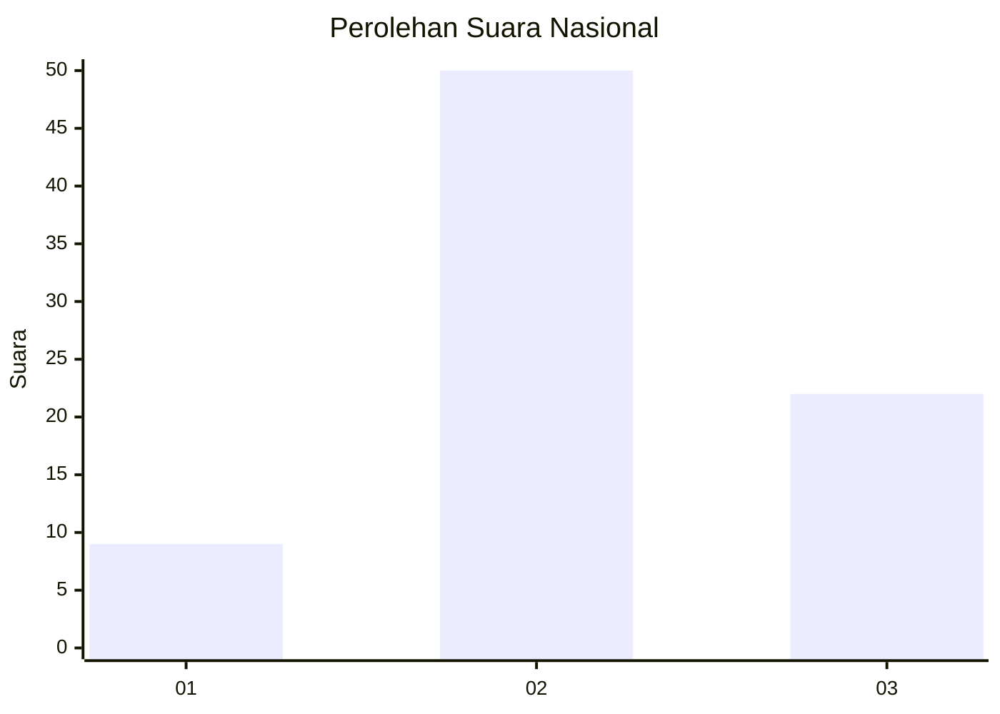
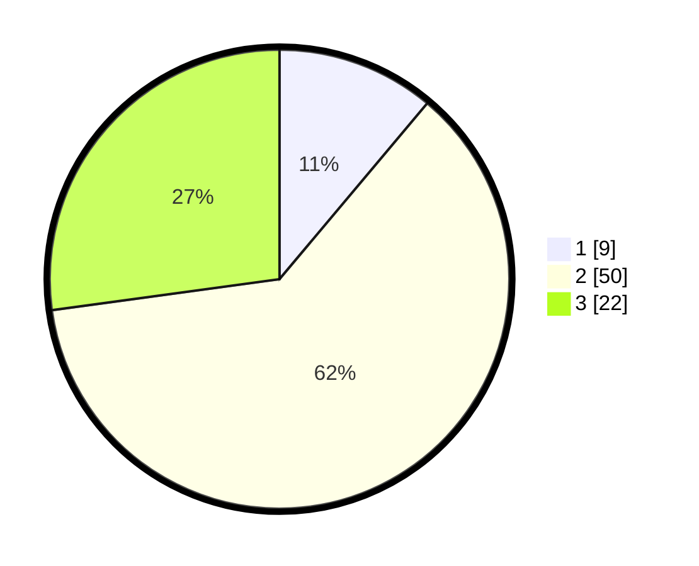

# Hasil

## Grafik

## Tabel

| No. | Nama Paslon    | Suara | Suara (raw) | Persentase |
|:--- |:-------------- | -----:| -----------:| ----------:|
| 1   | ANIES MUHAIMIN | 9     | [9][p-1]    | 11,11      |
| 2   | PRABOWO GIBRAN | 50    | [50][p-2]   | 61,73      |
| 3   | GANJAR MAHFUD  | 22    | [22][p-3]   | 27,16      |

[p-1]: https://github.com/gigit-pemilu/pemilu-2024/blob/main/pilpres/hitung-suara/sub/96-papua-barat-daya/sub/01-sorong/sub/07-aimas/sub/1001-aimas/sub/023-tps/sub/paslon-1.txt
[p-2]: https://github.com/gigit-pemilu/pemilu-2024/blob/main/pilpres/hitung-suara/sub/96-papua-barat-daya/sub/01-sorong/sub/07-aimas/sub/1001-aimas/sub/023-tps/sub/paslon-2.txt
[p-3]: https://github.com/gigit-pemilu/pemilu-2024/blob/main/pilpres/hitung-suara/sub/96-papua-barat-daya/sub/01-sorong/sub/07-aimas/sub/1001-aimas/sub/023-tps/sub/paslon-3.txt

## Foto C Plano

https://sirekap-obj-formc.kpu.go.id/87eb/pemilu/ppwp/96/01/07/10/01/9601071001023-20240215-013057--644aa538-0d85-463e-b1b4-0db1e7a74455.jpg

https://sirekap-obj-formc.kpu.go.id/87eb/pemilu/ppwp/96/01/07/10/01/9601071001023-20240215-065531--31cea26b-5a2a-484c-ba6a-80c0c8b70484.jpg

https://sirekap-obj-formc.kpu.go.id/87eb/pemilu/ppwp/96/01/07/10/01/9601071001023-20240215-072108--e79bdb30-7ef1-48ea-a890-5c90b570ac5c.jpg

## Metadata

| Key        | Value               |
| ---------- | ------------------- |
| Time Stamp | 2024-02-17 16:00:02 |

