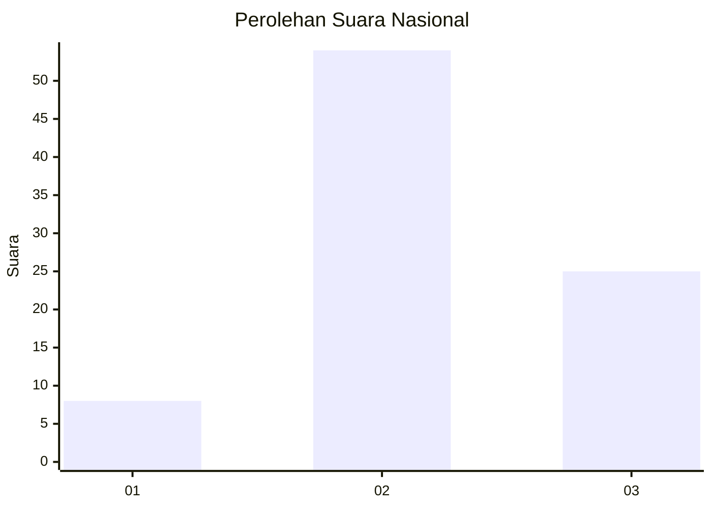
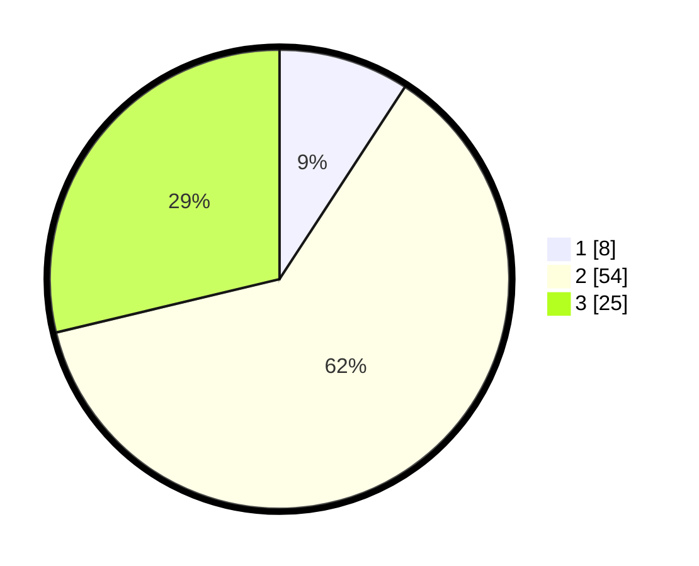

# Hasil

## Grafik

## Tabel

| No. | Nama Paslon    | Suara | Suara (raw) | Persentase |
|:--- |:-------------- | -----:| -----------:| ----------:|
| 1   | ANIES MUHAIMIN | 8     | [8][p-1]    | 9,20       |
| 2   | PRABOWO GIBRAN | 54    | [54][p-2]   | 62,07      |
| 3   | GANJAR MAHFUD  | 25    | [25][p-3]   | 28,74      |

[p-1]: https://github.com/gigit-pemilu/pemilu-2024/blob/main/pilpres/hitung-suara/sub/96-papua-barat-daya/sub/01-sorong/sub/07-aimas/sub/1001-aimas/sub/024-tps/sub/paslon-1.txt
[p-2]: https://github.com/gigit-pemilu/pemilu-2024/blob/main/pilpres/hitung-suara/sub/96-papua-barat-daya/sub/01-sorong/sub/07-aimas/sub/1001-aimas/sub/024-tps/sub/paslon-2.txt
[p-3]: https://github.com/gigit-pemilu/pemilu-2024/blob/main/pilpres/hitung-suara/sub/96-papua-barat-daya/sub/01-sorong/sub/07-aimas/sub/1001-aimas/sub/024-tps/sub/paslon-3.txt

## Foto C Plano

https://sirekap-obj-formc.kpu.go.id/0fe8/pemilu/ppwp/96/01/07/10/01/9601071001024-20240214-204511--a35b3df5-ffdd-4626-a477-cfd7f76136ea.jpg

https://sirekap-obj-formc.kpu.go.id/0fe8/pemilu/ppwp/96/01/07/10/01/9601071001024-20240214-204620--b190f876-786e-43e3-878c-24eaf440cb82.jpg

https://sirekap-obj-formc.kpu.go.id/0fe8/pemilu/ppwp/96/01/07/10/01/9601071001024-20240214-204750--c6a56544-913a-4fb7-8ad3-8fbae4fabdd1.jpg

## Metadata

| Key        | Value               |
| ---------- | ------------------- |
| Time Stamp | 2024-02-17 16:00:02 |

