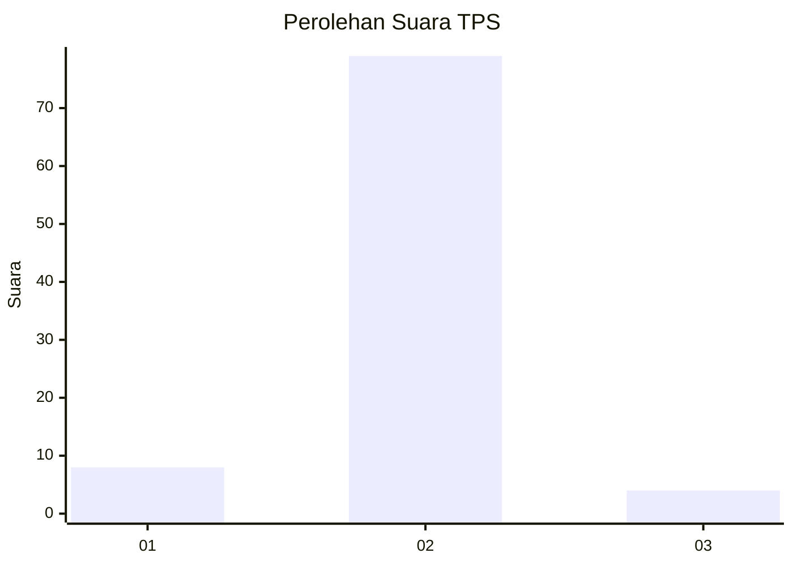
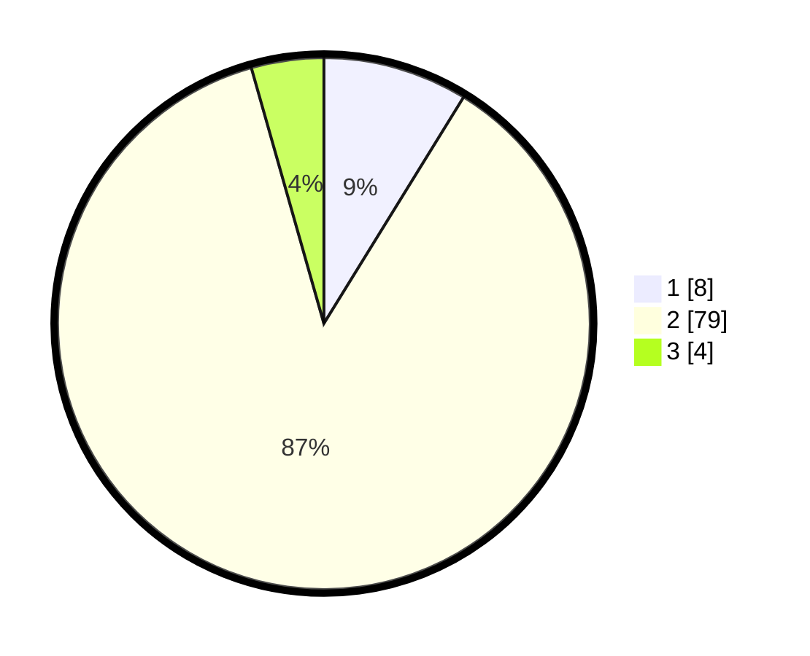

# Hasil

## Grafik

## Tabel

| No. | Nama Paslon    | Suara | Suara (raw) | Persentase |
|:--- |:-------------- | -----:| -----------:| ----------:|
| 1   | ANIES MUHAIMIN | 8     | [8][p-1]    | 8,79       |
| 2   | PRABOWO GIBRAN | 79    | [79][p-2]   | 86,81      |
| 3   | GANJAR MAHFUD  | 4     | [4][p-3]    | 4,40       |

[p-1]: https://github.com/gigit-pemilu/pemilu-2024-96-papua-barat-daya/blob/main/pilpres/hitung-suara/sub/96-papua-barat-daya/sub/01-sorong/sub/07-aimas/sub/1002-malawili/sub/001-tps/sub/paslon-1.txt
[p-2]: https://github.com/gigit-pemilu/pemilu-2024-96-papua-barat-daya/blob/main/pilpres/hitung-suara/sub/96-papua-barat-daya/sub/01-sorong/sub/07-aimas/sub/1002-malawili/sub/001-tps/sub/paslon-2.txt
[p-3]: https://github.com/gigit-pemilu/pemilu-2024-96-papua-barat-daya/blob/main/pilpres/hitung-suara/sub/96-papua-barat-daya/sub/01-sorong/sub/07-aimas/sub/1002-malawili/sub/001-tps/sub/paslon-3.txt

## Foto C Plano

https://sirekap-obj-formc.kpu.go.id/8a35/pemilu/ppwp/96/01/07/10/02/9601071002001-20240214-212938--eb502822-5277-433f-8547-049a5f3a838e.jpg

https://sirekap-obj-formc.kpu.go.id/8a35/pemilu/ppwp/96/01/07/10/02/9601071002001-20240214-213008--93419788-bb3e-4574-91f1-036f8b7e451a.jpg

https://sirekap-obj-formc.kpu.go.id/8a35/pemilu/ppwp/96/01/07/10/02/9601071002001-20240214-213039--69cae77d-dc39-4345-a3e0-e2a1ce849d72.jpg

## Metadata

| Key        | Value               |
| ---------- | ------------------- |
| Time Stamp | 2024-02-25 15:00:00 |

