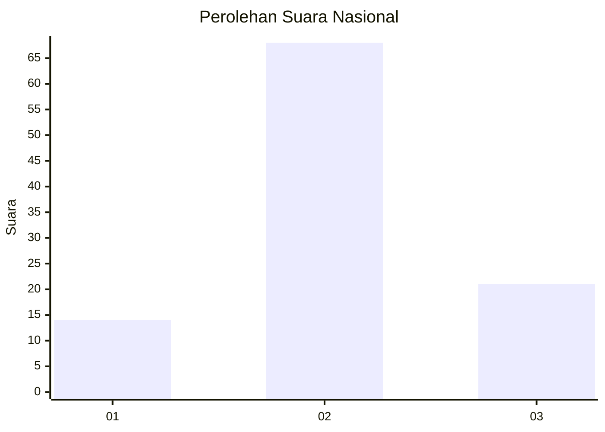
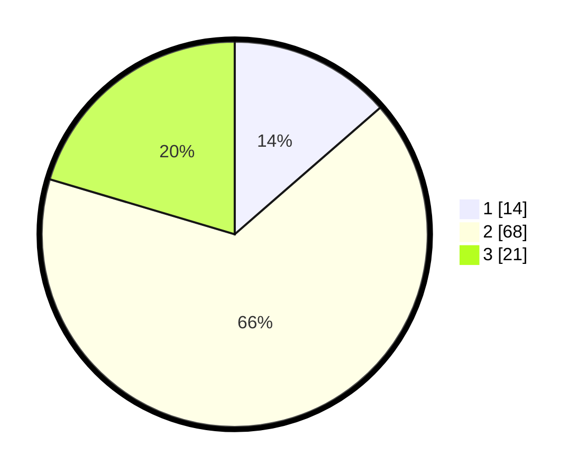

# Hasil

## Grafik

## Tabel

| No. | Nama Paslon    | Suara | Suara (raw) | Persentase |
|:--- |:-------------- | -----:| -----------:| ----------:|
| 1   | ANIES MUHAIMIN | 14    | [14][p-1]   | 13,59      |
| 2   | PRABOWO GIBRAN | 68    | [68][p-2]   | 66,02      |
| 3   | GANJAR MAHFUD  | 21    | [21][p-3]   | 20,39      |

[p-1]: https://github.com/gigit-pemilu/pemilu-2024/blob/main/pilpres/hitung-suara/sub/96-papua-barat-daya/sub/01-sorong/sub/07-aimas/sub/1034-malagusa/sub/005-tps/sub/paslon-1.txt
[p-2]: https://github.com/gigit-pemilu/pemilu-2024/blob/main/pilpres/hitung-suara/sub/96-papua-barat-daya/sub/01-sorong/sub/07-aimas/sub/1034-malagusa/sub/005-tps/sub/paslon-2.txt
[p-3]: https://github.com/gigit-pemilu/pemilu-2024/blob/main/pilpres/hitung-suara/sub/96-papua-barat-daya/sub/01-sorong/sub/07-aimas/sub/1034-malagusa/sub/005-tps/sub/paslon-3.txt

## Foto C Plano

https://sirekap-obj-formc.kpu.go.id/69c5/pemilu/ppwp/96/01/07/10/34/9601071034005-20240214-221444--a3e55f63-f35a-480f-991e-5b72937005f2.jpg

https://sirekap-obj-formc.kpu.go.id/69c5/pemilu/ppwp/96/01/07/10/34/9601071034005-20240215-012850--b367fe3e-bfbe-4bd4-8473-4387899a34ea.jpg

https://sirekap-obj-formc.kpu.go.id/69c5/pemilu/ppwp/96/01/07/10/34/9601071034005-20240214-222057--c7f91ac3-f117-4055-a0a0-b91d2265aa16.jpg

## Metadata

| Key        | Value               |
| ---------- | ------------------- |
| Time Stamp | 2024-02-25 17:00:00 |

