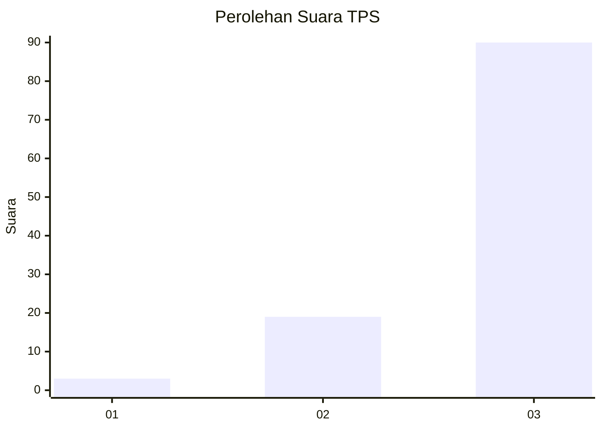
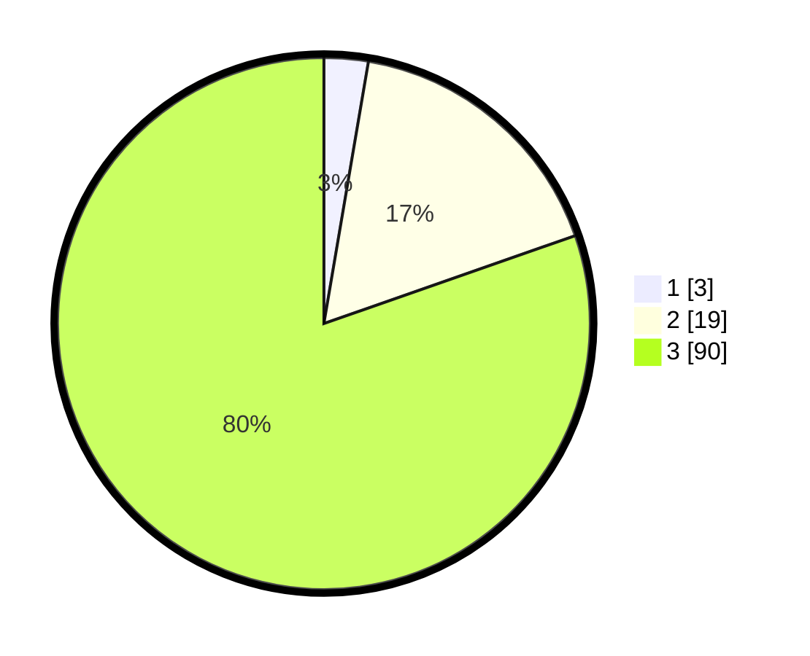

# Hasil

## Grafik

## Tabel

| No. | Nama Paslon    | Suara | Suara (raw) | Persentase |
|:--- |:-------------- | -----:| -----------:| ----------:|
| 1   | ANIES MUHAIMIN | 3     | [3][p-1]    | 2,68       |
| 2   | PRABOWO GIBRAN | 19    | [19][p-2]   | 16,96      |
| 3   | GANJAR MAHFUD  | 90    | [90][p-3]   | 80,36      |

[p-1]: https://github.com/gigit-pemilu/pemilu-2024-96-papua-barat-daya/blob/main/pilpres/hitung-suara/sub/96-papua-barat-daya/sub/01-sorong/sub/07-aimas/sub/2038-malasaum/sub/001-tps/sub/paslon-1.txt
[p-2]: https://github.com/gigit-pemilu/pemilu-2024-96-papua-barat-daya/blob/main/pilpres/hitung-suara/sub/96-papua-barat-daya/sub/01-sorong/sub/07-aimas/sub/2038-malasaum/sub/001-tps/sub/paslon-2.txt
[p-3]: https://github.com/gigit-pemilu/pemilu-2024-96-papua-barat-daya/blob/main/pilpres/hitung-suara/sub/96-papua-barat-daya/sub/01-sorong/sub/07-aimas/sub/2038-malasaum/sub/001-tps/sub/paslon-3.txt

## Foto C Plano

https://sirekap-obj-formc.kpu.go.id/d070/pemilu/ppwp/96/01/07/20/38/9601072038001-20240215-085546--b750fb1f-db6a-4145-bd2c-606314fcfbd7.jpg

https://sirekap-obj-formc.kpu.go.id/d070/pemilu/ppwp/96/01/07/20/38/9601072038001-20240215-085428--d1bdb709-a83b-49b6-8d64-f2e813f151b6.jpg

https://sirekap-obj-formc.kpu.go.id/d070/pemilu/ppwp/96/01/07/20/38/9601072038001-20240215-085848--97e6a461-289d-4c20-8731-df0b21db9705.jpg

## Metadata

| Key        | Value               |
| ---------- | ------------------- |
| Time Stamp | 2024-02-25 08:00:00 |

