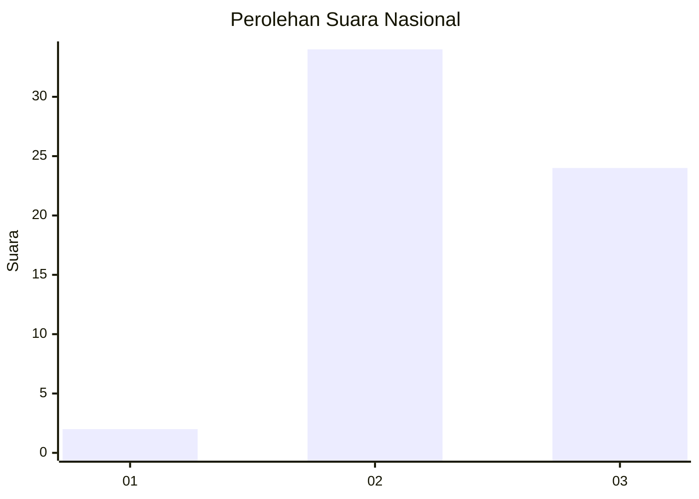
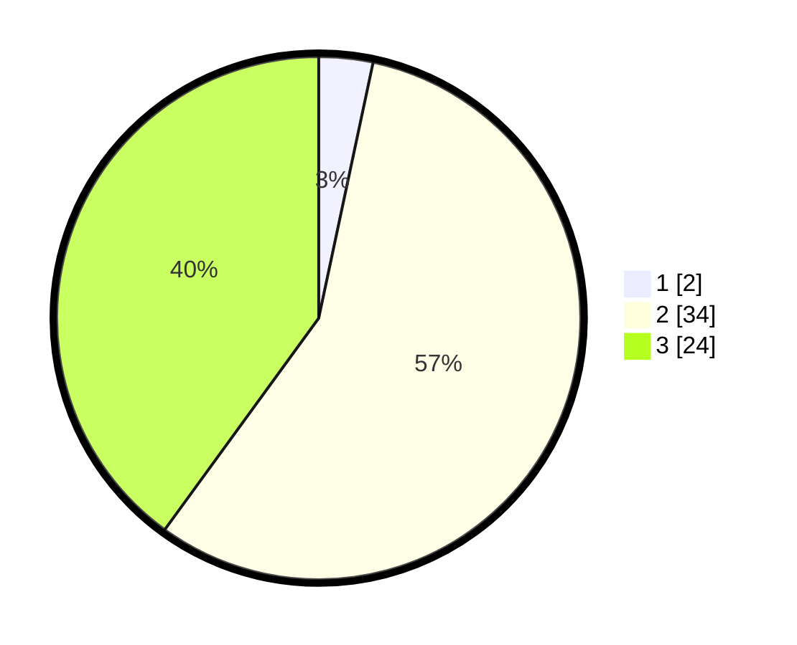

# Hasil

## Grafik

## Tabel

| No. | Nama Paslon    | Suara | Suara (raw) | Persentase |
|:--- |:-------------- | -----:| -----------:| ----------:|
| 1   | ANIES MUHAIMIN | 2     | [2][p-1]    | 3,33       |
| 2   | PRABOWO GIBRAN | 34    | [34][p-2]   | 56,67      |
| 3   | GANJAR MAHFUD  | 24    | [24][p-3]   | 40,00      |

[p-1]: https://github.com/gigit-pemilu/pemilu-2024/blob/main/pilpres/hitung-suara/sub/96-papua-barat-daya/sub/01-sorong/sub/10-sayosa/sub/2012-klamintu/sub/001-tps/sub/paslon-1.txt
[p-2]: https://github.com/gigit-pemilu/pemilu-2024/blob/main/pilpres/hitung-suara/sub/96-papua-barat-daya/sub/01-sorong/sub/10-sayosa/sub/2012-klamintu/sub/001-tps/sub/paslon-2.txt
[p-3]: https://github.com/gigit-pemilu/pemilu-2024/blob/main/pilpres/hitung-suara/sub/96-papua-barat-daya/sub/01-sorong/sub/10-sayosa/sub/2012-klamintu/sub/001-tps/sub/paslon-3.txt

## Foto C Plano

https://sirekap-obj-formc.kpu.go.id/5101/pemilu/ppwp/96/01/10/20/12/9601102012001-20240222-085933--c098e248-fcba-4ff8-9120-0b0155b5b188.jpg

https://sirekap-obj-formc.kpu.go.id/5101/pemilu/ppwp/96/01/10/20/12/9601102012001-20240222-090024--0b2dea15-e639-4645-a159-027897a7357c.jpg

https://sirekap-obj-formc.kpu.go.id/5101/pemilu/ppwp/96/01/10/20/12/9601102012001-20240222-090148--f14abfad-f2e0-43e6-b6fe-0c6fffd7d40b.jpg

## Metadata

| Key        | Value               |
| ---------- | ------------------- |
| Time Stamp | 2024-02-24 22:31:28 |

