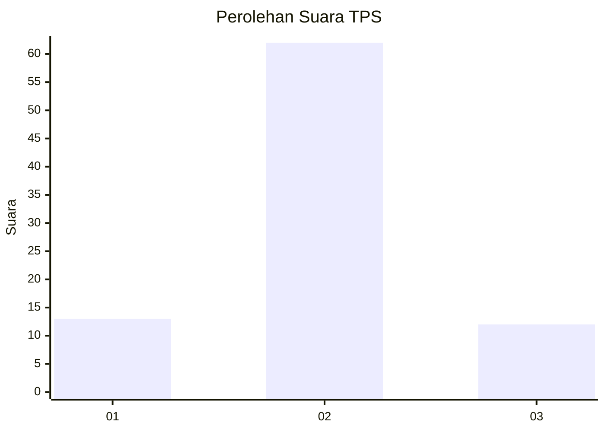
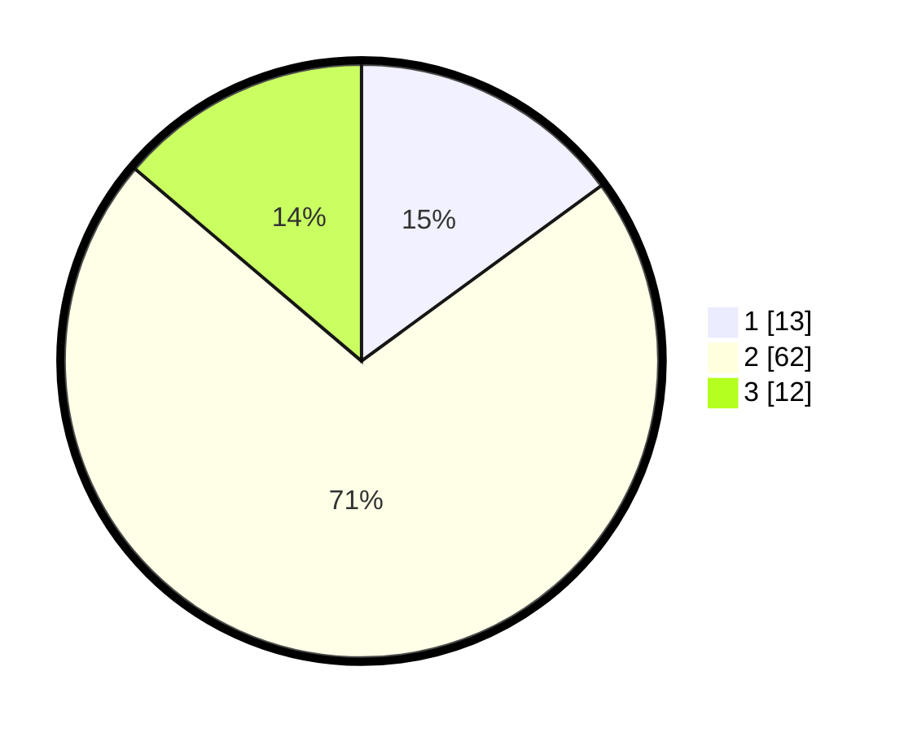

# Hasil

## Grafik

## Tabel

| No. | Nama Paslon    | Suara | Suara (raw) | Persentase |
|:--- |:-------------- | -----:| -----------:| ----------:|
| 1   | ANIES MUHAIMIN | 13    | [13][p-1]   | 14,94      |
| 2   | PRABOWO GIBRAN | 62    | [62][p-2]   | 71,26      |
| 3   | GANJAR MAHFUD  | 12    | [12][p-3]   | 13,79      |

[p-1]: https://github.com/gigit-pemilu/pemilu-2024-96-papua-barat-daya/blob/main/pilpres/hitung-suara/sub/96-papua-barat-daya/sub/01-sorong/sub/13-mayamuk/sub/1003-makotyamsa/sub/008-tps/sub/paslon-1.txt
[p-2]: https://github.com/gigit-pemilu/pemilu-2024-96-papua-barat-daya/blob/main/pilpres/hitung-suara/sub/96-papua-barat-daya/sub/01-sorong/sub/13-mayamuk/sub/1003-makotyamsa/sub/008-tps/sub/paslon-2.txt
[p-3]: https://github.com/gigit-pemilu/pemilu-2024-96-papua-barat-daya/blob/main/pilpres/hitung-suara/sub/96-papua-barat-daya/sub/01-sorong/sub/13-mayamuk/sub/1003-makotyamsa/sub/008-tps/sub/paslon-3.txt

## Foto C Plano

https://sirekap-obj-formc.kpu.go.id/6c20/pemilu/ppwp/96/01/13/10/03/9601131003008-20240215-002837--5bc638b3-42cb-493e-a87f-415ede697234.jpg

https://sirekap-obj-formc.kpu.go.id/6c20/pemilu/ppwp/96/01/13/10/03/9601131003008-20240215-002851--281c4319-805e-4f19-ab8c-95932f2ac342.jpg

https://sirekap-obj-formc.kpu.go.id/6c20/pemilu/ppwp/96/01/13/10/03/9601131003008-20240215-002856--c3933acf-3468-494b-8075-012a0e81d26a.jpg

## Metadata

| Key        | Value               |
| ---------- | ------------------- |
| Time Stamp | 2024-02-17 18:00:00 |

