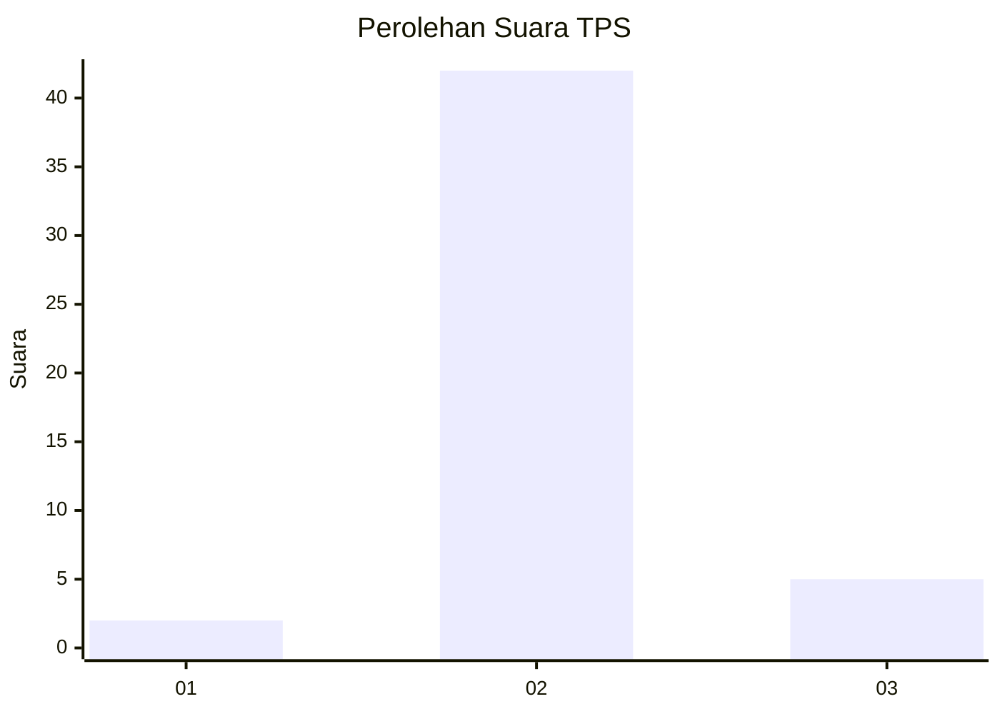
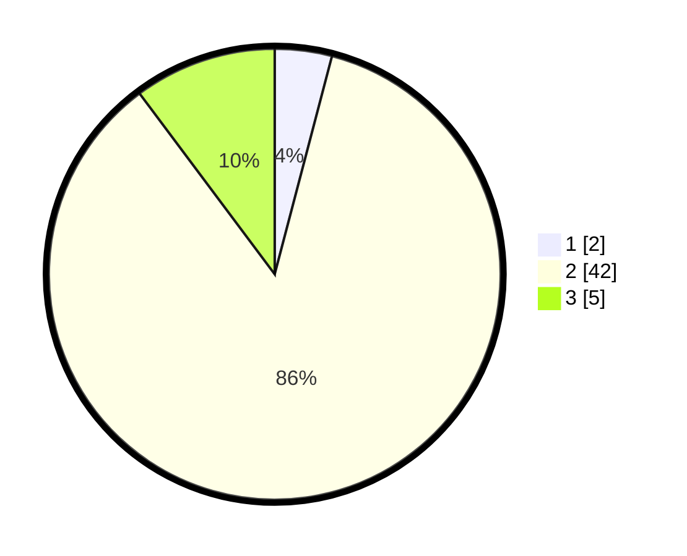

# Hasil

## Grafik

## Tabel

| No. | Nama Paslon    | Suara | Suara (raw) | Persentase |
|:--- |:-------------- | -----:| -----------:| ----------:|
| 1   | ANIES MUHAIMIN | 2     | [2][p-1]    | 4,08       |
| 2   | PRABOWO GIBRAN | 42    | [42][p-2]   | 85,71      |
| 3   | GANJAR MAHFUD  | 5     | [5][p-3]    | 10,20      |

[p-1]: https://github.com/gigit-pemilu/pemilu-2024-96-papua-barat-daya/blob/main/pilpres/hitung-suara/sub/96-papua-barat-daya/sub/01-sorong/sub/14-salawati-selatan/sub/2007-dulbatan/sub/001-tps/sub/paslon-1.txt
[p-2]: https://github.com/gigit-pemilu/pemilu-2024-96-papua-barat-daya/blob/main/pilpres/hitung-suara/sub/96-papua-barat-daya/sub/01-sorong/sub/14-salawati-selatan/sub/2007-dulbatan/sub/001-tps/sub/paslon-2.txt
[p-3]: https://github.com/gigit-pemilu/pemilu-2024-96-papua-barat-daya/blob/main/pilpres/hitung-suara/sub/96-papua-barat-daya/sub/01-sorong/sub/14-salawati-selatan/sub/2007-dulbatan/sub/001-tps/sub/paslon-3.txt

## Foto C Plano

https://sirekap-obj-formc.kpu.go.id/2fbd/pemilu/ppwp/96/01/14/20/07/9601142007001-20240215-234056--c59de622-7aff-414a-8871-fac2d57e655a.jpg

https://sirekap-obj-formc.kpu.go.id/2fbd/pemilu/ppwp/96/01/14/20/07/9601142007001-20240215-071914--b6df1118-c9ca-4149-bdc9-b68efc27236b.jpg

https://sirekap-obj-formc.kpu.go.id/2fbd/pemilu/ppwp/96/01/14/20/07/9601142007001-20240215-072129--2e615a92-3626-4643-8738-14ec163ead9e.jpg

## Metadata

| Key        | Value               |
| ---------- | ------------------- |
| Time Stamp | 2024-02-16 00:00:26 |

## DATA PEMILIH TETAP

Jumlah pemilih dalam DPT: **49**.
 * L: **25**.
 * P: **24**.

## DATA PENGGUNA HAK PILIH

Jumlah pengguna hak pilih dalam DPT: **40**.
 * L: **20**.
 * P: **20**.

Jumlah pengguna hak pilih dalam DPTb: **0**.
 * L: **0**.
 * P: **0**.

Jumlah pengguna hak pilih dalam DPK: **9**.
 * L: **8**.
 * P: **1**.

Jumlah pengguna hak pilih: **43**.
 * L: **28**.
 * P: **21**.

## JUMLAH SUARA SAH DAN TIDAK SAH

JUMLAH SELURUH SUARA SAH: **49**.

JUMLAH SUARA TIDAK SAH: **0**.

JUMLAH SELURUH SUARA SAH DAN SUARA TIDAK SAH: **49**.

