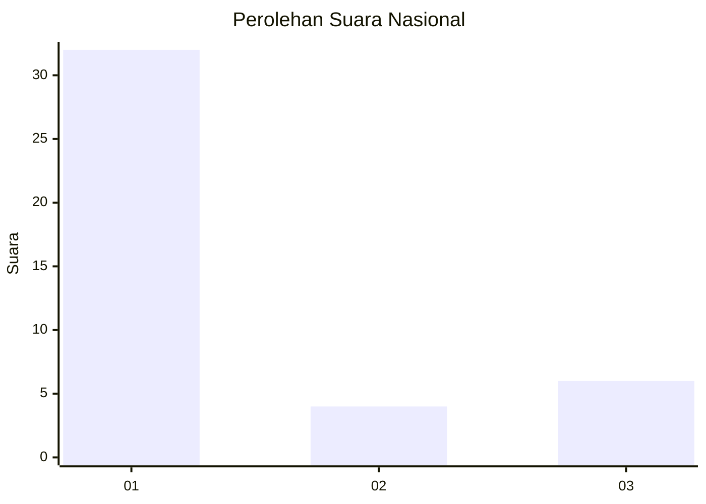
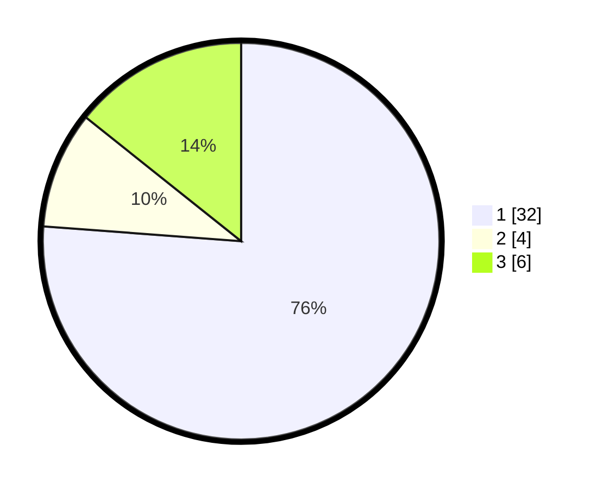

# Hasil

## Grafik

## Tabel

| No. | Nama Paslon    | Suara | Suara (raw) | Persentase |
|:--- |:-------------- | -----:| -----------:| ----------:|
| 1   | ANIES MUHAIMIN | 32    | [32][p-1]   | 76,19      |
| 2   | PRABOWO GIBRAN | 4     | [4][p-2]    | 9,52       |
| 3   | GANJAR MAHFUD  | 6     | [6][p-3]    | 14,29      |

[p-1]: https://github.com/gigit-pemilu/pemilu-2024/blob/main/pilpres/hitung-suara/sub/96-papua-barat-daya/sub/01-sorong/sub/18-klawak/sub/2012-kmasen/sub/001-tps/sub/paslon-1.txt
[p-2]: https://github.com/gigit-pemilu/pemilu-2024/blob/main/pilpres/hitung-suara/sub/96-papua-barat-daya/sub/01-sorong/sub/18-klawak/sub/2012-kmasen/sub/001-tps/sub/paslon-2.txt
[p-3]: https://github.com/gigit-pemilu/pemilu-2024/blob/main/pilpres/hitung-suara/sub/96-papua-barat-daya/sub/01-sorong/sub/18-klawak/sub/2012-kmasen/sub/001-tps/sub/paslon-3.txt

## Foto C Plano

https://sirekap-obj-formc.kpu.go.id/01e0/pemilu/ppwp/96/01/18/20/12/9601182012001-20240218-193346--e65dcb3a-b089-408a-bce5-3411beeab3fe.jpg

https://sirekap-obj-formc.kpu.go.id/01e0/pemilu/ppwp/96/01/18/20/12/9601182012001-20240218-193402--6f7e91ee-063e-4663-9d29-933d3c725d9e.jpg

https://sirekap-obj-formc.kpu.go.id/01e0/pemilu/ppwp/96/01/18/20/12/9601182012001-20240218-193418--ad2e6a97-a6a3-4ced-ae5b-f5fb7f472a81.jpg

## Metadata

| Key        | Value               |
| ---------- | ------------------- |
| Time Stamp | 2024-02-19 06:16:00 |

## DATA PEMILIH TETAP

Jumlah pemilih dalam DPT: **42**.
 * L: **26**.
 * P: **16**.

## DATA PENGGUNA HAK PILIH

Jumlah pengguna hak pilih dalam DPT: **42**.
 * L: **26**.
 * P: **16**.

Jumlah pengguna hak pilih dalam DPTb: **42**.
 * L: **25**.
 * P: **17**.

Jumlah pengguna hak pilih dalam DPK: **42**.
 * L: **25**.
 * P: **17**.

Jumlah pengguna hak pilih: **42**.
 * L: **26**.
 * P: **16**.

## JUMLAH SUARA SAH DAN TIDAK SAH

JUMLAH SELURUH SUARA SAH: **42**.

JUMLAH SUARA TIDAK SAH: **0**.

JUMLAH SELURUH SUARA SAH DAN SUARA TIDAK SAH: **42**.

