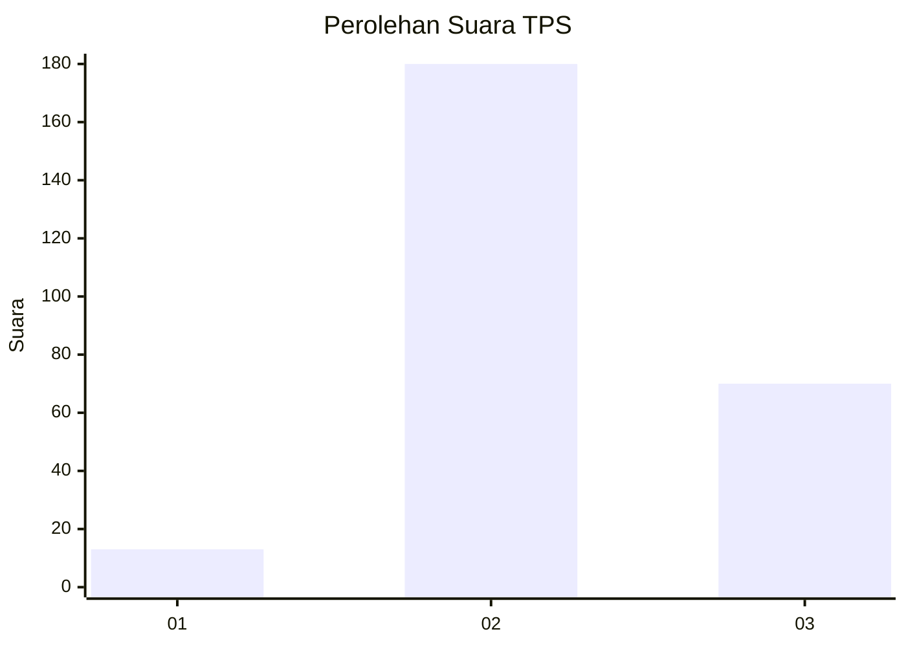

# Hasil

## Grafik

## Tabel

| No. | Nama Paslon    | Suara | Suara (raw) | Persentase |
|:--- |:-------------- | -----:| -----------:| ----------:|
| 1   | ANIES MUHAIMIN | 13    | [13][p-1]   | 4,94       |
| 2   | PRABOWO GIBRAN | 180   | [180][p-2]  | 68,44      |
| 3   | GANJAR MAHFUD  | 70    | [70][p-3]   | 26,62      |

[p-1]: https://github.com/gigit-pemilu/pemilu-2024-96-papua-barat-daya/blob/main/pilpres/hitung-suara/sub/96-papua-barat-daya/sub/01-sorong/sub/39-mariat/sub/1001-klamalu/sub/001-tps/sub/paslon-1.txt
[p-2]: https://github.com/gigit-pemilu/pemilu-2024-96-papua-barat-daya/blob/main/pilpres/hitung-suara/sub/96-papua-barat-daya/sub/01-sorong/sub/39-mariat/sub/1001-klamalu/sub/001-tps/sub/paslon-2.txt
[p-3]: https://github.com/gigit-pemilu/pemilu-2024-96-papua-barat-daya/blob/main/pilpres/hitung-suara/sub/96-papua-barat-daya/sub/01-sorong/sub/39-mariat/sub/1001-klamalu/sub/001-tps/sub/paslon-3.txt

## Foto C Plano

https://sirekap-obj-formc.kpu.go.id/1f40/pemilu/ppwp/96/01/39/10/01/9601391001001-20240216-115811--d1453b3d-0544-444a-9fd6-f514c76f0986.jpg

https://sirekap-obj-formc.kpu.go.id/1f40/pemilu/ppwp/96/01/39/10/01/9601391001001-20240216-123218--e6fd9b16-8143-4f83-bd57-ce0e38e93447.jpg

https://sirekap-obj-formc.kpu.go.id/1f40/pemilu/ppwp/96/01/39/10/01/9601391001001-20240216-115412--58a8c432-86f6-4fc9-9031-ad6b39429735.jpg

## Metadata

| Key        | Value               |
| ---------- | ------------------- |
| Time Stamp | 2024-02-20 11:00:00 |

