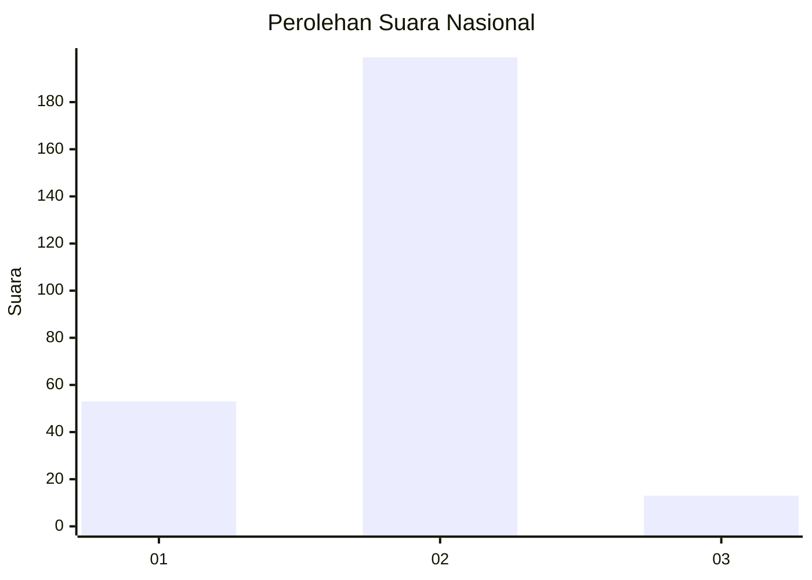
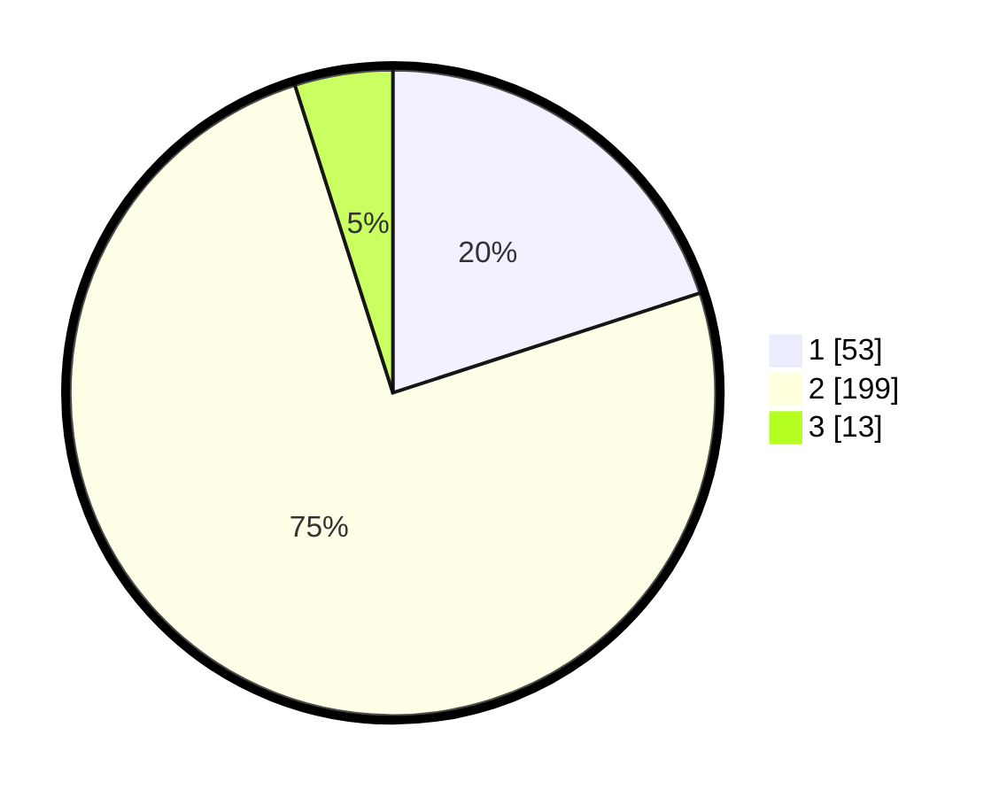

# Hasil

## Grafik

## Tabel

| No. | Nama Paslon    | Suara | Suara (raw) | Persentase |
|:--- |:-------------- | -----:| -----------:| ----------:|
| 1   | ANIES MUHAIMIN | 53    | [53][p-1]   | 20,00      |
| 2   | PRABOWO GIBRAN | 199   | [199][p-2]  | 75,09      |
| 3   | GANJAR MAHFUD  | 13    | [13][p-3]   | 4,91       |

[p-1]: https://github.com/gigit-pemilu/pemilu-2024/blob/main/pilpres/hitung-suara/sub/96-papua-barat-daya/sub/01-sorong/sub/39-mariat/sub/1003-klasuluk/sub/004-tps/sub/paslon-1.txt
[p-2]: https://github.com/gigit-pemilu/pemilu-2024/blob/main/pilpres/hitung-suara/sub/96-papua-barat-daya/sub/01-sorong/sub/39-mariat/sub/1003-klasuluk/sub/004-tps/sub/paslon-2.txt
[p-3]: https://github.com/gigit-pemilu/pemilu-2024/blob/main/pilpres/hitung-suara/sub/96-papua-barat-daya/sub/01-sorong/sub/39-mariat/sub/1003-klasuluk/sub/004-tps/sub/paslon-3.txt

## Foto C Plano

https://sirekap-obj-formc.kpu.go.id/cfe9/pemilu/ppwp/96/01/39/10/03/9601391003004-20240215-141942--4923cb07-369c-432e-ab2c-66dbdc0a9c35.jpg

https://sirekap-obj-formc.kpu.go.id/cfe9/pemilu/ppwp/96/01/39/10/03/9601391003004-20240216-180808--07df9c46-6726-4ca7-88ef-3a7c6fc29da8.jpg

https://sirekap-obj-formc.kpu.go.id/cfe9/pemilu/ppwp/96/01/39/10/03/9601391003004-20240215-161459--f0be91fc-bec8-499a-b003-dab82cc16db4.jpg

## Metadata

| Key        | Value               |
| ---------- | ------------------- |
| Time Stamp | 2024-02-21 21:00:04 |

