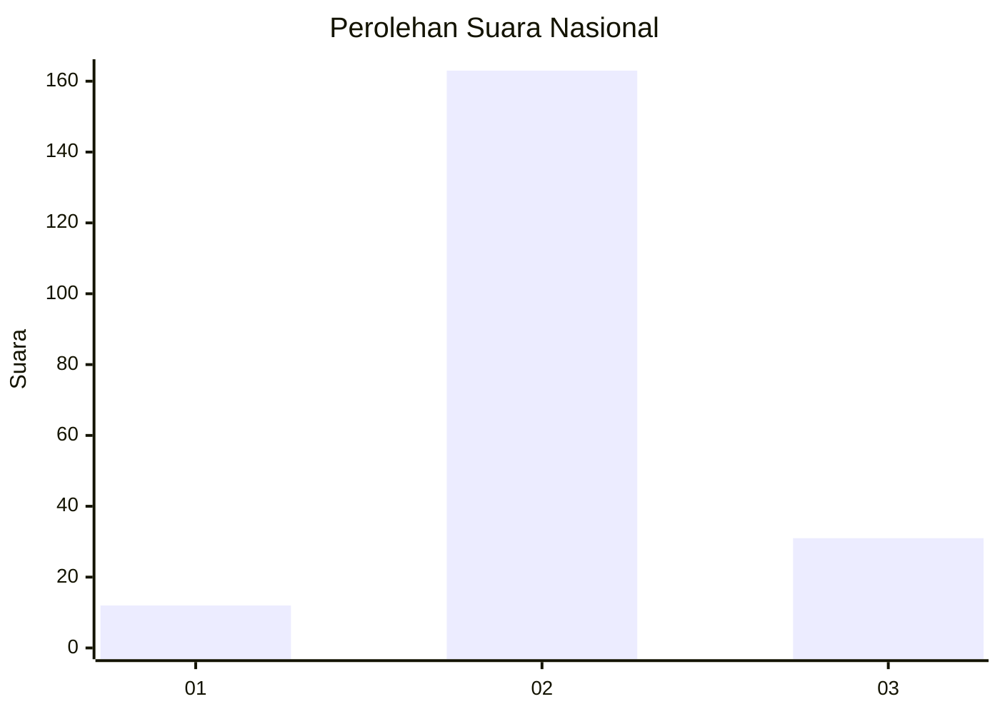

# Hasil

## Grafik

## Tabel

| No. | Nama Paslon    | Suara | Suara (raw) | Persentase |
|:--- |:-------------- | -----:| -----------:| ----------:|
| 1   | ANIES MUHAIMIN | 12    | [12][p-1]   | 5,83       |
| 2   | PRABOWO GIBRAN | 163   | [163][p-2]  | 79,13      |
| 3   | GANJAR MAHFUD  | 31    | [31][p-3]   | 15,05      |

[p-1]: https://github.com/gigit-pemilu/pemilu-2024/blob/main/pilpres/hitung-suara/sub/96-papua-barat-daya/sub/01-sorong/sub/39-mariat/sub/1011-jamaimo/sub/002-tps/sub/paslon-1.txt
[p-2]: https://github.com/gigit-pemilu/pemilu-2024/blob/main/pilpres/hitung-suara/sub/96-papua-barat-daya/sub/01-sorong/sub/39-mariat/sub/1011-jamaimo/sub/002-tps/sub/paslon-2.txt
[p-3]: https://github.com/gigit-pemilu/pemilu-2024/blob/main/pilpres/hitung-suara/sub/96-papua-barat-daya/sub/01-sorong/sub/39-mariat/sub/1011-jamaimo/sub/002-tps/sub/paslon-3.txt

## Foto C Plano

https://sirekap-obj-formc.kpu.go.id/c6eb/pemilu/ppwp/96/01/39/10/11/9601391011002-20240214-141943--9d081261-94f8-4469-b8f9-aa7e8de62fbc.jpg

https://sirekap-obj-formc.kpu.go.id/c6eb/pemilu/ppwp/96/01/39/10/11/9601391011002-20240214-141937--ef7e75e4-cdc8-43cf-8508-7fcd9081ed11.jpg

https://sirekap-obj-formc.kpu.go.id/c6eb/pemilu/ppwp/96/01/39/10/11/9601391011002-20240214-141659--c082dcb3-d612-4312-a271-27e3d9d39748.jpg

## Metadata

| Key        | Value               |
| ---------- | ------------------- |
| Time Stamp | 2024-02-25 22:00:00 |

