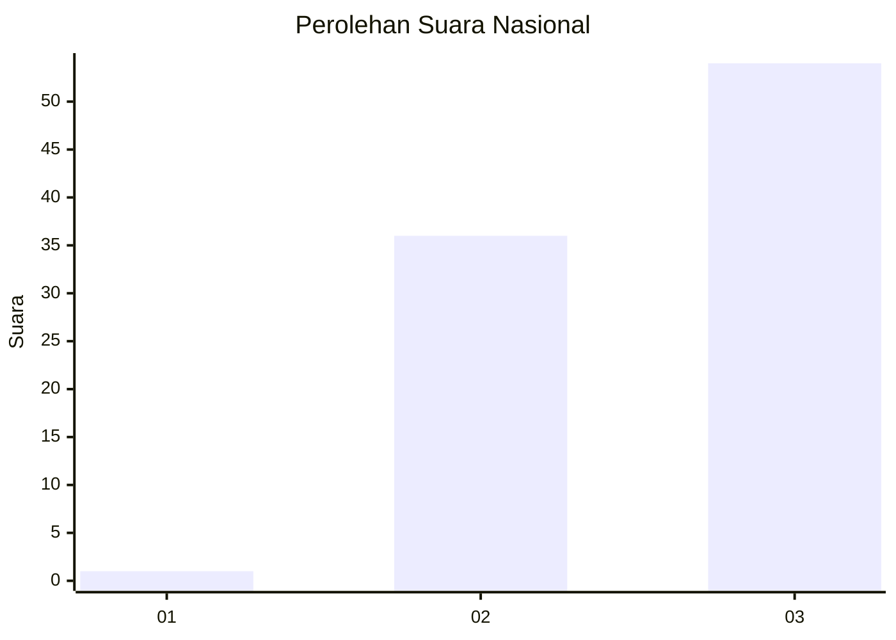
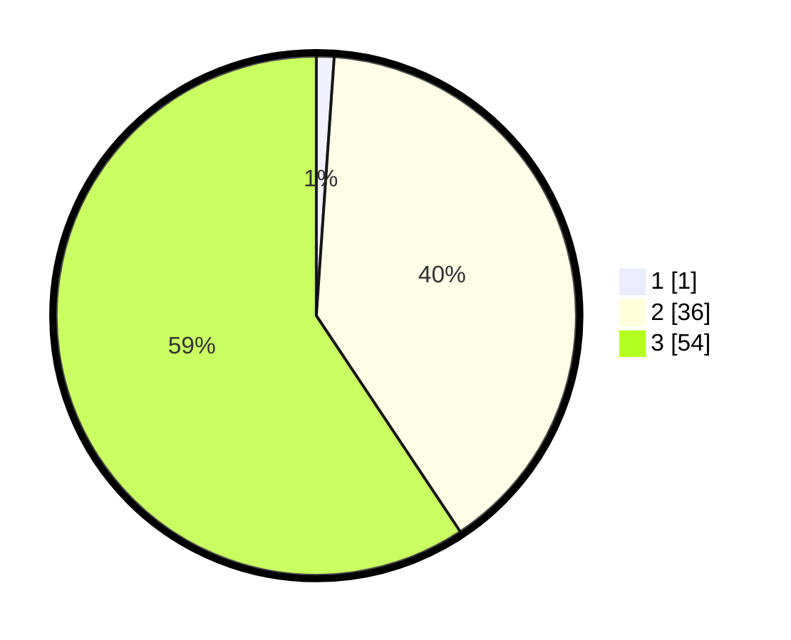

# Hasil

## Grafik

## Tabel

| No. | Nama Paslon    | Suara | Suara (raw) | Persentase |
|:--- |:-------------- | -----:| -----------:| ----------:|
| 1   | ANIES MUHAIMIN | 1     | [1][p-1]    | 1,10       |
| 2   | PRABOWO GIBRAN | 36    | [36][p-2]   | 39,56      |
| 3   | GANJAR MAHFUD  | 54    | [54][p-3]   | 59,34      |

[p-1]: https://github.com/gigit-pemilu/pemilu-2024/blob/main/pilpres/hitung-suara/sub/96-papua-barat-daya/sub/01-sorong/sub/39-mariat/sub/2012-kasih/sub/002-tps/sub/paslon-1.txt
[p-2]: https://github.com/gigit-pemilu/pemilu-2024/blob/main/pilpres/hitung-suara/sub/96-papua-barat-daya/sub/01-sorong/sub/39-mariat/sub/2012-kasih/sub/002-tps/sub/paslon-2.txt
[p-3]: https://github.com/gigit-pemilu/pemilu-2024/blob/main/pilpres/hitung-suara/sub/96-papua-barat-daya/sub/01-sorong/sub/39-mariat/sub/2012-kasih/sub/002-tps/sub/paslon-3.txt

## Foto C Plano

https://sirekap-obj-formc.kpu.go.id/c742/pemilu/ppwp/96/01/39/20/12/9601392012002-20240215-151557--9a540519-e9d9-430f-bd9c-1d9c7ca00a34.jpg

https://sirekap-obj-formc.kpu.go.id/c742/pemilu/ppwp/96/01/39/20/12/9601392012002-20240215-155855--cb6f76f0-93ca-4491-802c-80a2451bf0e5.jpg

https://sirekap-obj-formc.kpu.go.id/c742/pemilu/ppwp/96/01/39/20/12/9601392012002-20240215-160245--7ed631e8-4b5c-4f32-8097-63eee2362be8.jpg

## Metadata

| Key        | Value               |
| ---------- | ------------------- |
| Time Stamp | 2024-02-19 06:16:00 |

