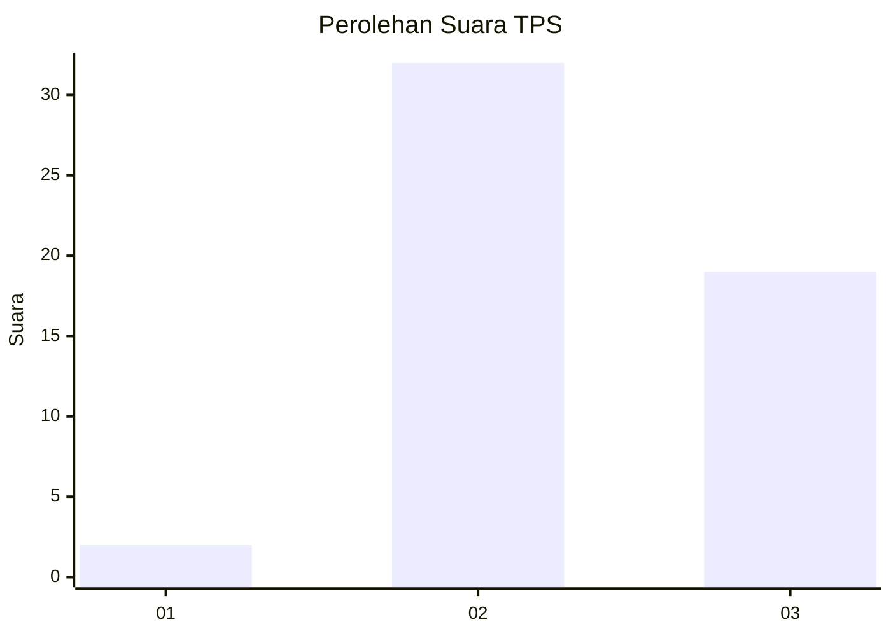
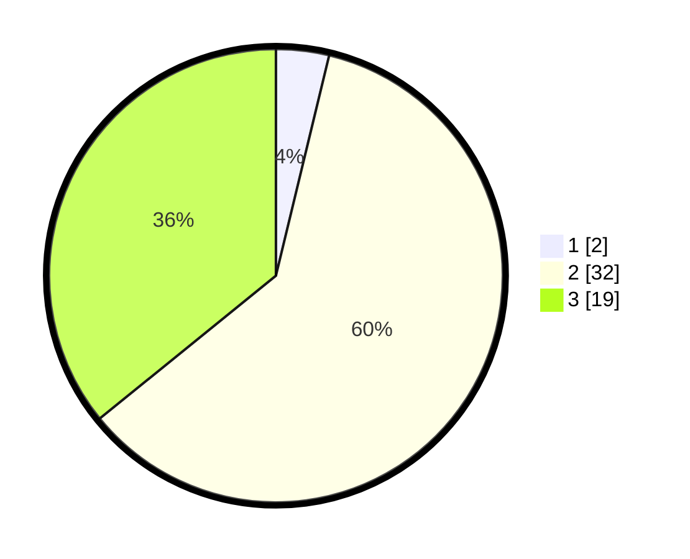

# Hasil

## Grafik

## Tabel

| No. | Nama Paslon    | Suara | Suara (raw) | Persentase |
|:--- |:-------------- | -----:| -----------:| ----------:|
| 1   | ANIES MUHAIMIN | 2     | [2][p-1]    | 3,77       |
| 2   | PRABOWO GIBRAN | 32    | [32][p-2]   | 60,38      |
| 3   | GANJAR MAHFUD  | 19    | [19][p-3]   | 35,85      |

[p-1]: https://github.com/gigit-pemilu/pemilu-2024-96-papua-barat-daya/blob/main/pilpres/hitung-suara/sub/96-papua-barat-daya/sub/01-sorong/sub/40-klayili/sub/2005-klasowoh/sub/001-tps/sub/paslon-1.txt
[p-2]: https://github.com/gigit-pemilu/pemilu-2024-96-papua-barat-daya/blob/main/pilpres/hitung-suara/sub/96-papua-barat-daya/sub/01-sorong/sub/40-klayili/sub/2005-klasowoh/sub/001-tps/sub/paslon-2.txt
[p-3]: https://github.com/gigit-pemilu/pemilu-2024-96-papua-barat-daya/blob/main/pilpres/hitung-suara/sub/96-papua-barat-daya/sub/01-sorong/sub/40-klayili/sub/2005-klasowoh/sub/001-tps/sub/paslon-3.txt

## Foto C Plano

https://sirekap-obj-formc.kpu.go.id/0889/pemilu/ppwp/96/01/40/20/05/9601402005001-20240214-132935--8b52e7ec-f01a-4884-92be-0adde0c62297.jpg

https://sirekap-obj-formc.kpu.go.id/0889/pemilu/ppwp/96/01/40/20/05/9601402005001-20240214-160127--1e5612ba-ebfa-4fe2-803e-1b5c6d550b3f.jpg

https://sirekap-obj-formc.kpu.go.id/0889/pemilu/ppwp/96/01/40/20/05/9601402005001-20240215-120421--08898b94-6c00-4b59-9375-d4154497be5c.jpg

## Metadata

| Key        | Value               |
| ---------- | ------------------- |
| Time Stamp | 2024-02-26 15:00:00 |

