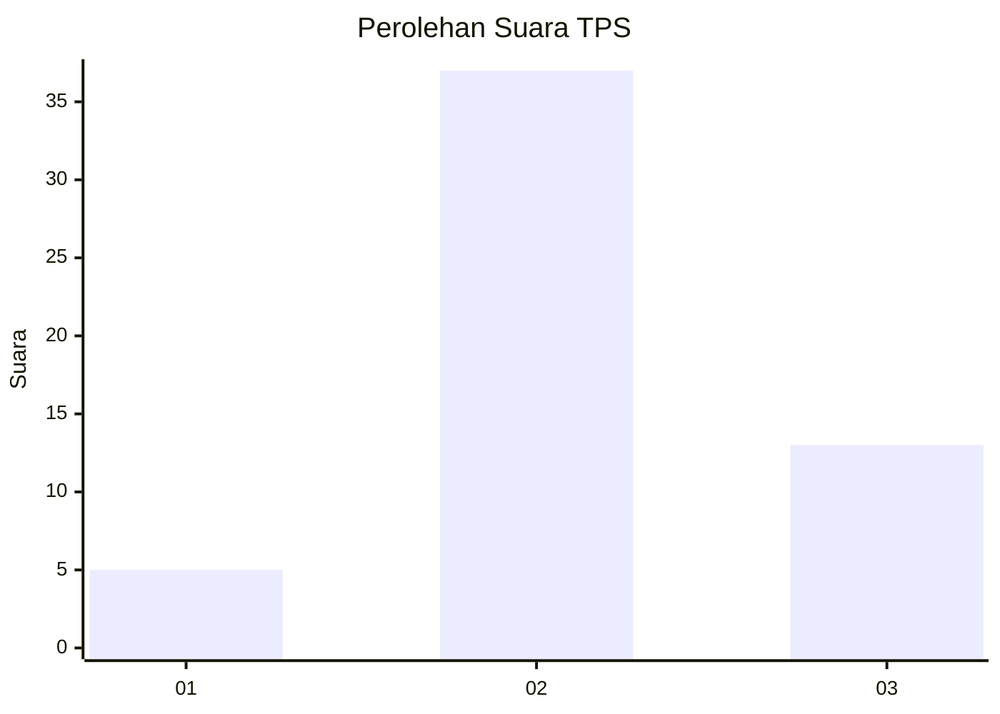
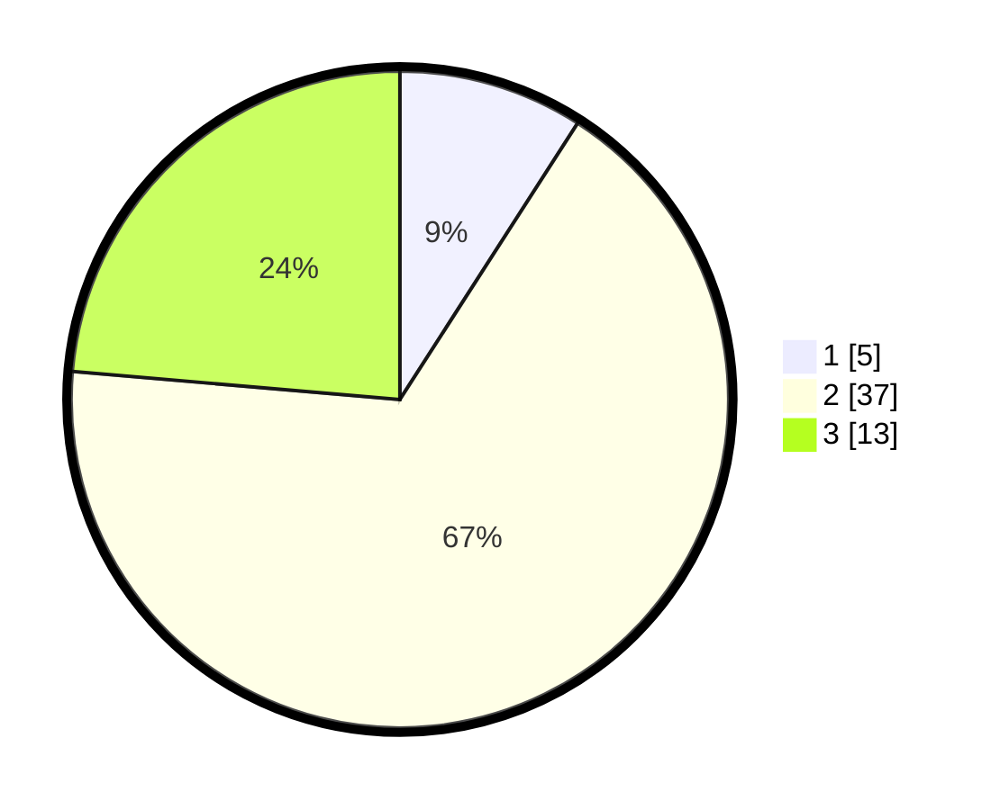

# Hasil

## Grafik

## Tabel

| No. | Nama Paslon    | Suara | Suara (raw) | Persentase |
|:--- |:-------------- | -----:| -----------:| ----------:|
| 1   | ANIES MUHAIMIN | 5     | [5][p-1]    | 9,09       |
| 2   | PRABOWO GIBRAN | 37    | [37][p-2]   | 67,27      |
| 3   | GANJAR MAHFUD  | 13    | [13][p-3]   | 23,64      |

[p-1]: https://github.com/gigit-pemilu/pemilu-2024-96-papua-barat-daya/blob/main/pilpres/hitung-suara/sub/96-papua-barat-daya/sub/01-sorong/sub/43-sorong/sub/2004-kagiwala/sub/002-tps/sub/paslon-1.txt
[p-2]: https://github.com/gigit-pemilu/pemilu-2024-96-papua-barat-daya/blob/main/pilpres/hitung-suara/sub/96-papua-barat-daya/sub/01-sorong/sub/43-sorong/sub/2004-kagiwala/sub/002-tps/sub/paslon-2.txt
[p-3]: https://github.com/gigit-pemilu/pemilu-2024-96-papua-barat-daya/blob/main/pilpres/hitung-suara/sub/96-papua-barat-daya/sub/01-sorong/sub/43-sorong/sub/2004-kagiwala/sub/002-tps/sub/paslon-3.txt

## Foto C Plano

https://sirekap-obj-formc.kpu.go.id/ce0e/pemilu/ppwp/96/01/43/20/04/9601432004002-20240214-202441--b36ba398-1a74-4a80-a2fa-12c5b596d5a9.jpg

https://sirekap-obj-formc.kpu.go.id/ce0e/pemilu/ppwp/96/01/43/20/04/9601432004002-20240214-192542--e878999e-77e7-4b7f-bd2f-83c9ef070e8c.jpg

https://sirekap-obj-formc.kpu.go.id/ce0e/pemilu/ppwp/96/01/43/20/04/9601432004002-20240214-192603--ec2b1d17-a0f0-4ae1-99c7-1f85f4b0f78b.jpg

## Metadata

| Key        | Value               |
| ---------- | ------------------- |
| Time Stamp | 2024-02-15 00:41:44 |

## DATA PEMILIH TETAP

Jumlah pemilih dalam DPT: **55**.
 * L: **29**.
 * P: **26**.

## DATA PENGGUNA HAK PILIH

Jumlah pengguna hak pilih dalam DPT: **55**.
 * L: **29**.
 * P: **26**.

Jumlah pengguna hak pilih dalam DPTb: **0**.
 * L: **0**.
 * P: **0**.

Jumlah pengguna hak pilih dalam DPK: **0**.
 * L: **0**.
 * P: **0**.

Jumlah pengguna hak pilih: **55**.
 * L: **29**.
 * P: **26**.

## JUMLAH SUARA SAH DAN TIDAK SAH

JUMLAH SELURUH SUARA SAH: **55**.

JUMLAH SUARA TIDAK SAH: **0**.

JUMLAH SELURUH SUARA SAH DAN SUARA TIDAK SAH: **55**.

