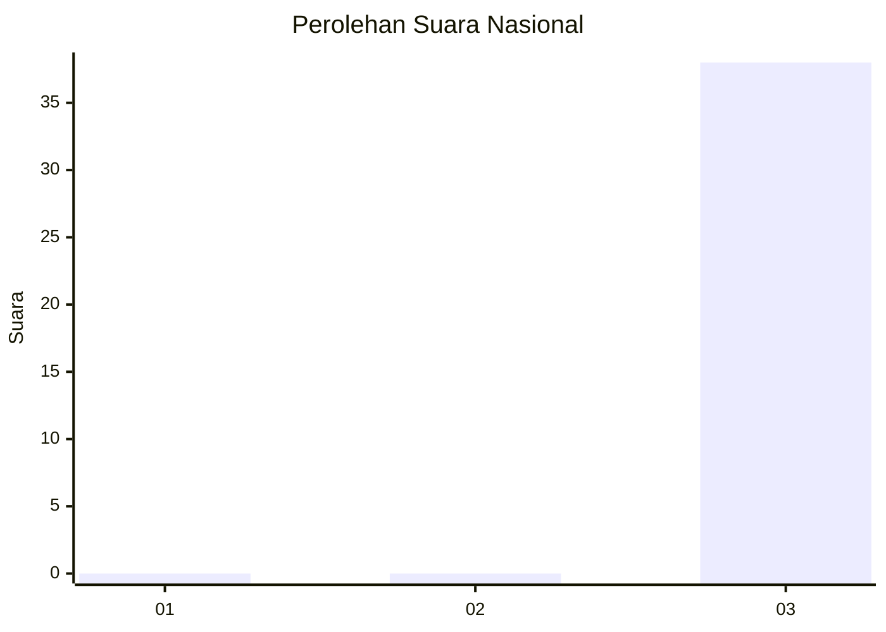
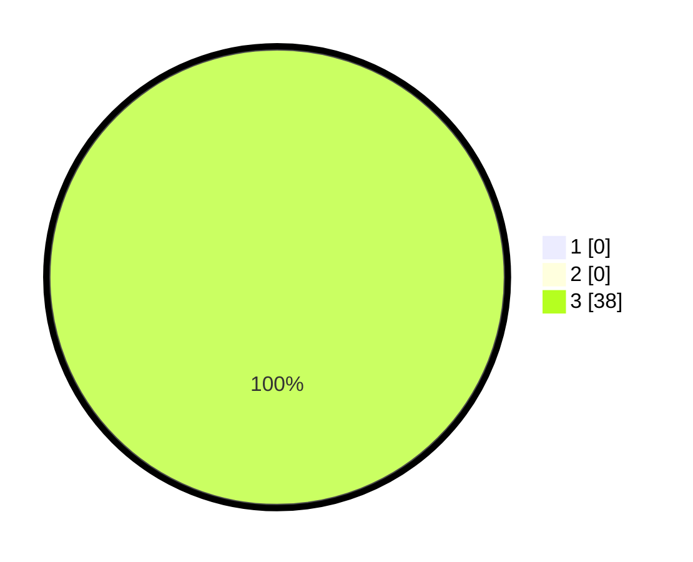

# Hasil

## Grafik

## Tabel

| No. | Nama Paslon    | Suara | Suara (raw) | Persentase |
|:--- |:-------------- | -----:| -----------:| ----------:|
| 1   | ANIES MUHAIMIN | 0     | [0][p-1]    | 0,00       |
| 2   | PRABOWO GIBRAN | 0     | [0][p-2]    | 0,00       |
| 3   | GANJAR MAHFUD  | 38    | [38][p-3]   | 100,00     |

[p-1]: https://github.com/gigit-pemilu/pemilu-2024/blob/main/pilpres/hitung-suara/sub/96-papua-barat-daya/sub/01-sorong/sub/44-bagun/sub/2004-klamomis/sub/001-tps/sub/paslon-1.txt
[p-2]: https://github.com/gigit-pemilu/pemilu-2024/blob/main/pilpres/hitung-suara/sub/96-papua-barat-daya/sub/01-sorong/sub/44-bagun/sub/2004-klamomis/sub/001-tps/sub/paslon-2.txt
[p-3]: https://github.com/gigit-pemilu/pemilu-2024/blob/main/pilpres/hitung-suara/sub/96-papua-barat-daya/sub/01-sorong/sub/44-bagun/sub/2004-klamomis/sub/001-tps/sub/paslon-3.txt

## Foto C Plano

https://sirekap-obj-formc.kpu.go.id/dada/pemilu/ppwp/96/01/44/20/04/9601442004001-20240216-192156--349e2449-8858-48c8-b3ad-8f37db05c24f.jpg

https://sirekap-obj-formc.kpu.go.id/dada/pemilu/ppwp/96/01/44/20/04/9601442004001-20240216-164800--63d083ab-3cda-4569-aa5d-e54ff4b00068.jpg

https://sirekap-obj-formc.kpu.go.id/dada/pemilu/ppwp/96/01/44/20/04/9601442004001-20240216-172739--f6fa794c-5dfd-4b22-a5dd-c66f00f424ba.jpg

## Metadata

| Key        | Value               |
| ---------- | ------------------- |
| Time Stamp | 2024-02-16 21:01:00 |

