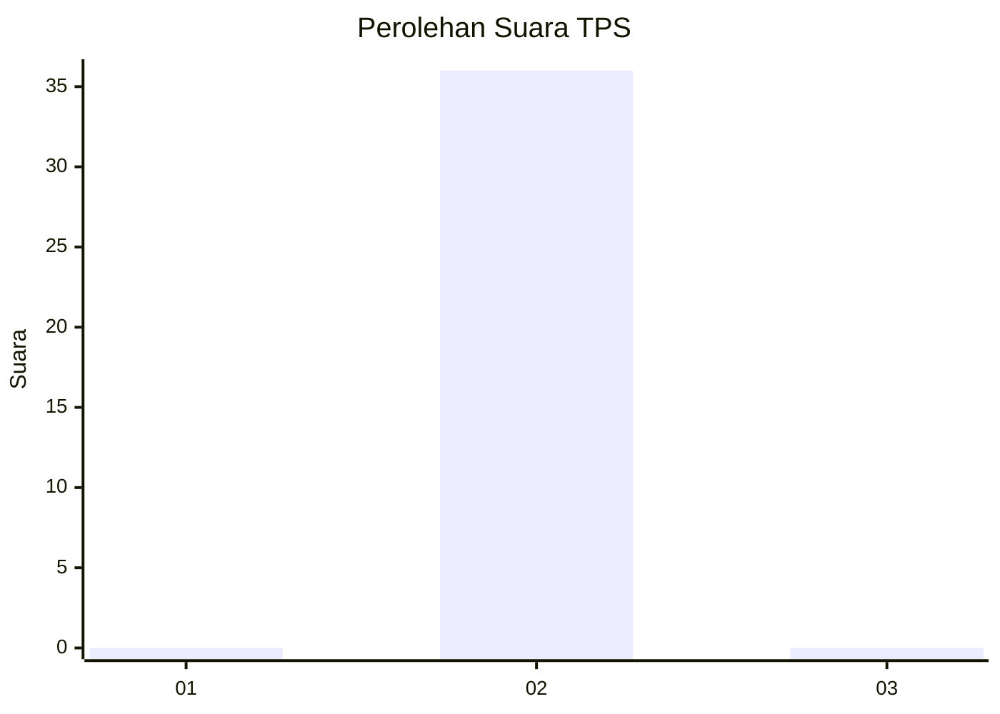
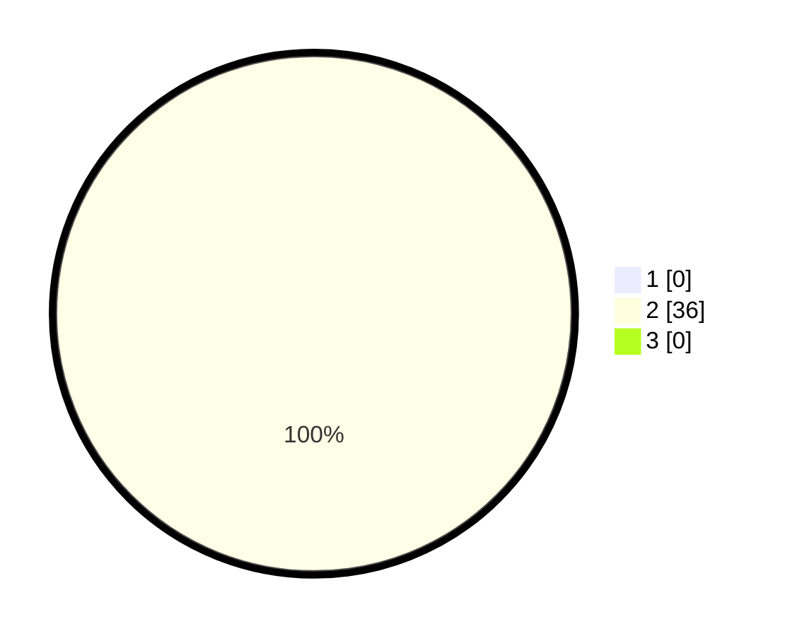

# Hasil

## Grafik

## Tabel

| No. | Nama Paslon    | Suara | Suara (raw) | Persentase |
|:--- |:-------------- | -----:| -----------:| ----------:|
| 1   | ANIES MUHAIMIN | 0     | [0][p-1]    | 0,00       |
| 2   | PRABOWO GIBRAN | 36    | [36][p-2]   | 100,00     |
| 3   | GANJAR MAHFUD  | 0     | [0][p-3]    | 0,00       |

[p-1]: https://github.com/gigit-pemilu/pemilu-2024-96-papua-barat-daya/blob/main/pilpres/hitung-suara/sub/96-papua-barat-daya/sub/01-sorong/sub/44-bagun/sub/2005-klakwonrit/sub/001-tps/sub/paslon-1.txt
[p-2]: https://github.com/gigit-pemilu/pemilu-2024-96-papua-barat-daya/blob/main/pilpres/hitung-suara/sub/96-papua-barat-daya/sub/01-sorong/sub/44-bagun/sub/2005-klakwonrit/sub/001-tps/sub/paslon-2.txt
[p-3]: https://github.com/gigit-pemilu/pemilu-2024-96-papua-barat-daya/blob/main/pilpres/hitung-suara/sub/96-papua-barat-daya/sub/01-sorong/sub/44-bagun/sub/2005-klakwonrit/sub/001-tps/sub/paslon-3.txt

## Foto C Plano

https://sirekap-obj-formc.kpu.go.id/2bdc/pemilu/ppwp/96/01/44/20/05/9601442005001-20240217-025649--2b22d982-efb8-491e-95b6-f6eb1d44468c.jpg

https://sirekap-obj-formc.kpu.go.id/2bdc/pemilu/ppwp/96/01/44/20/05/9601442005001-20240217-150523--3bfd966a-05cb-4ffc-9602-9ec9b25606db.jpg

https://sirekap-obj-formc.kpu.go.id/2bdc/pemilu/ppwp/96/01/44/20/05/9601442005001-20240217-150954--1ae41f67-cc59-41cf-a3be-c14f41edc91b.jpg

## Metadata

| Key        | Value               |
| ---------- | ------------------- |
| Time Stamp | 2024-02-17 16:00:02 |

