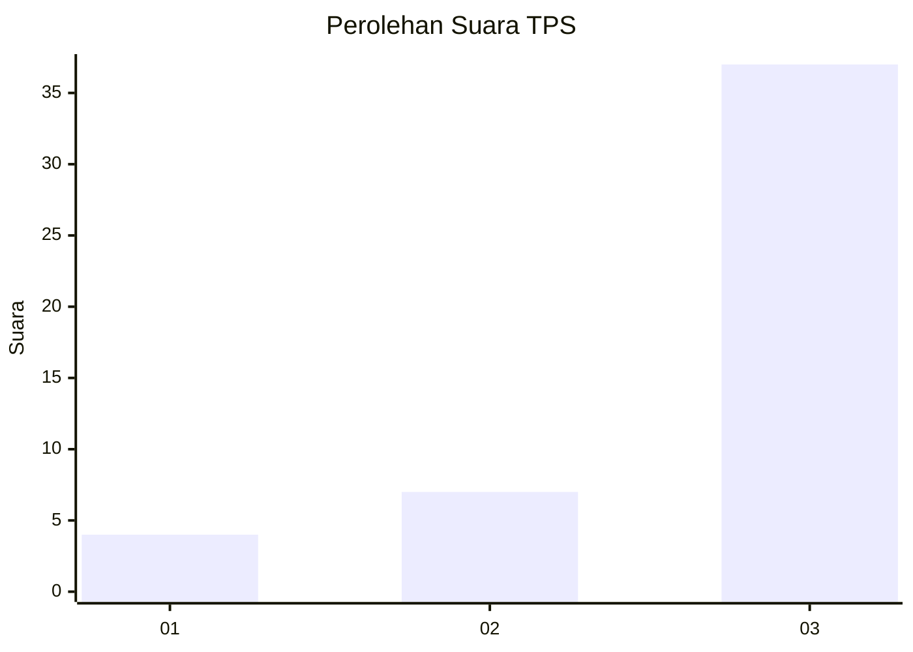
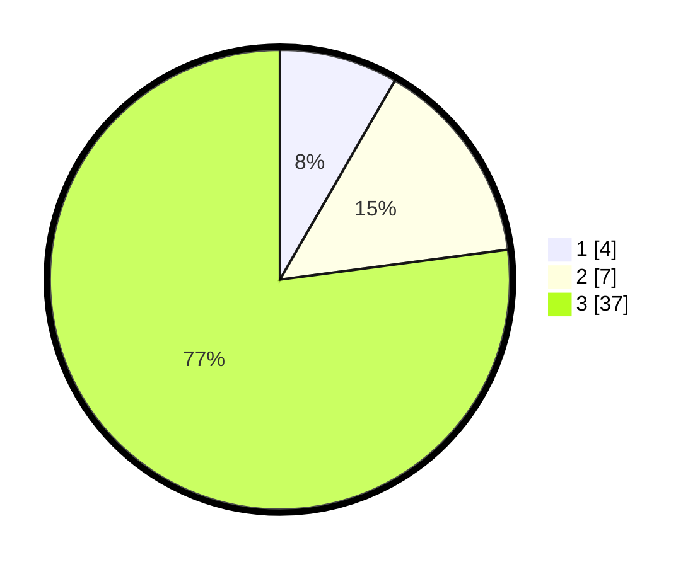

# Hasil

## Grafik

## Tabel

| No. | Nama Paslon    | Suara | Suara (raw) | Persentase |
|:--- |:-------------- | -----:| -----------:| ----------:|
| 1   | ANIES MUHAIMIN | 4     | [4][p-1]    | 8,33       |
| 2   | PRABOWO GIBRAN | 7     | [7][p-2]    | 14,58      |
| 3   | GANJAR MAHFUD  | 37    | [37][p-3]   | 77,08      |

[p-1]: https://github.com/gigit-pemilu/pemilu-2024-96-papua-barat-daya/blob/main/pilpres/hitung-suara/sub/96-papua-barat-daya/sub/01-sorong/sub/44-bagun/sub/2007-bratmawe/sub/001-tps/sub/paslon-1.txt
[p-2]: https://github.com/gigit-pemilu/pemilu-2024-96-papua-barat-daya/blob/main/pilpres/hitung-suara/sub/96-papua-barat-daya/sub/01-sorong/sub/44-bagun/sub/2007-bratmawe/sub/001-tps/sub/paslon-2.txt
[p-3]: https://github.com/gigit-pemilu/pemilu-2024-96-papua-barat-daya/blob/main/pilpres/hitung-suara/sub/96-papua-barat-daya/sub/01-sorong/sub/44-bagun/sub/2007-bratmawe/sub/001-tps/sub/paslon-3.txt

## Foto C Plano

https://sirekap-obj-formc.kpu.go.id/b96a/pemilu/ppwp/96/01/44/20/07/9601442007001-20240216-095253--75d72a87-bd25-4e39-b5f0-0ac6dd9fe52f.jpg

https://sirekap-obj-formc.kpu.go.id/b96a/pemilu/ppwp/96/01/44/20/07/9601442007001-20240216-095523--b58b3964-21e6-4908-93da-54a48b1533f8.jpg

https://sirekap-obj-formc.kpu.go.id/b96a/pemilu/ppwp/96/01/44/20/07/9601442007001-20240216-100109--ef6e10ac-99b2-4c8a-b97b-bec6c1474597.jpg

## Metadata

| Key        | Value               |
| ---------- | ------------------- |
| Time Stamp | 2024-02-20 09:00:00 |

