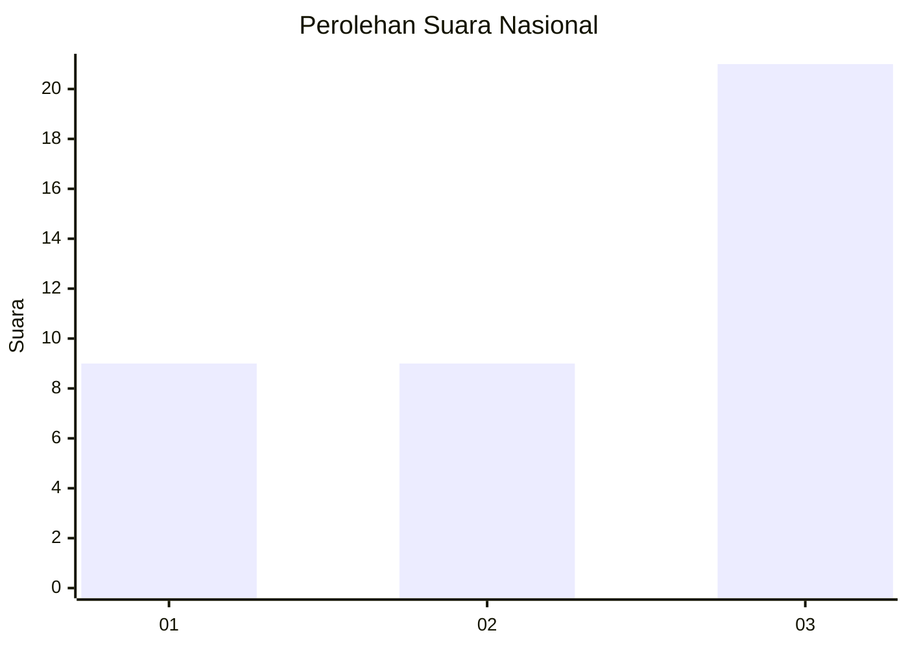
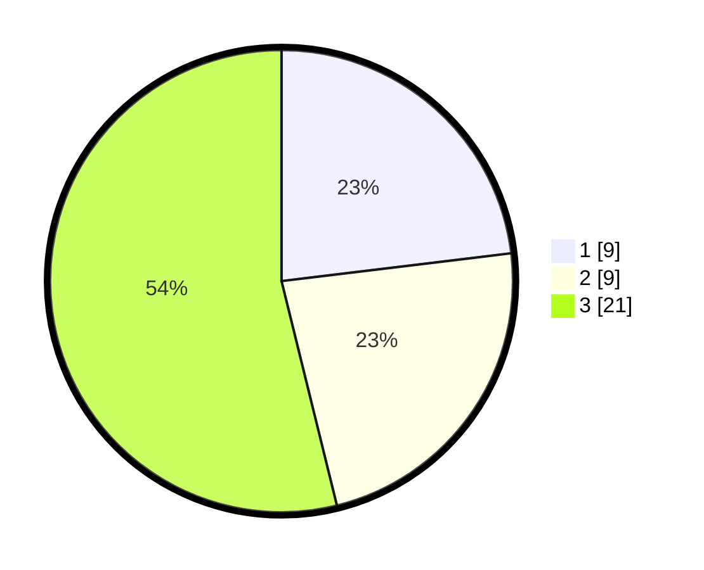

# Hasil

## Grafik

## Tabel

| No. | Nama Paslon    | Suara | Suara (raw) | Persentase |
|:--- |:-------------- | -----:| -----------:| ----------:|
| 1   | ANIES MUHAIMIN | 9     | [9][p-1]    | 23,08      |
| 2   | PRABOWO GIBRAN | 9     | [9][p-2]    | 23,08      |
| 3   | GANJAR MAHFUD  | 21    | [21][p-3]   | 53,85      |

[p-1]: https://github.com/gigit-pemilu/pemilu-2024/blob/main/pilpres/hitung-suara/sub/96-papua-barat-daya/sub/01-sorong/sub/46-sunook/sub/2001-dasri/sub/001-tps/sub/paslon-1.txt
[p-2]: https://github.com/gigit-pemilu/pemilu-2024/blob/main/pilpres/hitung-suara/sub/96-papua-barat-daya/sub/01-sorong/sub/46-sunook/sub/2001-dasri/sub/001-tps/sub/paslon-2.txt
[p-3]: https://github.com/gigit-pemilu/pemilu-2024/blob/main/pilpres/hitung-suara/sub/96-papua-barat-daya/sub/01-sorong/sub/46-sunook/sub/2001-dasri/sub/001-tps/sub/paslon-3.txt

## Foto C Plano

https://sirekap-obj-formc.kpu.go.id/12c1/pemilu/ppwp/96/01/46/20/01/9601462001001-20240218-151303--dda33a9e-6b85-4303-8cf0-c27d32094cac.jpg

https://sirekap-obj-formc.kpu.go.id/12c1/pemilu/ppwp/96/01/46/20/01/9601462001001-20240218-151855--7e7ec5f0-67a4-4432-abea-5673320e11b2.jpg

https://sirekap-obj-formc.kpu.go.id/12c1/pemilu/ppwp/96/01/46/20/01/9601462001001-20240218-152135--da58a6e5-df6a-4bf5-801e-363d912dd6c9.jpg

## Metadata

| Key        | Value               |
| ---------- | ------------------- |
| Time Stamp | 2024-02-25 16:00:00 |

