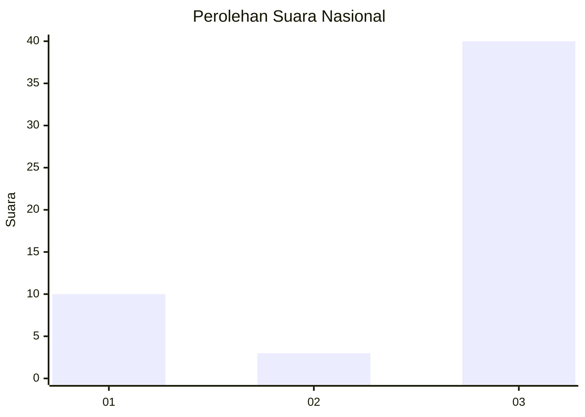
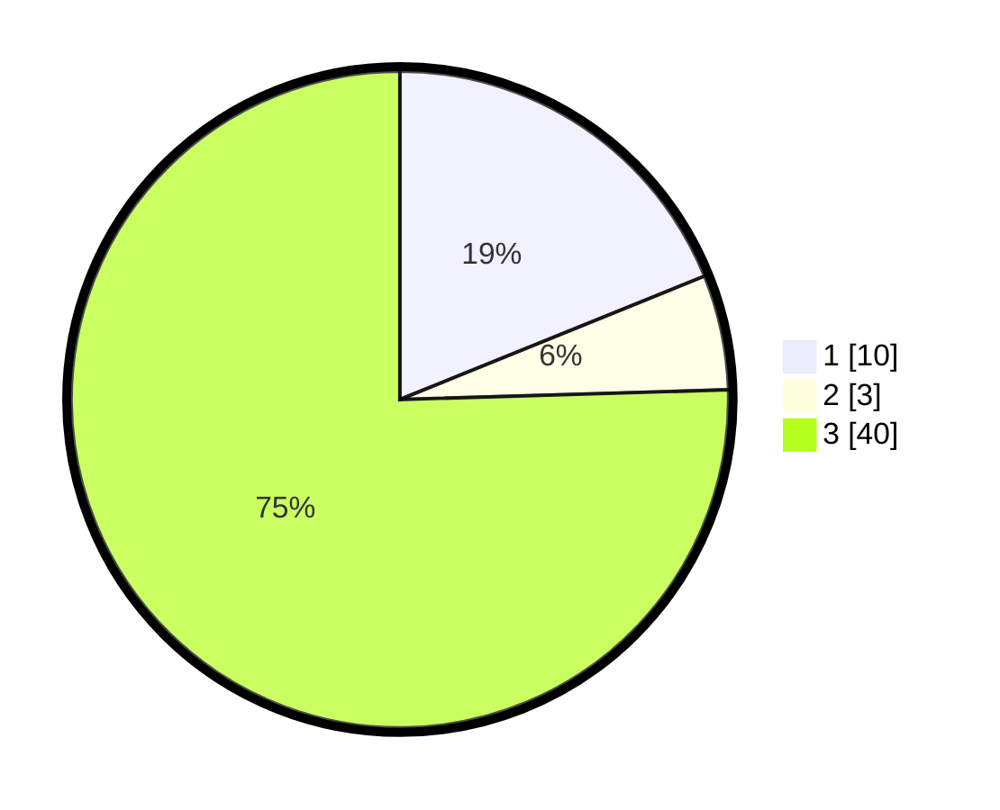

# Hasil

## Grafik

## Tabel

| No. | Nama Paslon    | Suara | Suara (raw) | Persentase |
|:--- |:-------------- | -----:| -----------:| ----------:|
| 1   | ANIES MUHAIMIN | 10    | [10][p-1]   | 18,87      |
| 2   | PRABOWO GIBRAN | 3     | [3][p-2]    | 5,66       |
| 3   | GANJAR MAHFUD  | 40    | [40][p-3]   | 75,47      |

[p-1]: https://github.com/gigit-pemilu/pemilu-2024/blob/main/pilpres/hitung-suara/sub/96-papua-barat-daya/sub/01-sorong/sub/48-saengkeduk/sub/2005-sambatie/sub/001-tps/sub/paslon-1.txt
[p-2]: https://github.com/gigit-pemilu/pemilu-2024/blob/main/pilpres/hitung-suara/sub/96-papua-barat-daya/sub/01-sorong/sub/48-saengkeduk/sub/2005-sambatie/sub/001-tps/sub/paslon-2.txt
[p-3]: https://github.com/gigit-pemilu/pemilu-2024/blob/main/pilpres/hitung-suara/sub/96-papua-barat-daya/sub/01-sorong/sub/48-saengkeduk/sub/2005-sambatie/sub/001-tps/sub/paslon-3.txt

## Foto C Plano

https://sirekap-obj-formc.kpu.go.id/e8cc/pemilu/ppwp/96/01/48/20/05/9601482005001-20240215-110935--ec28c135-2dee-4d7e-8cee-cc3922186365.jpg

https://sirekap-obj-formc.kpu.go.id/e8cc/pemilu/ppwp/96/01/48/20/05/9601482005001-20240215-091342--938c8ed5-db42-4d67-bb19-c510ec9ead2f.jpg

https://sirekap-obj-formc.kpu.go.id/e8cc/pemilu/ppwp/96/01/48/20/05/9601482005001-20240215-091549--9ff810eb-dec5-4cdf-bc48-242314ae586b.jpg

## Metadata

| Key        | Value               |
| ---------- | ------------------- |
| Time Stamp | 2024-02-25 17:00:00 |

