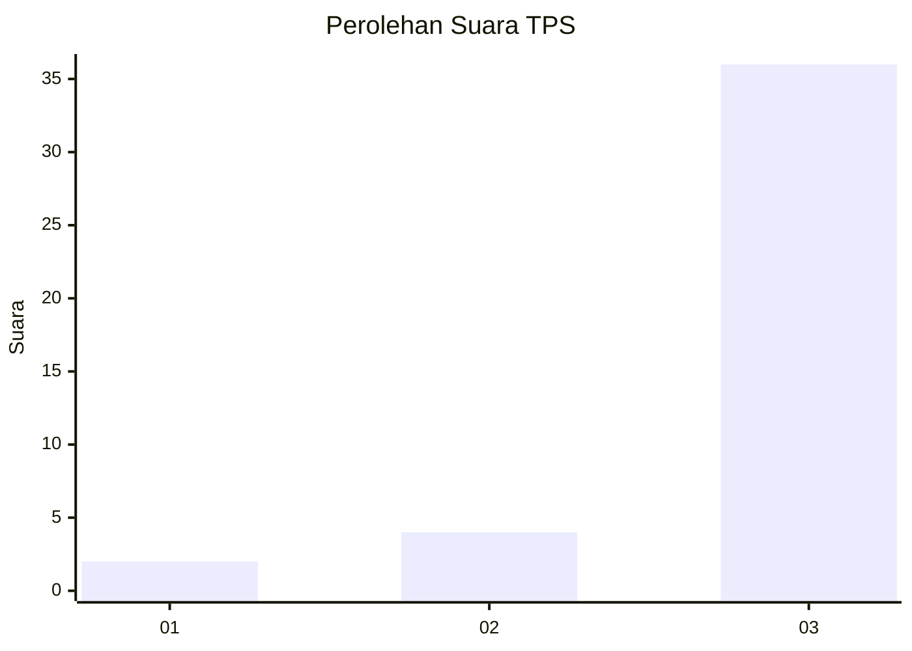
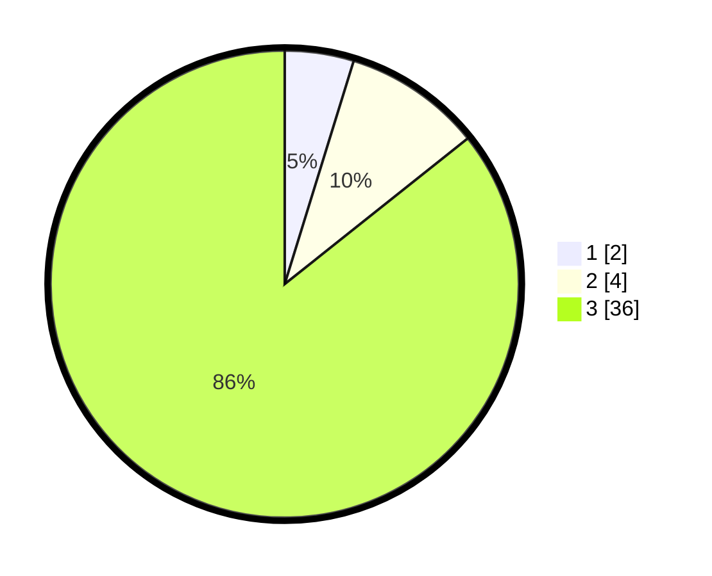

# Hasil

## Grafik

## Tabel

| No. | Nama Paslon    | Suara | Suara (raw) | Persentase |
|:--- |:-------------- | -----:| -----------:| ----------:|
| 1   | ANIES MUHAIMIN | 2     | [2][p-1]    | 4,76       |
| 2   | PRABOWO GIBRAN | 4     | [4][p-2]    | 9,52       |
| 3   | GANJAR MAHFUD  | 36    | [36][p-3]   | 85,71      |

[p-1]: https://github.com/gigit-pemilu/pemilu-2024-96-papua-barat-daya/blob/main/pilpres/hitung-suara/sub/96-papua-barat-daya/sub/01-sorong/sub/50-konhir/sub/2004-klafyo/sub/001-tps/sub/paslon-1.txt
[p-2]: https://github.com/gigit-pemilu/pemilu-2024-96-papua-barat-daya/blob/main/pilpres/hitung-suara/sub/96-papua-barat-daya/sub/01-sorong/sub/50-konhir/sub/2004-klafyo/sub/001-tps/sub/paslon-2.txt
[p-3]: https://github.com/gigit-pemilu/pemilu-2024-96-papua-barat-daya/blob/main/pilpres/hitung-suara/sub/96-papua-barat-daya/sub/01-sorong/sub/50-konhir/sub/2004-klafyo/sub/001-tps/sub/paslon-3.txt

## Foto C Plano

https://sirekap-obj-formc.kpu.go.id/95a4/pemilu/ppwp/96/01/50/20/04/9601502004001-20240215-125614--23cfcbdc-9810-4753-a977-ada12da917d7.jpg

https://sirekap-obj-formc.kpu.go.id/95a4/pemilu/ppwp/96/01/50/20/04/9601502004001-20240215-125833--4dbd2145-205e-4fcc-8c28-45ec87b446a2.jpg

https://sirekap-obj-formc.kpu.go.id/95a4/pemilu/ppwp/96/01/50/20/04/9601502004001-20240215-130011--f073592c-cd9d-4508-902c-555fedeb546c.jpg

## Metadata

| Key        | Value               |
| ---------- | ------------------- |
| Time Stamp | 2024-02-17 13:37:34 |

