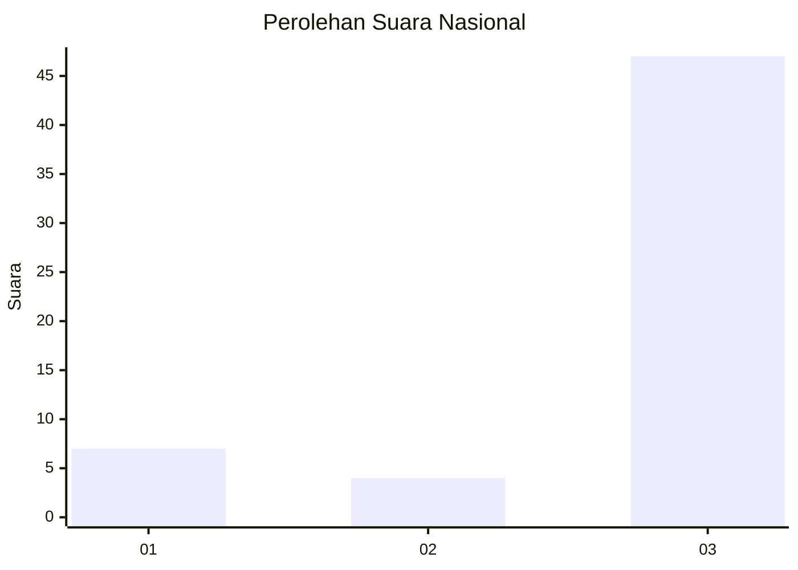
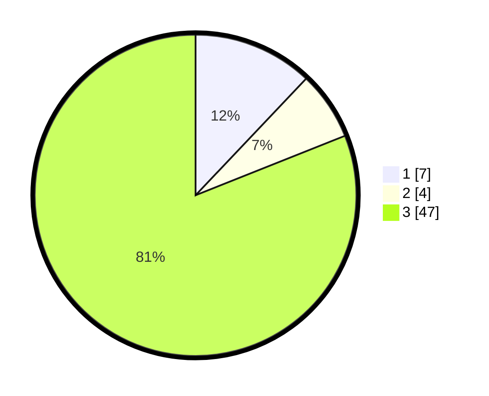

# Hasil

## Grafik

## Tabel

| No. | Nama Paslon    | Suara | Suara (raw) | Persentase |
|:--- |:-------------- | -----:| -----------:| ----------:|
| 1   | ANIES MUHAIMIN | 7     | [7][p-1]    | 12,07      |
| 2   | PRABOWO GIBRAN | 4     | [4][p-2]    | 6,90       |
| 3   | GANJAR MAHFUD  | 47    | [47][p-3]   | 81,03      |

[p-1]: https://github.com/gigit-pemilu/pemilu-2024/blob/main/pilpres/hitung-suara/sub/96-papua-barat-daya/sub/01-sorong/sub/50-konhir/sub/2008-klarin/sub/001-tps/sub/paslon-1.txt
[p-2]: https://github.com/gigit-pemilu/pemilu-2024/blob/main/pilpres/hitung-suara/sub/96-papua-barat-daya/sub/01-sorong/sub/50-konhir/sub/2008-klarin/sub/001-tps/sub/paslon-2.txt
[p-3]: https://github.com/gigit-pemilu/pemilu-2024/blob/main/pilpres/hitung-suara/sub/96-papua-barat-daya/sub/01-sorong/sub/50-konhir/sub/2008-klarin/sub/001-tps/sub/paslon-3.txt

## Foto C Plano

https://sirekap-obj-formc.kpu.go.id/b414/pemilu/ppwp/96/01/50/20/08/9601502008001-20240215-111440--3ae1b9ea-5bc1-4d53-8319-3821b20ce445.jpg

https://sirekap-obj-formc.kpu.go.id/b414/pemilu/ppwp/96/01/50/20/08/9601502008001-20240215-111844--204ea262-9a00-423c-855e-16f521784e7d.jpg

https://sirekap-obj-formc.kpu.go.id/b414/pemilu/ppwp/96/01/50/20/08/9601502008001-20240215-112330--3ebfc073-4ba9-4f66-a214-8b3f9a6a3ed0.jpg

## Metadata

| Key        | Value               |
| ---------- | ------------------- |
| Time Stamp | 2024-02-17 14:45:18 |

