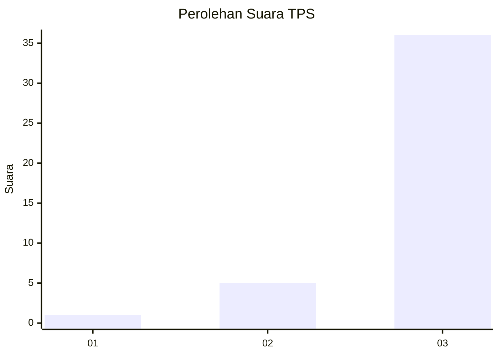
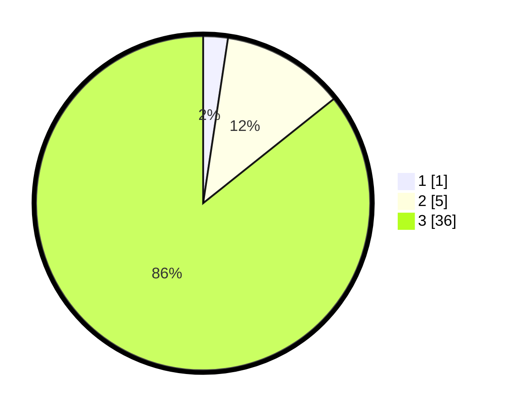

# Hasil

## Grafik

## Tabel

| No. | Nama Paslon    | Suara | Suara (raw) | Persentase |
|:--- |:-------------- | -----:| -----------:| ----------:|
| 1   | ANIES MUHAIMIN | 1     | [1][p-1]    | 2,38       |
| 2   | PRABOWO GIBRAN | 5     | [5][p-2]    | 11,90      |
| 3   | GANJAR MAHFUD  | 36    | [36][p-3]   | 85,71      |

[p-1]: https://github.com/gigit-pemilu/pemilu-2024-96-papua-barat-daya/blob/main/pilpres/hitung-suara/sub/96-papua-barat-daya/sub/01-sorong/sub/51-klasafet/sub/2005-klawilibe/sub/002-tps/sub/paslon-1.txt
[p-2]: https://github.com/gigit-pemilu/pemilu-2024-96-papua-barat-daya/blob/main/pilpres/hitung-suara/sub/96-papua-barat-daya/sub/01-sorong/sub/51-klasafet/sub/2005-klawilibe/sub/002-tps/sub/paslon-2.txt
[p-3]: https://github.com/gigit-pemilu/pemilu-2024-96-papua-barat-daya/blob/main/pilpres/hitung-suara/sub/96-papua-barat-daya/sub/01-sorong/sub/51-klasafet/sub/2005-klawilibe/sub/002-tps/sub/paslon-3.txt

## Foto C Plano

https://sirekap-obj-formc.kpu.go.id/8370/pemilu/ppwp/96/01/51/20/05/9601512005002-20240220-101600--bc806adb-238f-419f-95ae-65fccf8ce54f.jpg

https://sirekap-obj-formc.kpu.go.id/8370/pemilu/ppwp/96/01/51/20/05/9601512005002-20240220-101635--7f779576-0fd9-4d91-9620-5a8b9d37504b.jpg

## Metadata

| Key        | Value               |
| ---------- | ------------------- |
| Time Stamp | 2024-02-20 11:00:00 |

