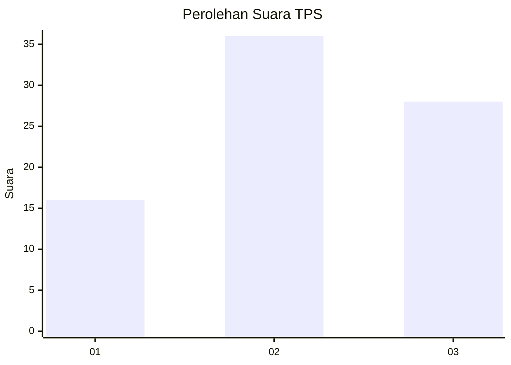
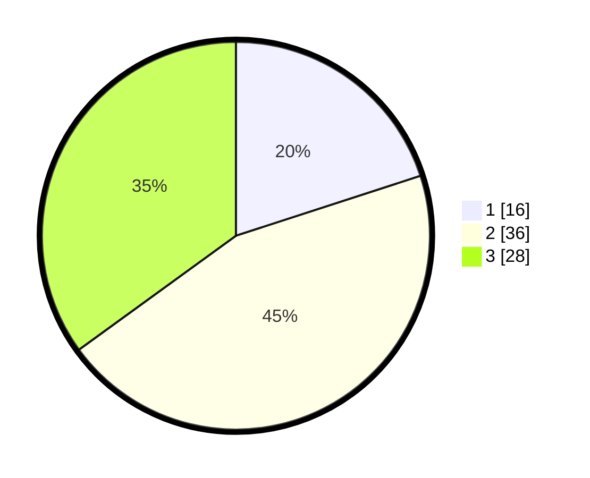

# Hasil

## Grafik

## Tabel

| No. | Nama Paslon    | Suara | Suara (raw) | Persentase |
|:--- |:-------------- | -----:| -----------:| ----------:|
| 1   | ANIES MUHAIMIN | 16    | [16][p-1]   | 20,00      |
| 2   | PRABOWO GIBRAN | 36    | [36][p-2]   | 45,00      |
| 3   | GANJAR MAHFUD  | 28    | [28][p-3]   | 35,00      |

[p-1]: https://github.com/gigit-pemilu/pemilu-2024-96-papua-barat-daya/blob/main/pilpres/hitung-suara/sub/96-papua-barat-daya/sub/01-sorong/sub/55-sayosa-timur/sub/2001-sailala/sub/001-tps/sub/paslon-1.txt
[p-2]: https://github.com/gigit-pemilu/pemilu-2024-96-papua-barat-daya/blob/main/pilpres/hitung-suara/sub/96-papua-barat-daya/sub/01-sorong/sub/55-sayosa-timur/sub/2001-sailala/sub/001-tps/sub/paslon-2.txt
[p-3]: https://github.com/gigit-pemilu/pemilu-2024-96-papua-barat-daya/blob/main/pilpres/hitung-suara/sub/96-papua-barat-daya/sub/01-sorong/sub/55-sayosa-timur/sub/2001-sailala/sub/001-tps/sub/paslon-3.txt

## Foto C Plano

https://sirekap-obj-formc.kpu.go.id/1a0b/pemilu/ppwp/96/01/55/20/01/9601552001001-20240220-081908--e4c58aaf-6a26-4bdb-9cac-154b93840dde.jpg

https://sirekap-obj-formc.kpu.go.id/1a0b/pemilu/ppwp/96/01/55/20/01/9601552001001-20240220-082019--50d79e68-7385-4b6e-91cb-14670be8231c.jpg

https://sirekap-obj-formc.kpu.go.id/1a0b/pemilu/ppwp/96/01/55/20/01/9601552001001-20240215-225618--15e28391-daa0-4689-af83-dab61dd33955.jpg

## Metadata

| Key        | Value               |
| ---------- | ------------------- |
| Time Stamp | 2024-02-20 23:00:00 |

