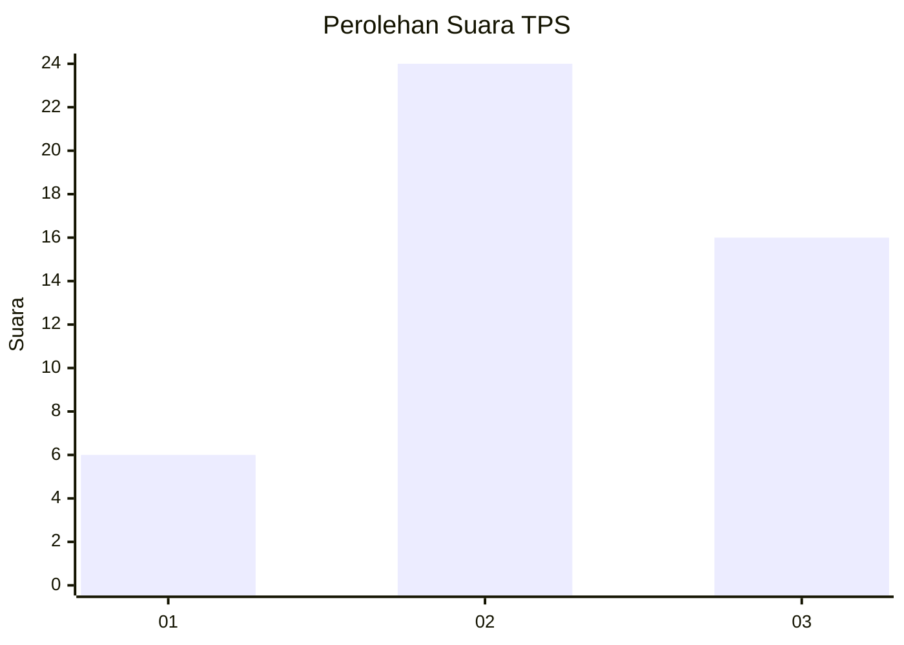
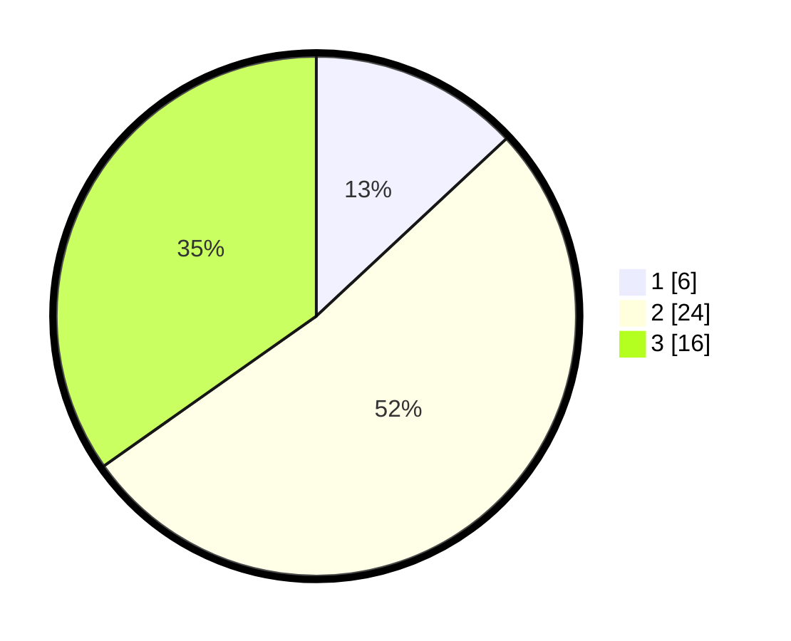

# Hasil

## Grafik

## Tabel

| No. | Nama Paslon    | Suara | Suara (raw) | Persentase |
|:--- |:-------------- | -----:| -----------:| ----------:|
| 1   | ANIES MUHAIMIN | 6     | [6][p-1]    | 13,04      |
| 2   | PRABOWO GIBRAN | 24    | [24][p-2]   | 52,17      |
| 3   | GANJAR MAHFUD  | 16    | [16][p-3]   | 34,78      |

[p-1]: https://github.com/gigit-pemilu/pemilu-2024-96-papua-barat-daya/blob/main/pilpres/hitung-suara/sub/96-papua-barat-daya/sub/01-sorong/sub/55-sayosa-timur/sub/2004-klawon-kec-sayosa-timur/sub/001-tps/sub/paslon-1.txt
[p-2]: https://github.com/gigit-pemilu/pemilu-2024-96-papua-barat-daya/blob/main/pilpres/hitung-suara/sub/96-papua-barat-daya/sub/01-sorong/sub/55-sayosa-timur/sub/2004-klawon-kec-sayosa-timur/sub/001-tps/sub/paslon-2.txt
[p-3]: https://github.com/gigit-pemilu/pemilu-2024-96-papua-barat-daya/blob/main/pilpres/hitung-suara/sub/96-papua-barat-daya/sub/01-sorong/sub/55-sayosa-timur/sub/2004-klawon-kec-sayosa-timur/sub/001-tps/sub/paslon-3.txt

## Foto C Plano

https://sirekap-obj-formc.kpu.go.id/fd22/pemilu/ppwp/96/01/55/20/04/9601552004001-20240216-084025--c1e5b5d4-5298-42fa-8fbb-2e2d233e42b3.jpg

https://sirekap-obj-formc.kpu.go.id/fd22/pemilu/ppwp/96/01/55/20/04/9601552004001-20240216-084915--3925b887-e4dc-4ceb-8ac0-e35fd282c3b7.jpg

https://sirekap-obj-formc.kpu.go.id/fd22/pemilu/ppwp/96/01/55/20/04/9601552004001-20240216-084409--2f7b3132-f5d1-4a5f-ba3e-8fcb7d0c697c.jpg

## Metadata

| Key        | Value               |
| ---------- | ------------------- |
| Time Stamp | 2024-02-19 18:00:00 |

## DATA PEMILIH TETAP

Jumlah pemilih dalam DPT: **45**.
 * L: **22**.
 * P: **23**.

## DATA PENGGUNA HAK PILIH

Jumlah pengguna hak pilih dalam DPT: **45**.
 * L: **22**.
 * P: **23**.

Jumlah pengguna hak pilih dalam DPTb: **0**.
 * L: **0**.
 * P: **0**.

Jumlah pengguna hak pilih dalam DPK: **1**.
 * L: **0**.
 * P: **1**.

Jumlah pengguna hak pilih: **46**.
 * L: **22**.
 * P: **24**.

## JUMLAH SUARA SAH DAN TIDAK SAH

JUMLAH SELURUH SUARA SAH: **46**.

JUMLAH SUARA TIDAK SAH: **0**.

JUMLAH SELURUH SUARA SAH DAN SUARA TIDAK SAH: **46**.

