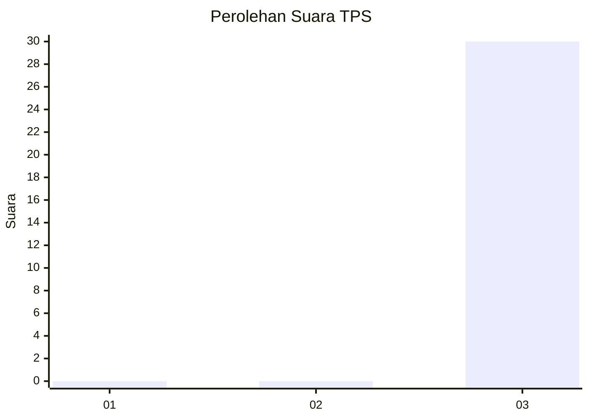
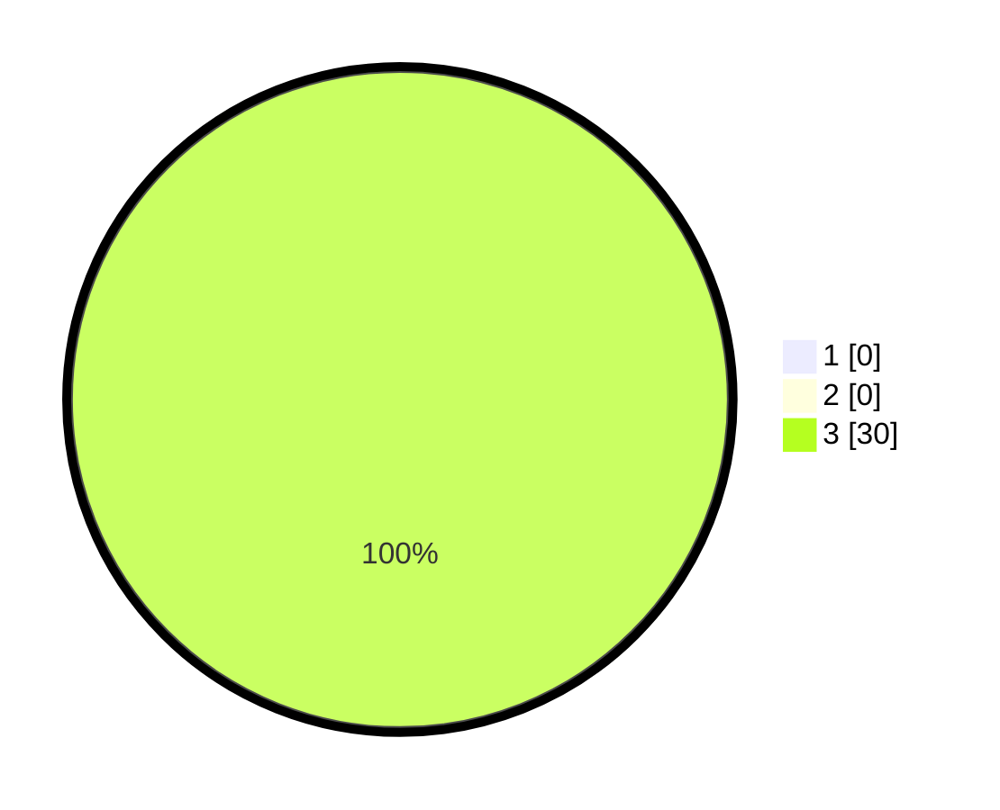

# Hasil

## Grafik

## Tabel

| No. | Nama Paslon    | Suara | Suara (raw) | Persentase |
|:--- |:-------------- | -----:| -----------:| ----------:|
| 1   | ANIES MUHAIMIN | 0     | [0][p-1]    | 0,00       |
| 2   | PRABOWO GIBRAN | 0     | [0][p-2]    | 0,00       |
| 3   | GANJAR MAHFUD  | 30    | [30][p-3]   | 100,00     |

[p-1]: https://github.com/gigit-pemilu/pemilu-2024-96-papua-barat-daya/blob/main/pilpres/hitung-suara/sub/96-papua-barat-daya/sub/01-sorong/sub/55-sayosa-timur/sub/2005-klakak/sub/001-tps/sub/paslon-1.txt
[p-2]: https://github.com/gigit-pemilu/pemilu-2024-96-papua-barat-daya/blob/main/pilpres/hitung-suara/sub/96-papua-barat-daya/sub/01-sorong/sub/55-sayosa-timur/sub/2005-klakak/sub/001-tps/sub/paslon-2.txt
[p-3]: https://github.com/gigit-pemilu/pemilu-2024-96-papua-barat-daya/blob/main/pilpres/hitung-suara/sub/96-papua-barat-daya/sub/01-sorong/sub/55-sayosa-timur/sub/2005-klakak/sub/001-tps/sub/paslon-3.txt

## Foto C Plano

https://sirekap-obj-formc.kpu.go.id/d80a/pemilu/ppwp/96/01/55/20/05/9601552005001-20240215-090548--d6ca6cd4-58d4-498a-86e3-debead406606.jpg

https://sirekap-obj-formc.kpu.go.id/d80a/pemilu/ppwp/96/01/55/20/05/9601552005001-20240215-090948--98573885-bbd1-4845-8765-e78f7697f7ec.jpg

https://sirekap-obj-formc.kpu.go.id/d80a/pemilu/ppwp/96/01/55/20/05/9601552005001-20240215-091320--36e44984-cb7c-4698-b26d-e80684cabd5c.jpg

## Metadata

| Key        | Value               |
| ---------- | ------------------- |
| Time Stamp | 2024-02-17 12:00:00 |

