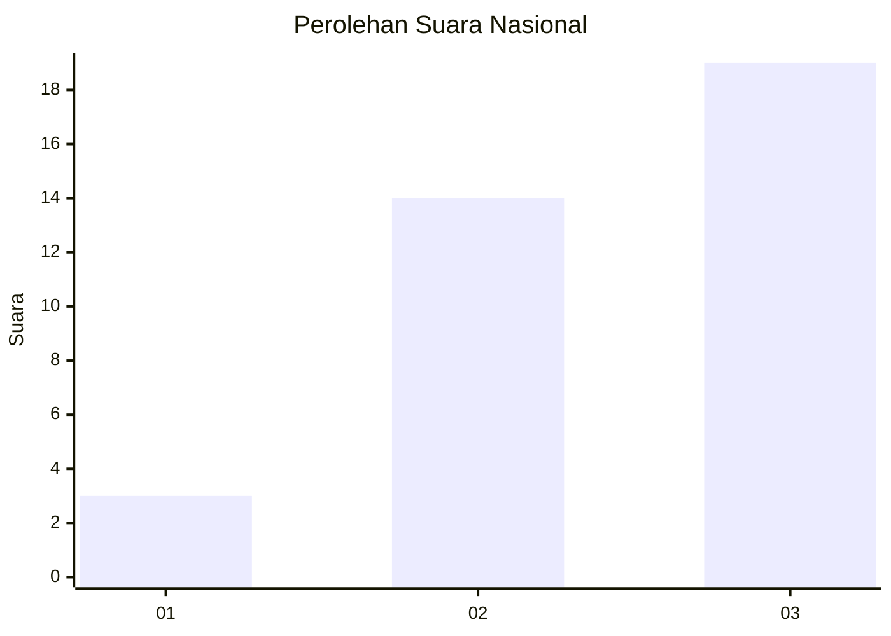
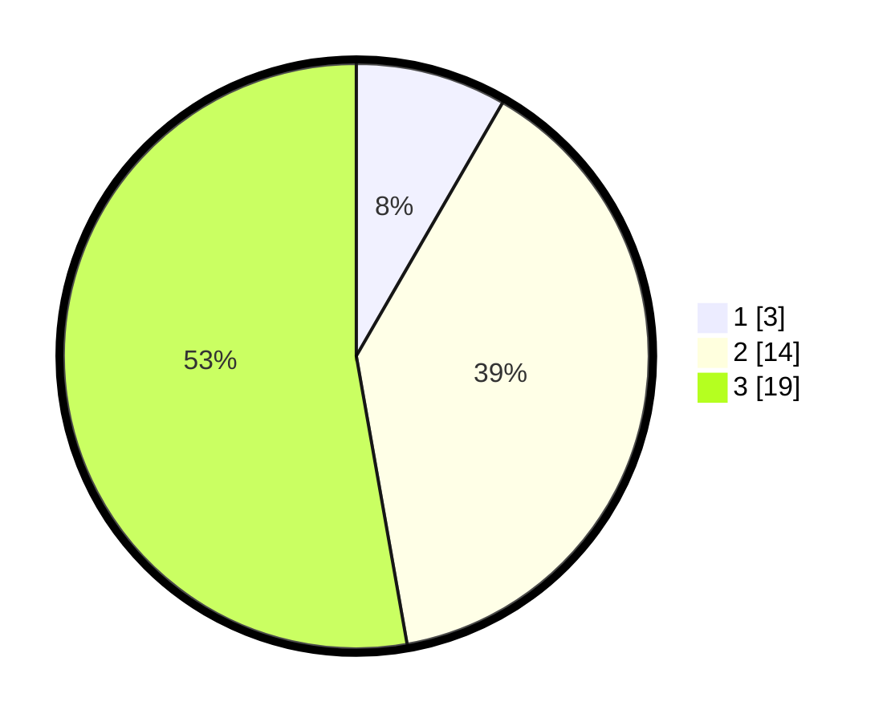

# Hasil

## Grafik

## Tabel

| No. | Nama Paslon    | Suara | Suara (raw) | Persentase |
|:--- |:-------------- | -----:| -----------:| ----------:|
| 1   | ANIES MUHAIMIN | 3     | [3][p-1]    | 8,33       |
| 2   | PRABOWO GIBRAN | 14    | [14][p-2]   | 38,89      |
| 3   | GANJAR MAHFUD  | 19    | [19][p-3]   | 52,78      |

[p-1]: https://github.com/gigit-pemilu/pemilu-2024/blob/main/pilpres/hitung-suara/sub/96-papua-barat-daya/sub/01-sorong/sub/55-sayosa-timur/sub/2006-klalwok/sub/001-tps/sub/paslon-1.txt
[p-2]: https://github.com/gigit-pemilu/pemilu-2024/blob/main/pilpres/hitung-suara/sub/96-papua-barat-daya/sub/01-sorong/sub/55-sayosa-timur/sub/2006-klalwok/sub/001-tps/sub/paslon-2.txt
[p-3]: https://github.com/gigit-pemilu/pemilu-2024/blob/main/pilpres/hitung-suara/sub/96-papua-barat-daya/sub/01-sorong/sub/55-sayosa-timur/sub/2006-klalwok/sub/001-tps/sub/paslon-3.txt

## Foto C Plano

https://sirekap-obj-formc.kpu.go.id/cb87/pemilu/ppwp/96/01/55/20/06/9601552006001-20240216-111347--51b24e1e-7937-4900-b954-4bfc23f19492.jpg

https://sirekap-obj-formc.kpu.go.id/cb87/pemilu/ppwp/96/01/55/20/06/9601552006001-20240216-100027--e2cba309-18d2-4f8e-9153-dbb14ecb91ef.jpg

https://sirekap-obj-formc.kpu.go.id/cb87/pemilu/ppwp/96/01/55/20/06/9601552006001-20240215-130135--43fddc32-08c1-4842-8bae-313ff75eacae.jpg

## Metadata

| Key        | Value               |
| ---------- | ------------------- |
| Time Stamp | 2024-02-17 12:00:00 |

