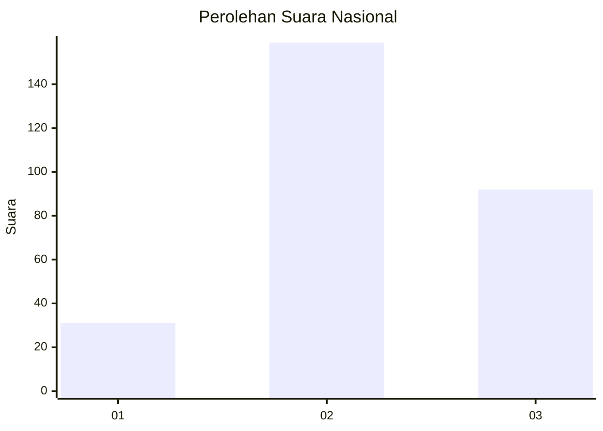
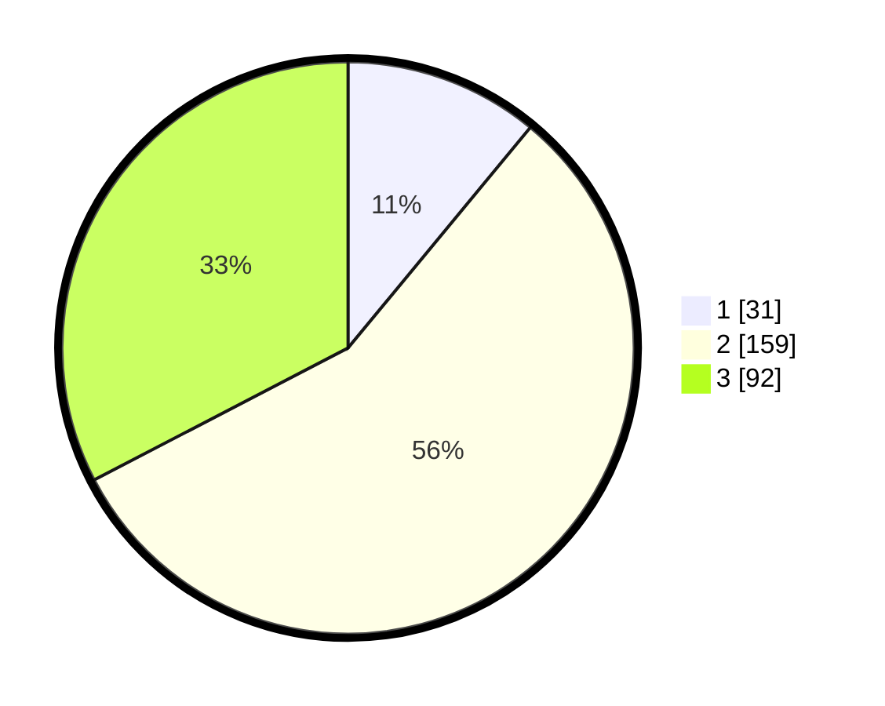

# Hasil

## Grafik

## Tabel

| No. | Nama Paslon    | Suara | Suara (raw) | Persentase |
|:--- |:-------------- | -----:| -----------:| ----------:|
| 1   | ANIES MUHAIMIN | 31    | [31][p-1]   | 10,99      |
| 2   | PRABOWO GIBRAN | 159   | [159][p-2]  | 56,38      |
| 3   | GANJAR MAHFUD  | 92    | [92][p-3]   | 32,62      |

[p-1]: https://github.com/gigit-pemilu/pemilu-2024/blob/main/pilpres/hitung-suara/sub/96-papua-barat-daya/sub/02-sorong-selatan/sub/01-teminabuan/sub/2034-wernas/sub/001-tps/sub/paslon-1.txt
[p-2]: https://github.com/gigit-pemilu/pemilu-2024/blob/main/pilpres/hitung-suara/sub/96-papua-barat-daya/sub/02-sorong-selatan/sub/01-teminabuan/sub/2034-wernas/sub/001-tps/sub/paslon-2.txt
[p-3]: https://github.com/gigit-pemilu/pemilu-2024/blob/main/pilpres/hitung-suara/sub/96-papua-barat-daya/sub/02-sorong-selatan/sub/01-teminabuan/sub/2034-wernas/sub/001-tps/sub/paslon-3.txt

## Foto C Plano

https://sirekap-obj-formc.kpu.go.id/d510/pemilu/ppwp/96/02/01/20/34/9602012034001-20240215-182608--4ec15e74-b0e5-4de6-ac83-412fac46b0c9.jpg

https://sirekap-obj-formc.kpu.go.id/d510/pemilu/ppwp/96/02/01/20/34/9602012034001-20240215-182715--6fbe7cad-ffa8-4338-a040-8846372b4338.jpg

https://sirekap-obj-formc.kpu.go.id/d510/pemilu/ppwp/96/02/01/20/34/9602012034001-20240215-182801--491e38ef-0250-4326-9c62-568965472be6.jpg

## Metadata

| Key        | Value               |
| ---------- | ------------------- |
| Time Stamp | 2024-02-15 21:30:27 |

