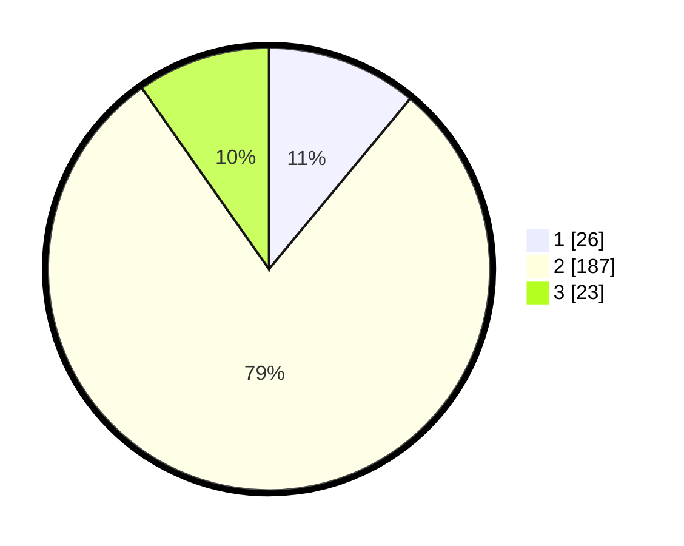

# Hasil

## Grafik

## Tabel

| No. | Nama Paslon    | Suara | Suara (raw) | Persentase |
|:--- |:-------------- | -----:| -----------:| ----------:|
| 1   | ANIES MUHAIMIN | 26    | [26][p-1]   | 11,02      |
| 2   | PRABOWO GIBRAN | 187   | [187][p-2]  | 79,24      |
| 3   | GANJAR MAHFUD  | 23    | [23][p-3]   | 9,75       |

[p-1]: https://github.com/gigit-pemilu/pemilu-2024-96-papua-barat-daya/blob/main/pilpres/hitung-suara/sub/96-papua-barat-daya/sub/02-sorong-selatan/sub/10-moswaren/sub/2004-bumi-ajo/sub/003-tps/sub/paslon-1.txt
[p-2]: https://github.com/gigit-pemilu/pemilu-2024-96-papua-barat-daya/blob/main/pilpres/hitung-suara/sub/96-papua-barat-daya/sub/02-sorong-selatan/sub/10-moswaren/sub/2004-bumi-ajo/sub/003-tps/sub/paslon-2.txt
[p-3]: https://github.com/gigit-pemilu/pemilu-2024-96-papua-barat-daya/blob/main/pilpres/hitung-suara/sub/96-papua-barat-daya/sub/02-sorong-selatan/sub/10-moswaren/sub/2004-bumi-ajo/sub/003-tps/sub/paslon-3.txt

## Foto C Plano

https://sirekap-obj-formc.kpu.go.id/6320/pemilu/ppwp/96/02/10/20/04/9602102004003-20240214-132457--7943419c-91ba-4d37-84b6-4195abe3a293.jpg

https://sirekap-obj-formc.kpu.go.id/6320/pemilu/ppwp/96/02/10/20/04/9602102004003-20240214-132753--5049ad01-cf5d-4130-8f27-5e72bd0c3419.jpg

https://sirekap-obj-formc.kpu.go.id/6320/pemilu/ppwp/96/02/10/20/04/9602102004003-20240214-132634--202a23b3-57f3-4eba-917a-bb029d9121a2.jpg

## Metadata

| Key        | Value               |
| ---------- | ------------------- |
| Time Stamp | 2024-02-15 21:30:27 |

