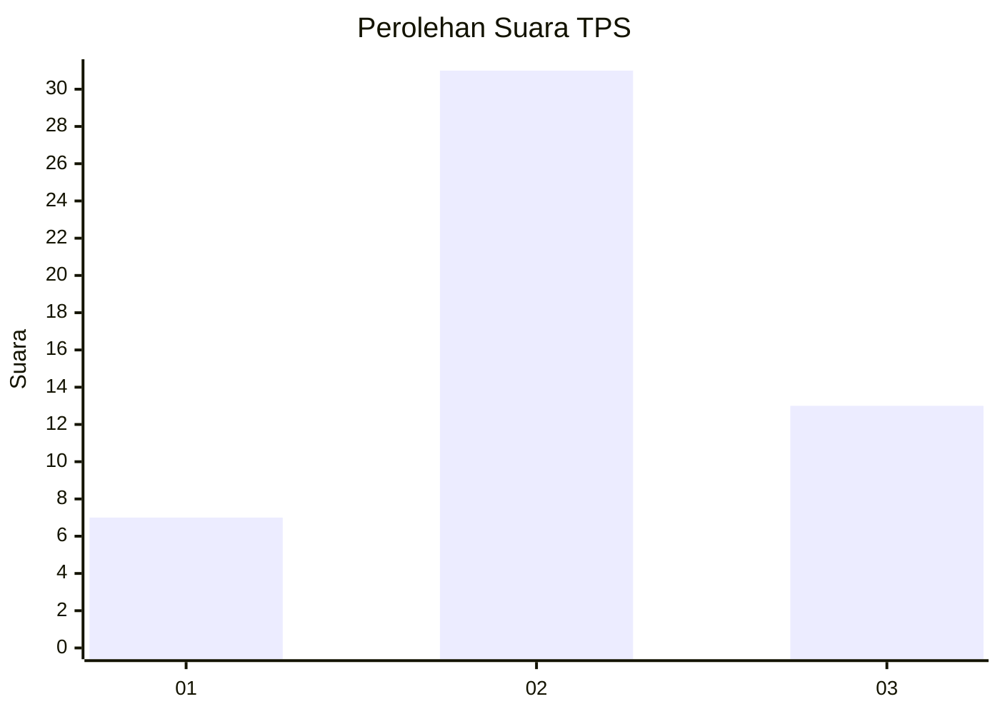
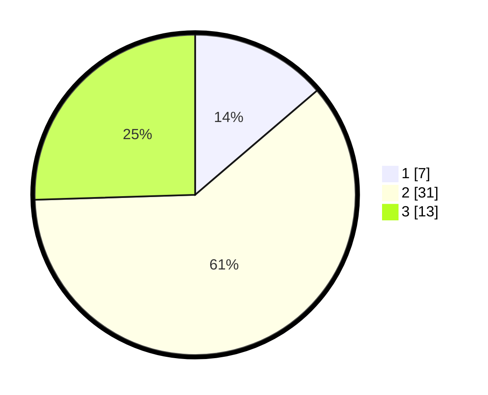

# Hasil

## Grafik

## Tabel

| No. | Nama Paslon    | Suara | Suara (raw) | Persentase |
|:--- |:-------------- | -----:| -----------:| ----------:|
| 1   | ANIES MUHAIMIN | 7     | [7][p-1]    | 13,73      |
| 2   | PRABOWO GIBRAN | 31    | [31][p-2]   | 60,78      |
| 3   | GANJAR MAHFUD  | 13    | [13][p-3]   | 25,49      |

[p-1]: https://github.com/gigit-pemilu/pemilu-2024-96-papua-barat-daya/blob/main/pilpres/hitung-suara/sub/96-papua-barat-daya/sub/02-sorong-selatan/sub/12-wayer/sub/2001-sungguer/sub/901-tps/sub/paslon-1.txt
[p-2]: https://github.com/gigit-pemilu/pemilu-2024-96-papua-barat-daya/blob/main/pilpres/hitung-suara/sub/96-papua-barat-daya/sub/02-sorong-selatan/sub/12-wayer/sub/2001-sungguer/sub/901-tps/sub/paslon-2.txt
[p-3]: https://github.com/gigit-pemilu/pemilu-2024-96-papua-barat-daya/blob/main/pilpres/hitung-suara/sub/96-papua-barat-daya/sub/02-sorong-selatan/sub/12-wayer/sub/2001-sungguer/sub/901-tps/sub/paslon-3.txt

## Foto C Plano

https://sirekap-obj-formc.kpu.go.id/c252/pemilu/ppwp/96/02/12/20/01/9602122001901-20240214-123443--8b2c9fb8-73d5-43b8-9728-bc10adb0f1d5.jpg

https://sirekap-obj-formc.kpu.go.id/c252/pemilu/ppwp/96/02/12/20/01/9602122001901-20240214-121505--fe914fcd-5586-4ede-bea6-e0475c28dc87.jpg

https://sirekap-obj-formc.kpu.go.id/c252/pemilu/ppwp/96/02/12/20/01/9602122001901-20240214-121614--742af217-b8b6-4768-a0e5-dc3657447995.jpg

## Metadata

| Key        | Value               |
| ---------- | ------------------- |
| Time Stamp | 2024-02-14 21:46:01 |

## DATA PEMILIH TETAP

Jumlah pemilih dalam DPT: **70**.
 * L: **68**.
 * P: **2**.

## DATA PENGGUNA HAK PILIH

Jumlah pengguna hak pilih dalam DPT: **42**.
 * L: **41**.
 * P: **1**.

Jumlah pengguna hak pilih dalam DPTb: **12**.
 * L: **11**.
 * P: **1**.

Jumlah pengguna hak pilih dalam DPK: **0**.
 * L: **0**.
 * P: **0**.

Jumlah pengguna hak pilih: **54**.
 * L: **52**.
 * P: **2**.

## JUMLAH SUARA SAH DAN TIDAK SAH

JUMLAH SELURUH SUARA SAH: **51**.

JUMLAH SUARA TIDAK SAH: **3**.

JUMLAH SELURUH SUARA SAH DAN SUARA TIDAK SAH: **54**.

