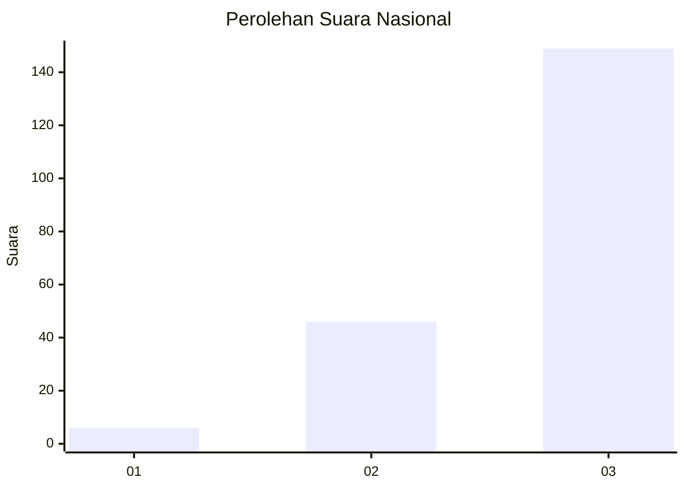
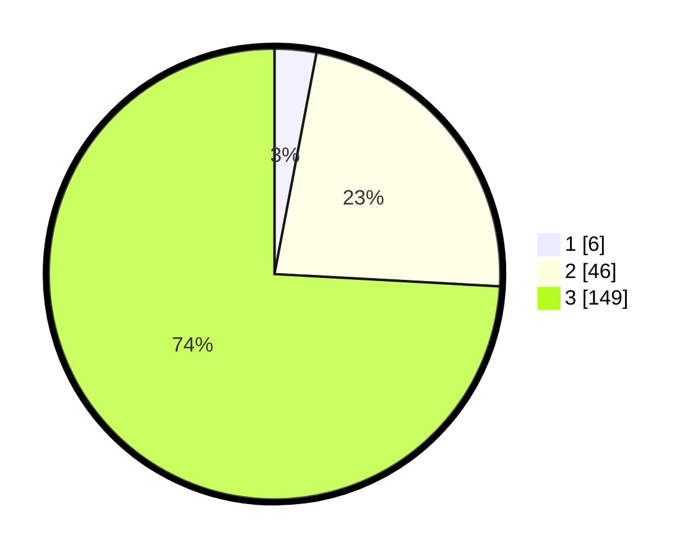

# Hasil

## Grafik

## Tabel

| No. | Nama Paslon    | Suara | Suara (raw) | Persentase |
|:--- |:-------------- | -----:| -----------:| ----------:|
| 1   | ANIES MUHAIMIN | 6     | [6][p-1]    | 2,99       |
| 2   | PRABOWO GIBRAN | 46    | [46][p-2]   | 22,89      |
| 3   | GANJAR MAHFUD  | 149   | [149][p-3]  | 74,13      |

[p-1]: https://github.com/gigit-pemilu/pemilu-2024/blob/main/pilpres/hitung-suara/sub/96-papua-barat-daya/sub/03-raja-ampat/sub/02-waigeo-utara/sub/2011-asukweri/sub/001-tps/sub/paslon-1.txt
[p-2]: https://github.com/gigit-pemilu/pemilu-2024/blob/main/pilpres/hitung-suara/sub/96-papua-barat-daya/sub/03-raja-ampat/sub/02-waigeo-utara/sub/2011-asukweri/sub/001-tps/sub/paslon-2.txt
[p-3]: https://github.com/gigit-pemilu/pemilu-2024/blob/main/pilpres/hitung-suara/sub/96-papua-barat-daya/sub/03-raja-ampat/sub/02-waigeo-utara/sub/2011-asukweri/sub/001-tps/sub/paslon-3.txt

## Foto C Plano

https://sirekap-obj-formc.kpu.go.id/d585/pemilu/ppwp/96/03/02/20/11/9603022011001-20240222-085628--ee8ff399-632b-44be-a58a-caccfffd16e7.jpg

https://sirekap-obj-formc.kpu.go.id/d585/pemilu/ppwp/96/03/02/20/11/9603022011001-20240222-091314--0ab4541d-01d3-4cc7-aae7-54b260112060.jpg

https://sirekap-obj-formc.kpu.go.id/d585/pemilu/ppwp/96/03/02/20/11/9603022011001-20240222-090859--8bd92435-a6f1-42d8-9242-84baefc9d2d2.jpg

## Metadata

| Key        | Value               |
| ---------- | ------------------- |
| Time Stamp | 2024-02-22 10:00:00 |

## DATA PEMILIH TETAP

Jumlah pemilih dalam DPT: **227**.
 * L: **104**.
 * P: **123**.

## DATA PENGGUNA HAK PILIH

Jumlah pengguna hak pilih dalam DPT: **200**.
 * L: **95**.
 * P: **104**.

Jumlah pengguna hak pilih dalam DPTb: **0**.
 * L: **0**.
 * P: **0**.

Jumlah pengguna hak pilih dalam DPK: **7**.
 * L: **3**.
 * P: **4**.

Jumlah pengguna hak pilih: **207**.
 * L: **99**.
 * P: **108**.

## JUMLAH SUARA SAH DAN TIDAK SAH

JUMLAH SELURUH SUARA SAH: **201**.

JUMLAH SUARA TIDAK SAH: **6**.

JUMLAH SELURUH SUARA SAH DAN SUARA TIDAK SAH: **207**.

