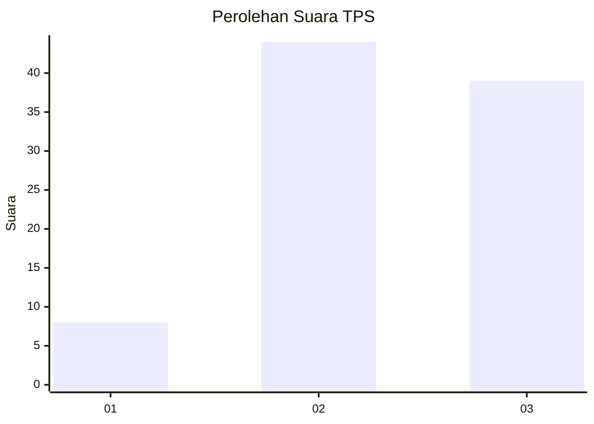
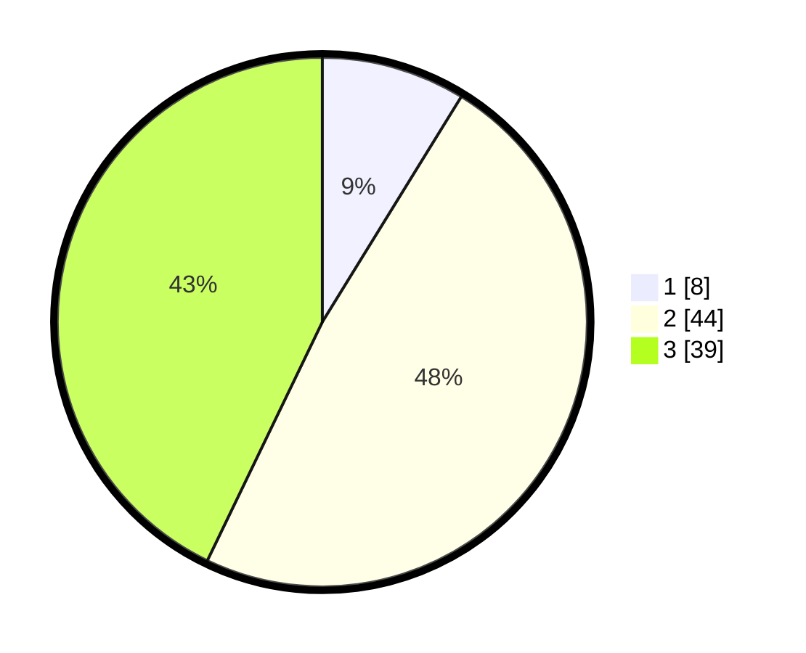

# Hasil

## Grafik

## Tabel

| No. | Nama Paslon    | Suara | Suara (raw) | Persentase |
|:--- |:-------------- | -----:| -----------:| ----------:|
| 1   | ANIES MUHAIMIN | 8     | [8][p-1]    | 8,79       |
| 2   | PRABOWO GIBRAN | 44    | [44][p-2]   | 48,35      |
| 3   | GANJAR MAHFUD  | 39    | [39][p-3]   | 42,86      |

[p-1]: https://github.com/gigit-pemilu/pemilu-2024-96-papua-barat-daya/blob/main/pilpres/hitung-suara/sub/96-papua-barat-daya/sub/03-raja-ampat/sub/09-teluk-mayalibit/sub/2007-warsamdin/sub/002-tps/sub/paslon-1.txt
[p-2]: https://github.com/gigit-pemilu/pemilu-2024-96-papua-barat-daya/blob/main/pilpres/hitung-suara/sub/96-papua-barat-daya/sub/03-raja-ampat/sub/09-teluk-mayalibit/sub/2007-warsamdin/sub/002-tps/sub/paslon-2.txt
[p-3]: https://github.com/gigit-pemilu/pemilu-2024-96-papua-barat-daya/blob/main/pilpres/hitung-suara/sub/96-papua-barat-daya/sub/03-raja-ampat/sub/09-teluk-mayalibit/sub/2007-warsamdin/sub/002-tps/sub/paslon-3.txt

## Foto C Plano

https://sirekap-obj-formc.kpu.go.id/4f58/pemilu/ppwp/96/03/09/20/07/9603092007002-20240219-234501--beeeff40-30b6-434f-8987-254a7de78dbf.jpg

https://sirekap-obj-formc.kpu.go.id/4f58/pemilu/ppwp/96/03/09/20/07/9603092007002-20240219-234531--ba0ed213-38d5-4c37-9641-5744c937897b.jpg

https://sirekap-obj-formc.kpu.go.id/4f58/pemilu/ppwp/96/03/09/20/07/9603092007002-20240219-234547--b310c788-2efb-4060-93fb-8fe6d6b870d6.jpg

## Metadata

| Key        | Value               |
| ---------- | ------------------- |
| Time Stamp | 2024-02-25 12:00:00 |

