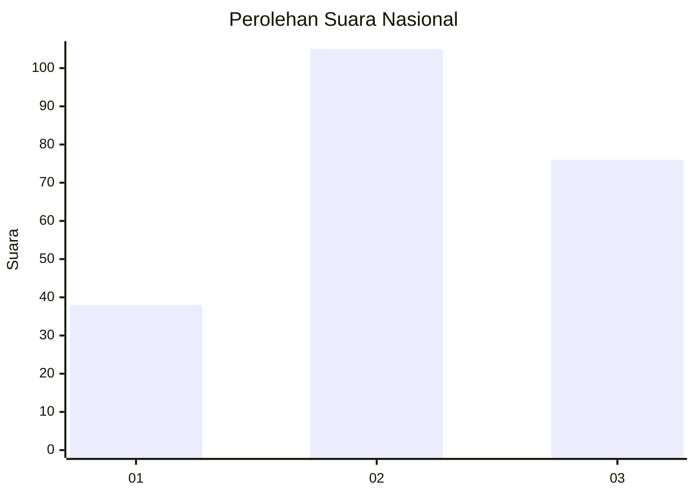
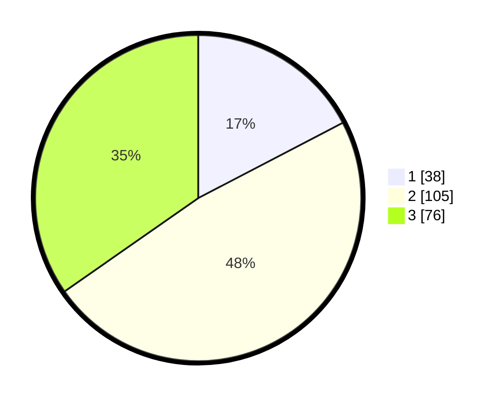

# Hasil

## Grafik

## Tabel

| No. | Nama Paslon    | Suara | Suara (raw) | Persentase |
|:--- |:-------------- | -----:| -----------:| ----------:|
| 1   | ANIES MUHAIMIN | 38    | [38][p-1]   | 17,35      |
| 2   | PRABOWO GIBRAN | 105   | [105][p-2]  | 47,95      |
| 3   | GANJAR MAHFUD  | 76    | [76][p-3]   | 34,70      |

[p-1]: https://github.com/gigit-pemilu/pemilu-2024/blob/main/pilpres/hitung-suara/sub/96-papua-barat-daya/sub/03-raja-ampat/sub/15-waigeo-barat-kepulauan/sub/2001-manyaifun/sub/001-tps/sub/paslon-1.txt
[p-2]: https://github.com/gigit-pemilu/pemilu-2024/blob/main/pilpres/hitung-suara/sub/96-papua-barat-daya/sub/03-raja-ampat/sub/15-waigeo-barat-kepulauan/sub/2001-manyaifun/sub/001-tps/sub/paslon-2.txt
[p-3]: https://github.com/gigit-pemilu/pemilu-2024/blob/main/pilpres/hitung-suara/sub/96-papua-barat-daya/sub/03-raja-ampat/sub/15-waigeo-barat-kepulauan/sub/2001-manyaifun/sub/001-tps/sub/paslon-3.txt

## Foto C Plano

https://sirekap-obj-formc.kpu.go.id/4af6/pemilu/ppwp/96/03/15/20/01/9603152001001-20240221-200910--7cb08314-300a-4b62-9516-06617b5a3946.jpg

https://sirekap-obj-formc.kpu.go.id/4af6/pemilu/ppwp/96/03/15/20/01/9603152001001-20240221-201322--cdf2503e-f186-4789-b081-a2a1402fe5d6.jpg

https://sirekap-obj-formc.kpu.go.id/4af6/pemilu/ppwp/96/03/15/20/01/9603152001001-20240222-113306--1f76db0f-6e2f-4ed3-a828-fc5ea78a02fc.jpg

## Metadata

| Key        | Value               |
| ---------- | ------------------- |
| Time Stamp | 2024-02-24 22:31:28 |

