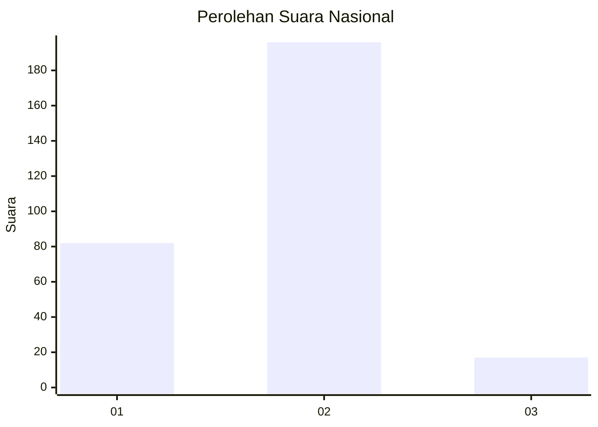
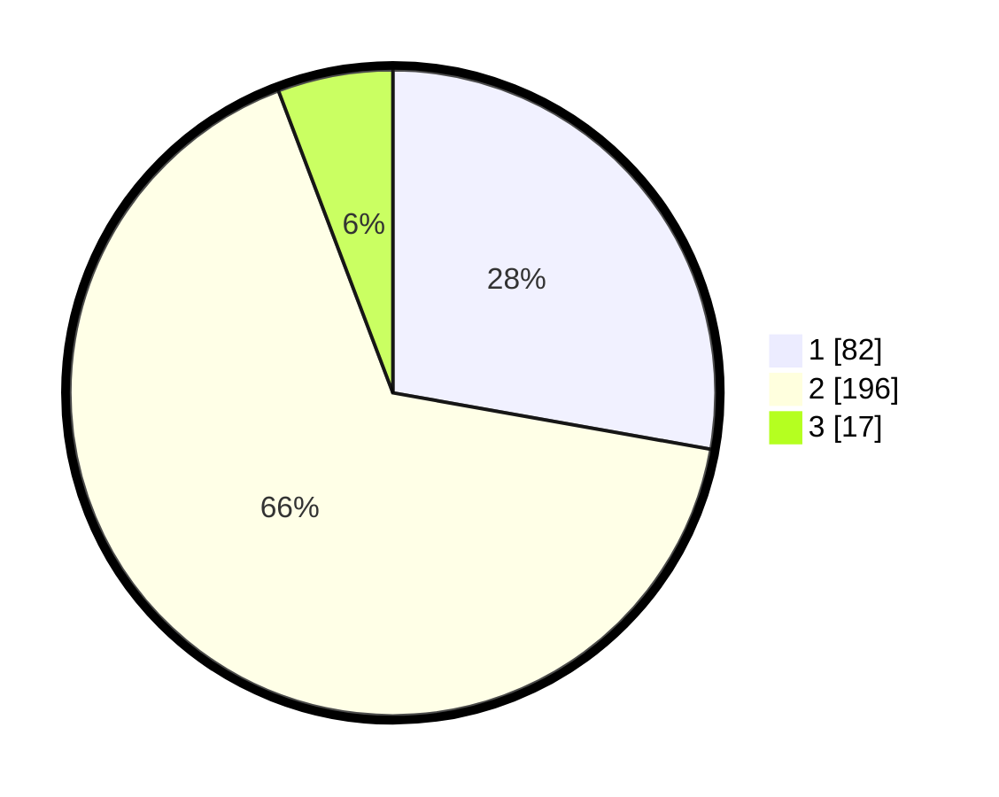

# Hasil

## Grafik

## Tabel

| No. | Nama Paslon    | Suara | Suara (raw) | Persentase |
|:--- |:-------------- | -----:| -----------:| ----------:|
| 1   | ANIES MUHAIMIN | 82    | [82][p-1]   | 27,80      |
| 2   | PRABOWO GIBRAN | 196   | [196][p-2]  | 66,44      |
| 3   | GANJAR MAHFUD  | 17    | [17][p-3]   | 5,76       |

[p-1]: https://github.com/gigit-pemilu/pemilu-2024/blob/main/pilpres/hitung-suara/sub/96-papua-barat-daya/sub/03-raja-ampat/sub/15-waigeo-barat-kepulauan/sub/2005-gag/sub/001-tps/sub/paslon-1.txt
[p-2]: https://github.com/gigit-pemilu/pemilu-2024/blob/main/pilpres/hitung-suara/sub/96-papua-barat-daya/sub/03-raja-ampat/sub/15-waigeo-barat-kepulauan/sub/2005-gag/sub/001-tps/sub/paslon-2.txt
[p-3]: https://github.com/gigit-pemilu/pemilu-2024/blob/main/pilpres/hitung-suara/sub/96-papua-barat-daya/sub/03-raja-ampat/sub/15-waigeo-barat-kepulauan/sub/2005-gag/sub/001-tps/sub/paslon-3.txt

## Foto C Plano

https://sirekap-obj-formc.kpu.go.id/d844/pemilu/ppwp/96/03/15/20/05/9603152005001-20240215-093102--33e5bc59-f8a9-4d8d-ba63-f958c8eff895.jpg

https://sirekap-obj-formc.kpu.go.id/d844/pemilu/ppwp/96/03/15/20/05/9603152005001-20240215-093120--a137a54d-033a-432e-96ee-67ccf98b1b5b.jpg

https://sirekap-obj-formc.kpu.go.id/d844/pemilu/ppwp/96/03/15/20/05/9603152005001-20240215-093136--6063b514-c2a0-4126-9485-5e314281123e.jpg

## Metadata

| Key        | Value               |
| ---------- | ------------------- |
| Time Stamp | 2024-02-16 08:30:27 |

